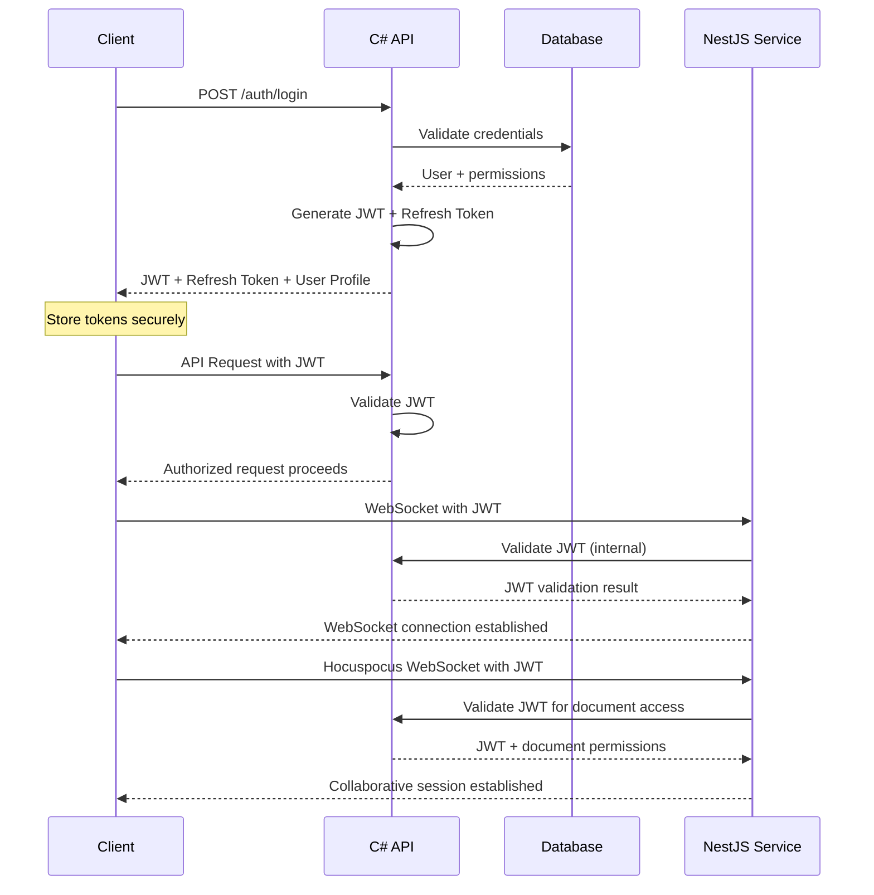

I will use nx for nestjs service and the mock "Hospital Systems" as mono repo, so when I have access to the real endpoints and schema I can simply replace that mock with the real ones.

# RELEVO Backend API Documentation

## Overview

This document provides comprehensive backend API specifications, database schemas, and real-time communication protocols for the RELEVO medical handoff platform. The backend architecture supports the transition from static/simulated features to fully real-time collaborative medical workflows while maintaining strict HIPAA compliance and audit requirements.

**Architecture**: NX Monorepo with microservices approach for scalable development and deployment.

## NX Monorepo Architecture Overview

### Workspace Structure

```
relevo-workspace/
├── apps/
│   ├── relevo-frontend/          # React CSR application
│   ├── relevo-api/               # C# Backend (Main API)
│   ├── relevo-nestjs/            # NestJS Service (Webhooks + Hocuspocus + External APIs)
│   └── hospital-mock-api/        # Mock Hospital Systems API
├── libs/
│   ├── shared/
│   │   ├── types/                # Shared TypeScript types
│   │   ├── constants/            # Shared constants
│   │   └── utils/                # Shared utilities
│   ├── hospital-sdk/             # Hospital API SDK (interfaces)
│   ├── collaboration/            # Collaboration features
│   └── medical-core/             # Core medical domain logic
└── tools/
```

### System Components

```
┌─────────────────────────────────────────────────────────────────────┐
│                        RELEVO NX Monorepo                          │
├─────────────────────────────────────────────────────────────────────┤
│  apps/relevo-frontend   │  apps/relevo-api    │  apps/relevo-nestjs │
│  (React CSR)            │  (C# Backend)       │  (NestJS Service)   │
│  - UI Components        │  - Main API         │  - Webhooks         │
│  - I-PASS Interface     │  - Authentication   │  - Hocuspocus       │
│  - Collaboration UI     │  - Patient Data     │  - Real-time        │
│                         │  - Audit Trails     │  - Cache Layer      │
├─────────────────────────┼─────────────────────┼─────────────────────┤
│  libs/shared/types      │  libs/hospital-sdk  │  libs/collaboration │
│  - Common Interfaces    │  - API Abstractions │  - Shared Logic     │
│  - Type Definitions     │  - Mock Fallbacks   │  - Real-time Utils  │
├─────────────────────────┼─────────────────────┼─────────────────────┤
│           apps/hospital-mock-api (Development)                      │
│           - Mock Hospital Systems                                   │
│           - Alert Simulation                                        │
│           - Development Testing                                     │
└─────────────────────────────────────────────────────────────────────┘
                                    │
                          ┌─────────────────────┐
                          │   PostgreSQL DB     │
                          │   (Single Source)   │
                          └─────────────────────┘
```

### Service Responsibilities

#### React Frontend (`apps/relevo-frontend`)

- **User Interface**: I-PASS workflow interface, patient management UI
- **Real-time Collaboration**: Tiptap integration, user presence indicators
- **State Management**: Local state, sync status, session management
- **Mobile Responsiveness**: Adaptive UI for different screen sizes
- **Authentication**: JWT token management, user session handling

#### C# Backend (`apps/relevo-api`)

- **Authentication & Authorization**: JWT tokens, user management, RBAC
- **Patient Management**: CRUD operations, medical data persistence
- **I-PASS Workflow**: Section management, audit trails, version control
- **Session Management**: Handover sessions, daily setup workflows
- **Compliance & Security**: HIPAA compliance, comprehensive audit logging
- **Database Operations**: Primary database access layer, data validation
- **Alert Management**: Alert storage, retrieval, and status management

#### NestJS Service (`apps/relevo-nestjs`)

- **Webhook Management**: External integrations, event processing
- **Real-time Events**: Non-collaborative real-time features
- **Cache Management**: In-memory caching with NestJS/cache-manager
- **Background Jobs**: Async processing, scheduled tasks
- **External API Integration**: Hospital systems coordination via hospital-sdk
- **Alert Synchronization**: Periodic alert fetching with fallback mechanisms
- **Collaborative Editing**: Integrated Hocuspocus server for real-time text editing
- **Document Collaboration**: Real-time text editing for I-PASS sections
- **Conflict Resolution**: Operational transformation, document persistence
- **User Presence**: Live editing indicators, collaboration status

#### Hospital Mock API (`apps/hospital-mock-api`)

- **Development Support**: Mock hospital system endpoints
- **Alert Simulation**: Realistic alert data generation using provided schema
- **API Testing**: Swagger documentation, endpoint validation
- **Fallback Service**: Automatic fallback when real hospital API unavailable
- **Data Generation**: Comprehensive mock data for development and testing

#### Shared Libraries (`libs/`)

- **hospital-sdk**: Interface-based hospital API abstraction
- **shared/types**: Common TypeScript interfaces and types
- **collaboration**: Shared collaboration logic and utilities
- **medical-core**: Core medical domain logic and validations

## Feature Implementation Classification

### 🔴 Real-time Features (Currently Implemented)

- Session management and timing (NestJS service)
- Auto-save and sync status (Frontend + NestJS)
- Mobile/responsive detection (Frontend)
- User presence tracking (Collaboration lib + NestJS)

### 🟡 Simulated Features (Backend Implementation Needed)

- Collaboration and discussion threads (NestJS + Collaboration lib)
- Activity feeds and notifications (NestJS service)
- Multi-user presence indicators (Frontend + NestJS)
- Real-time document editing (Hocuspocus integration)

### 🔵 Static Features (Persistence Required)

- Patient data management (C# Backend)
- I-PASS workflow content (C# Backend + Database)
- User authentication and authorization (C# Backend)
- Medical record integration (C# Backend + hospital-sdk)

### 🟠 External Integration Features (Hospital API Dependent)

- Alert fetching from hospital systems (hospital-sdk + Mock API)
- EMR data synchronization (hospital-sdk)
- Laboratory result integration (Mock API simulation)
- Vital signs monitoring (Future real API integration)
## Security & Compliance

### Enhanced HIPAA Compliance Framework

```yaml
security_framework:
  authentication:
    primary_backend: "C# Backend with JWT"
    external_api_integration:
      - "Hospital API key management"
      - "Service-to-service authentication"
      - "Hocuspocus WebSocket authentication"

  data_protection:
    in_transit:
      - "TLS 1.3 for all HTTP communications"
      - "WSS (WebSocket Secure) for Hocuspocus"
      - "Encrypted communication with hospital APIs"

    at_rest:
      - "Database encryption (PostgreSQL TDE)"
      - "Alert data encryption"
      - "Y.js document state encryption"

  access_control:
    nx_services:
      - "Service-to-service authentication"
      - "Role-based API access"
      - "Document-level permissions"
      - "Alert data filtering by unit/assignment"

  audit_logging:
    comprehensive_tracking:
      - "All NX service interactions"
      - "External API calls and responses"
      - "Collaborative sessions"
      - "Alert synchronization activities"

compliance_endpoints:
  relevo_api:
    - "/audit/patient-access/{patientId}"
    - "/audit/alert-access/{alertId}"
    - "/compliance/hipaa-report"

  relevo_nestjs:
    - "/audit/webhook-deliveries"
    - "/audit/hocuspocus-connections"
    - "/audit/hospital-api-calls"
    - "/compliance/real-time-activity"
```

## Deployment & Infrastructure

## Implementation Roadmap

### Phase 1: NX Foundation & Alert Integration (Months 1-2)

- **Complete NX workspace setup** with all applications and libraries
- **Hospital Mock API** with realistic alert data simulation
- **NestJS service enhancement** with alert synchronization
- **Shared library implementation** for types and utilities

### Phase 2: Real API Integration & Collaboration (Months 2-3)

- **Hospital SDK implementation** with real API integration
- **Hocuspocus collaborative editing** fully integrated
- **Enhanced caching strategy** with Redis for production
- **Comprehensive webhook system** for all service interactions

### Phase 3: Production Readiness (Months 3-4)

- **HIPAA compliance implementation** across all services
- **Performance optimization** and monitoring
- **Security enhancements** for all service communications
- **Deployment automation** and CI/CD pipeline

This updated BACKEND.md provides a complete specification for the NX monorepo architecture with integrated hospital API mock service, designed for seamless migration to real hospital endpoints when available.

### Service Responsibilities

#### C# Backend (Main API)

- **Authentication & Authorization**: JWT tokens, user management
- **Patient Management**: CRUD operations, medical data
- **I-PASS Workflow**: Section management, audit trails
- **Session Management**: Handover sessions, daily setup
- **Compliance & Security**: HIPAA compliance, audit logging
- **Database Operations**: Primary database access layer
- **Alert Management**: Alert storage, retrieval, and status management

#### NestJS Service (Integrated Real-time Hub)

- **Webhook Management**: External integrations, notifications
- **Real-time Events**: Non-collaborative real-time features
- **Cache Management**: In-memory caching with NestJS/cache-manager
- **Background Jobs**: Async processing, scheduled tasks
- **External API Integration**: Hospital systems, alert fetching
- **Alert Synchronization**: Periodic alert fetching from hospital REST APIs
- **Collaborative Editing**: Hocuspocus server integration for real-time text editing
- **Document Collaboration**: Real-time text editing for I-PASS sections
- **Conflict Resolution**: Operational transformation
- **Document Persistence**: Syncing with main database
- **User Presence**: Live editing indicators

## Feature Implementation Classification

### 🔴 Real-time Features (Currently Implemented)

- Session management and timing
- Auto-save and sync status
- Mobile/responsive detection
- User presence tracking

### 🟡 Simulated Features (Backend Implementation Needed)

- Collaboration and discussion threads
- Activity feeds and notifications
- Multi-user presence indicators
- Real-time document editing

### 🔵 Static Features (Persistence Required)

- Patient data management
- I-PASS workflow content
- User authentication and authorization
- Medical record integration

### 🟠 External Integration Features (Hospital API Dependent)

- Alert fetching from hospital systems
- EMR data synchronization
- Laboratory result integration
- Vital signs monitoring (future)

## Table of Contents

1. [C# Backend API Specifications](#c-backend-api-specifications)
2. [NestJS Service Specifications](#nestjs-service-specifications)
3. [External Hospital API Integration](#external-hospital-api-integration)
4. [Alert Management System](#alert-management-system)
5. [Hocuspocus Integration](#hocuspocus-integration)
6. [Webhook Specifications](#webhook-specifications)
7. [Database Schemas](#database-schemas)
8. [Caching Strategy](#caching-strategy)
9. [Security & Compliance](#security--compliance)

## C# Backend API Specifications

### OpenAPI Specification

```yaml
openapi: 3.0.3
info:
  title: RELEVO Medical Handoff API (C# Backend)
  version: 1.0.0
  description: Primary backend API for RELEVO medical handoff platform with HIPAA compliance
  contact:
    name: RELEVO Development Team
    email: dev@relevo-medical.com

servers:
  - url: https://api.relevo-medical.com/v1
    description: Production server
  - url: https://staging-api.relevo-medical.com/v1
    description: Staging server

security:
  - BearerAuth: []

components:
  securitySchemes:
    BearerAuth:
      type: http
      scheme: bearer
      bearerFormat: JWT

  schemas:
    User:
      type: object
      required:
        - id
        - name
        - email
        - role
        - medicalLicense
        - unit
      properties:
        id:
          type: string
          format: uuid
          example: "550e8400-e29b-41d4-a716-446655440000"
        name:
          type: string
          example: "Dr. Sarah Johnson"
        email:
          type: string
          format: email
          example: "sarah.johnson@hospital.com"
        role:
          type: string
          enum: [doctor, nurse, resident, attending, fellow]
          example: "doctor"
        medicalLicense:
          type: string
          example: "MD123456"
        unit:
          type: string
          enum: [PICU, NICU, General, Cardiology, Surgery, Emergency]
          example: "PICU"
        shift:
          type: string
          enum: [Morning, Evening, Night]
          example: "Morning"
        isActive:
          type: boolean
          example: true
        lastLogin:
          type: string
          format: date-time
          example: "2025-01-15T10:30:00Z"
        permissions:
          type: array
          items:
            type: string
          example: ["view_patients", "edit_handovers", "admin_access"]

    Patient:
      type: object
      required:
        - id
        - name
        - mrn
        - unit
        - assignedTo
        - illnessSeverity
      properties:
        id:
          type: integer
          example: 1
        name:
          type: string
          example: "Emma Rodriguez"
        age:
          type: integer
          example: 7
        mrn:
          type: string
          example: "MRN789012"
          description: "Medical Record Number"
        room:
          type: string
          example: "PICU-204"
        unit:
          type: string
          enum: [PICU, NICU, General, Cardiology, Surgery, Emergency]
          example: "PICU"
        assignedTo:
          type: string
          example: "Dr. Sarah Johnson"
        illnessSeverity:
          type: string
          enum: [stable, guarded, unstable, critical]
          example: "stable"
        diagnosis:
          type: string
          example: "Post-operative monitoring following cardiac surgery"
        status:
          type: string
          example: "Stable, responding well to treatment"
        admissionDate:
          type: string
          format: date-time
          example: "2025-01-10T08:00:00Z"
        lastUpdate:
          type: string
          format: date-time
          example: "2025-01-15T14:30:00Z"
        collaborators:
          type: array
          items:
            $ref: '#/components/schemas/Collaborator'
        alerts:
          type: array
          items:
            $ref: '#/components/schemas/Alert'
        priority:
          type: string
          enum: [low, medium, high, critical]
          example: "medium"

    Alert:
      type: object
      required:
        - id
        - patientId
        - type
        - alertCatalogItem
        - level
        - status
        - startDate
        - creationDetails
      properties:
        id:
          type: string
          format: uuid
          example: "a1b2c3d4-e5f6-7890-1234-567890abcdef"
        patientId:
          type: string
          example: "81891"
          description: "External patient ID from hospital system"
        internalPatientId:
          type: integer
          example: 1
          description: "Internal RELEVO patient ID"
        type:
          type: string
          enum: [INFECTION_CONTROL, MEDICATION, VITAL_SIGNS, LAB_RESULTS, PROCEDURE, GENERAL]
          example: "INFECTION_CONTROL"
        alertCatalogItem:
          type: object
          required:
            - code
            - description
          properties:
            code:
              type: string
              example: "70"
            description:
              type: string
              example: "Germen Multi Resistente"
        observations:
          type: string
          example: "OXA48/163"
          description: "Additional observations or notes"
        level:
          type: string
          enum: [LOW, MEDIUM, HIGH, CRITICAL]
          example: "MEDIUM"
        status:
          type: string
          enum: [ACTIVE, RESOLVED, EXPIRED]
          example: "ACTIVE"
          description: "Calculated by system: ACTIVE if endDate is null"
        startDate:
          type: string
          format: date
          example: "2025-06-09"
        endDate:
          type: string
          format: date
          nullable: true
          example: null
        creationDetails:
          type: object
          required:
            - author
            - timestamp
            - source
          properties:
            author:
              type: string
              example: "lab_auto"
            timestamp:
              type: string
              format: date-time
              example: "2025-06-09T10:00:00Z"
            source:
              type: string
              example: "Laboratory System"
        lastSyncedAt:
          type: string
          format: date-time
          example: "2025-01-15T14:30:00Z"
          description: "When this alert was last fetched from hospital system"

    IPassEntry:
      type: object
      required:
        - id
        - patientId
        - section
        - content
        - createdBy
        - createdAt
      properties:
        id:
          type: string
          format: uuid
        patientId:
          type: integer
        section:
          type: string
          enum: [illness, patient, actions, awareness, synthesis]
        content:
          type: object
          description: "Section-specific content structure"
        version:
          type: integer
          description: "Version number for optimistic locking"
        isCompleted:
          type: boolean
          default: false
        createdBy:
          type: string
          format: uuid
        createdAt:
          type: string
          format: date-time
        updatedAt:
          type: string
          format: date-time
        collaborativeDocumentId:
          type: string
          description: "Reference to Hocuspocus document for collaborative sections"

paths:
  /auth/login:
    post:
      tags:
        - Authentication
      summary: User login
      description: Authenticate user and return JWT token
      requestBody:
        required: true
        content:
          application/json:
            schema:
              type: object
              required:
                - email
                - password
              properties:
                email:
                  type: string
                  format: email
                password:
                  type: string
                  format: password
                rememberMe:
                  type: boolean
                  default: false
      responses:
        '200':
          description: Successful authentication
          content:
            application/json:
              schema:
                type: object
                properties:
                  accessToken:
                    type: string
                  refreshToken:
                    type: string
                  user:
                    $ref: '#/components/schemas/User'
                  expiresIn:
                    type: integer
        '401':
          description: Invalid credentials
        '429':
          description: Too many login attempts

  /patients:
    get:
      tags:
        - Patient Management
      summary: Get assigned patients
      description: Retrieve list of patients assigned to current user
      parameters:
        - name: unit
          in: query
          schema:
            type: string
          description: Filter by medical unit
        - name: severity
          in: query
          schema:
            type: string
            enum: [stable, guarded, unstable, critical]
          description: Filter by illness severity
        - name: includeAlerts
          in: query
          schema:
            type: boolean
            default: true
          description: Include active alerts for each patient
      responses:
        '200':
          description: List of assigned patients
          content:
            application/json:
              schema:
                type: object
                properties:
                  patients:
                    type: array
                    items:
                      $ref: '#/components/schemas/Patient'
                  total:
                    type: integer

  /patients/{patientId}:
    get:
      tags:
        - Patient Management
      summary: Get patient details
      parameters:
        - name: patientId
          in: path
          required: true
          schema:
            type: integer
        - name: includeAlerts
          in: query
          schema:
            type: boolean
            default: true
          description: Include all alerts for patient
      responses:
        '200':
          description: Patient details
          content:
            application/json:
              schema:
                $ref: '#/components/schemas/Patient'

    patch:
      tags:
        - Patient Management
      summary: Update patient information
      parameters:
        - name: patientId
          in: path
          required: true
          schema:
            type: integer
      requestBody:
        required: true
        content:
          application/json:
            schema:
              type: object
              properties:
                illnessSeverity:
                  type: string
                  enum: [stable, guarded, unstable, critical]
                status:
                  type: string
                assignedTo:
                  type: string
      responses:
        '200':
          description: Patient updated successfully
          headers:
            X-Webhook-Trigger:
              description: Triggers webhook to NestJS service
              schema:
                type: string
                example: "patient.updated"

  /patients/{patientId}/alerts:
    get:
      tags:
        - Alert Management
      summary: Get patient alerts
      description: Retrieve all alerts for a specific patient
      parameters:
        - name: patientId
          in: path
          required: true
          schema:
            type: integer
        - name: status
          in: query
          schema:
            type: string
            enum: [ACTIVE, RESOLVED, EXPIRED]
          description: Filter by alert status
        - name: type
          in: query
          schema:
            type: string
            enum: [INFECTION_CONTROL, MEDICATION, VITAL_SIGNS, LAB_RESULTS, PROCEDURE, GENERAL]
          description: Filter by alert type
        - name: level
          in: query
          schema:
            type: string
            enum: [LOW, MEDIUM, HIGH, CRITICAL]
          description: Filter by alert level
      responses:
        '200':
          description: List of patient alerts
          content:
            application/json:
              schema:
                type: object
                properties:
                  alerts:
                    type: array
                    items:
                      $ref: '#/components/schemas/Alert'
                  total:
                    type: integer
                  lastSyncedAt:
                    type: string
                    format: date-time
                    description: "When alerts were last synced from hospital system"

    post:
      tags:
        - Alert Management
      summary: Trigger alert sync
      description: Manually trigger alert synchronization from hospital system
      parameters:
        - name: patientId
          in: path
          required: true
          schema:
            type: integer
      responses:
        '202':
          description: Alert sync triggered
          content:
            application/json:
              schema:
                type: object
                properties:
                  message:
                    type: string
                    example: "Alert synchronization initiated"
                  syncJobId:
                    type: string
                    format: uuid
          headers:
            X-Webhook-Trigger:
              description: Triggers webhook to NestJS service
              schema:
                type: string
                example: "alert.sync.requested"

  /alerts/sync-status:
    get:
      tags:
        - Alert Management
      summary: Get alert sync status
      description: Get the status of alert synchronization jobs
      responses:
        '200':
          description: Alert sync status
          content:
            application/json:
              schema:
                type: object
                properties:
                  lastGlobalSync:
                    type: string
                    format: date-time
                  activeSyncJobs:
                    type: integer
                  failedSyncs:
                    type: integer
                  nextScheduledSync:
                    type: string
                    format: date-time

  /patients/{patientId}/ipass/{section}:
    get:
      tags:
        - I-PASS Workflow
      summary: Get I-PASS section
      parameters:
        - name: patientId
          in: path
          required: true
          schema:
            type: integer
        - name: section
          in: path
          required: true
          schema:
            type: string
            enum: [illness, patient, actions, awareness, synthesis]
      responses:
        '200':
          description: Section content
          content:
            application/json:
              schema:
                allOf:
                  - $ref: '#/components/schemas/IPassEntry'
                  - type: object
                    properties:
                      hocuspocusDocumentId:
                        type: string
                        description: "Document ID for collaborative editing"

    put:
      tags:
        - I-PASS Workflow
      summary: Update I-PASS section
      description: Update section content with optimistic locking
      parameters:
        - name: patientId
          in: path
          required: true
          schema:
            type: integer
        - name: section
          in: path
          required: true
          schema:
            type: string
            enum: [illness, patient, actions, awareness, synthesis]
      requestBody:
        required: true
        content:
          application/json:
            schema:
              type: object
              required:
                - content
                - version
              properties:
                content:
                  type: object
                version:
                  type: integer
                isCompleted:
                  type: boolean
                autosave:
                  type: boolean
                  default: false
      responses:
        '200':
          description: Section updated successfully
          headers:
            X-Webhook-Trigger:
              description: Triggers webhook to NestJS service
              schema:
                type: string
                example: "ipass.section.updated"
        '409':
          description: Version conflict

  /sessions:
    get:
      tags:
        - Session Management
      summary: Get user sessions
      responses:
        '200':
          description: List of sessions
          content:
            application/json:
              schema:
                type: array
                items:
                  type: object
                  properties:
                    id:
                      type: string
                      format: uuid
                    startTime:
                      type: string
                      format: date-time
                    endTime:
                      type: string
                      format: date-time
                    status:
                      type: string
                      enum: [active, completed, abandoned]

    post:
      tags:
        - Session Management
      summary: Start handover session
      requestBody:
        required: true
        content:
          application/json:
            schema:
              type: object
              required:
                - patientIds
                - shiftType
                - unit
              properties:
                patientIds:
                  type: array
                  items:
                    type: integer
                shiftType:
                  type: string
                  enum: [Morning, Evening, Night]
                unit:
                  type: string
      responses:
        '201':
          description: Session started successfully
          headers:
            X-Webhook-Trigger:
              description: Triggers webhook to NestJS service
              schema:
                type: string
                example: "session.started"

  /daily-setup:
    post:
      tags:
        - Session Management
      summary: Complete daily setup
      requestBody:
        required: true
        content:
          application/json:
            schema:
              type: object
              required:
                - doctorName
                - unit
                - shift
                - selectedPatients
              properties:
                doctorName:
                  type: string
                unit:
                  type: string
                shift:
                  type: string
                selectedPatients:
                  type: array
                  items:
                    type: integer
      responses:
        '201':
          description: Daily setup completed
          headers:
            X-Webhook-Trigger:
              description: Triggers webhook to NestJS service
              schema:
                type: string
                example: "daily.setup.completed"

  # Document Management for Hocuspocus Integration
  /documents/{documentId}:
    get:
      tags:
        - Document Management
      summary: Get collaborative document
      description: Retrieve document state for Hocuspocus server
      parameters:
        - name: documentId
          in: path
          required: true
          schema:
            type: string
      responses:
        '200':
          description: Document content
          content:
            application/json:
              schema:
                type: object
                properties:
                  content:
                    type: array
                    items:
                      type: integer
                    description: "Y.js document state as byte array"
                  lastModified:
                    type: string
                    format: date-time

    put:
      tags:
        - Document Management
      summary: Store collaborative document
      description: Store document state from Hocuspocus server
      parameters:
        - name: documentId
          in: path
          required: true
          schema:
            type: string
      requestBody:
        required: true
        content:
          application/json:
            schema:
              type: object
              required:
                - content
                - lastModified
              properties:
                content:
                  type: array
                  items:
                    type: integer
                  description: "Y.js document state as byte array"
                lastModified:
                  type: string
                  format: date-time
      responses:
        '200':
          description: Document stored successfully

  /auth/verify:
    post:
      tags:
        - Authentication
      summary: Verify JWT token
      description: Verify token for Hocuspocus authentication
      requestBody:
        required: true
        content:
          application/json:
            schema:
              type: object
      responses:
        '200':
          description: Token is valid
          content:
            application/json:
              schema:
                $ref: '#/components/schemas/User'
        '401':
          description: Invalid token
```


## Webhook Specifications

### Enhanced Webhook Event Types

```yaml
webhook_events:
  alert_events:
    - event: "alert.synced"
      description: "Alert synchronized from hospital system"
      payload:
        alertId: string
        patientId: string (hospital patient ID)
        internalPatientId: integer (RELEVO patient ID)
        type: string
        level: string
        status: string
        syncedAt: datetime
        timestamp: datetime

    - event: "alert.sync.requested"
      description: "Manual alert sync requested"
      payload:
        patientId: integer (optional)
        requestedBy: string
        syncJobId: string
        timestamp: datetime

    - event: "alert.sync.completed"
      description: "Alert sync job completed"
      payload:
        syncJobId: string
        alertCount: integer
        status: string
        duration: integer
        timestamp: datetime

    - event: "alert.sync.failed"
      description: "Alert sync job failed"
      payload:
        syncJobId: string
        error: string
        timestamp: datetime

  patient_events:
    - event: "patient.created"
      description: "New patient admitted"
      payload:
        patientId: integer
        patientData: Patient
        admissionType: string
        timestamp: datetime

    - event: "patient.updated"
      description: "Patient information updated"
      payload:
        patientId: integer
        changes: object
        updatedBy: string
        timestamp: datetime

    - event: "patient.severity_changed"
      description: "Patient illness severity changed"
      payload:
        patientId: integer
        oldSeverity: string
        newSeverity: string
        changedBy: string
        timestamp: datetime

    - event: "patient.alerts_updated"
      description: "Patient alerts were updated from hospital system"
      payload:
        patientId: integer
        newAlerts: integer
        resolvedAlerts: integer
        totalActiveAlerts: integer
        lastSyncedAt: datetime
        timestamp: datetime

  ipass_events:
    - event: "ipass.section.updated"
      description: "I-PASS section updated"
      payload:
        patientId: integer
        section: string
        content: object
        version: integer
        updatedBy: string
        isAutoSave: boolean
        isCollaborative: boolean
        timestamp: datetime

    - event: "ipass.section.completed"
      description: "I-PASS section marked as complete"
      payload:
        patientId: integer
        section: string
        completedBy: string
        timestamp: datetime

    - event: "ipass.handover.completed"
      description: "Full handover process completed"
      payload:
        patientId: integer
        sessionId: string
        handedOverBy: string
        receivedBy: string
        completionTime: datetime

  collaboration_events:
    - event: "collaboration.user_joined"
      description: "User joined patient collaboration"
      payload:
        patientId: integer
        userId: string
        userName: string
        userRole: string
        timestamp: datetime

    - event: "collaboration.user_left"
      description: "User left patient collaboration"
      payload:
        patientId: integer
        userId: string
        timestamp: datetime

    - event: "collaboration.document_edited"
      description: "Collaborative document edited"
      payload:
        documentId: string
        patientId: integer
        section: string
        userId: string
        changeType: string
        timestamp: datetime

    - event: "collaboration.presence_updated"
      description: "User presence status changed"
      payload:
        patientId: integer
        userId: string
        isActive: boolean
        currentSection: string
        timestamp: datetime

  session_events:
    - event: "session.started"
      description: "Handover session started"
      payload:
        sessionId: string
        userId: string
        patientIds: array
        shiftType: string
        unit: string
        startTime: datetime

    - event: "session.completed"
      description: "Handover session completed"
      payload:
        sessionId: string
        userId: string
        duration: integer
        completedPatients: integer
        timestamp: datetime

  system_events:
    - event: "daily.setup.completed"
      description: "Daily setup workflow completed"
      payload:
        userId: string
        doctorName: string
        unit: string
        shift: string
        selectedPatients: array
        timestamp: datetime

    - event: "hospital.api.health_check"
      description: "Hospital API health check result"
      payload:
        healthy: boolean
        responseTime: integer
        error: string (optional)
        timestamp: datetime

    - event: "system.error"
      description: "System error occurred"
      payload:
        errorType: string
        errorMessage: string
        userId: string
        context: object
        timestamp: datetime

  external_integration_events:
    - event: "hospital.alert.received"
      description: "Alert received from hospital system"
      payload:
        hospitalPatientId: string
        internalPatientId: integer
        alertData: object
        source: string
        timestamp: datetime

    - event: "hospital.api.error"
      description: "Error communicating with hospital API"
      payload:
        endpoint: string
        errorCode: integer
        errorMessage: string
        patientId: string (optional)
        timestamp: datetime
```

### Enhanced HIPAA Compliance Framework

```yaml
security_framework:
  authentication:
    primary_backend: "C# Backend with JWT"
    external_api_integration:
      - "Hospital API key management"
      - "Service-to-service authentication for alert APIs"
      - "Token refresh for long-running sync processes"

    hocuspocus_integration:
      - "JWT token validation for WebSocket connections"
      - "User context verification on document access"
      - "Session-based authentication tracking"

  data_protection:
    in_transit:
      - "TLS 1.3 for all HTTP communications"
      - "WSS (WebSocket Secure) for Hocuspocus"
      - "Encrypted communication with hospital APIs"
      - "Certificate pinning for external integrations"

    at_rest:
      - "Database encryption (PostgreSQL TDE)"
      - "Alert data encryption"
      - "Y.js document state encryption"
      - "Cache data encryption for sensitive information"

  access_control:
    alert_management:
      - "Role-based alert access control"
      - "Unit-based alert filtering"
      - "Patient assignment-based alert visibility"
      - "Alert sync audit logging"

    collaborative_documents:
      - "Document-level access control"
      - "Real-time permission checking"
      - "User presence validation"
      - "Edit permission verification"

    external_api_access:
      - "Hospital API rate limiting"
      - "Service account permissions"
      - "API endpoint monitoring"
      - "Fallback to mock data on API failures"

  audit_logging:
    alert_tracking:
      - "All alert synchronization activities"
      - "External API calls and responses"
      - "Alert status changes"
      - "Mock data usage periods"

    collaborative_tracking:
      - "All collaborative sessions logged"
      - "Document edit tracking"
      - "User presence monitoring"
      - "WebSocket connection auditing"

    comprehensive_tracking:
      - "All API calls logged"
      - "Webhook deliveries tracked"
      - "EMR integration activities"
      - "Cache access patterns"

compliance_endpoints:
  c_sharp_backend:
    - "/audit/patient-access/{patientId}"
    - "/audit/alert-access/{alertId}"
    - "/audit/collaborative-sessions/{documentId}"
    - "/compliance/hipaa-report"
    - "/compliance/alert-audit"
    - "/compliance/external-api-usage"

  nestjs_service:
    - "/audit/webhook-deliveries"
    - "/audit/hocuspocus-connections"
    - "/audit/hospital-api-calls"
    - "/audit/alert-sync-jobs"
    - "/compliance/real-time-activity"
    - "/compliance/mock-data-usage"

external_api_security:
  hospital_api_integration:
    - endpoint: "Hospital Alert API"
      authentication: "Bearer Token"
      rate_limiting: "100 requests/minute"
      timeout: "10 seconds"
      fallback: "Mock data service"
      monitoring: "Health checks every 60 seconds"

    - endpoint: "EMR Integration API"
      authentication: "API Key + OAuth"
      rate_limiting: "50 requests/minute"
      timeout: "30 seconds"
      fallback: "Cached data"
      monitoring: "Health checks every 300 seconds"
```

## Deployment & Infrastructure

### Enhanced Multi-Service Architecture

```yaml
# docker-compose.yml for integrated system with external API support
version: '3.8'
services:
  # PostgreSQL Database
  postgres:
    image: postgres:15
    environment:
      POSTGRES_DB: relevo
      POSTGRES_USER: relevo
      POSTGRES_PASSWORD: ${DB_PASSWORD}
    ports:
      - "5432:5432"
    volumes:
      - postgres_data:/var/lib/postgresql/data
      - ./schema.sql:/docker-entrypoint-initdb.d/schema.sql
    restart: unless-stopped

  # C# Backend (Main API)
  csharp-backend:
    build: ./csharp-backend
    ports:
      - "5000:5000"
    environment:
      - ASPNETCORE_ENVIRONMENT=Development
      - ConnectionStrings__DefaultConnection=${DB_CONNECTION_STRING}
      - JwtSettings__SecretKey=${JWT_SECRET}
      - NestJSService__BaseUrl=http://nestjs-service:3000
      - HospitalApi__BaseUrl=${HOSPITAL_API_URL}
      - HospitalApi__ApiKey=${HOSPITAL_API_KEY}
    depends_on:
      - postgres
    restart: unless-stopped

  # NestJS Service with Integrated Hocuspocus and External API Integration
  nestjs-service:
    build: ./nestjs-service
    ports:
      - "3000:3000"  # HTTP API
      - "3002:3002"  # Hocuspocus WebSocket
    environment:
      - NODE_ENV=development
      - DATABASE_URL=${DB_CONNECTION_STRING}
      - CSHARP_API_URL=http://csharp-backend:5000
      - JWT_SECRET=${JWT_SECRET}
      - SERVICE_TOKEN=${SERVICE_JWT_TOKEN}
      - CACHE_TTL=300
      - HOCUSPOCUS_PORT=3002
      - HOSPITAL_API_URL=${HOSPITAL_API_URL}
      - HOSPITAL_API_KEY=${HOSPITAL_API_KEY}
      - ALERT_SYNC_INTERVAL=300000  # 5 minutes
    depends_on:
      - postgres
      - csharp-backend
    restart: unless-stopped

  # React Frontend
  react-frontend:
    build: ./react-frontend
    ports:
      - "3001:3001"
    environment:
      - REACT_APP_API_URL=http://localhost:5000
      - REACT_APP_NESTJS_URL=http://localhost:3000
      - REACT_APP_HOCUSPOCUS_URL=ws://localhost:3002
      - REACT_APP_ENABLE_MOCK_ALERTS=true
    depends_on:
      - csharp-backend
      - nestjs-service
    restart: unless-stopped

volumes:
  postgres_data:

---
# Kubernetes deployment for production
apiVersion: apps/v1
kind: Deployment
metadata:
  name: relevo-system
spec:
  replicas: 1
  selector:
    matchLabels:
      app: relevo-system
  template:
    metadata:
      labels:
        app: relevo-system
    spec:
      containers:
      # PostgreSQL
      - name: postgres
        image: postgres:15
        env:
        - name: POSTGRES_DB
          value: "relevo"
        - name: POSTGRES_USER
          valueFrom:
            secretKeyRef:
              name: relevo-secrets
              key: db-user
        - name: POSTGRES_PASSWORD
          valueFrom:
            secretKeyRef:
              name: relevo-secrets
              key: db-password
        ports:
        - containerPort: 5432
        volumeMounts:
        - name: postgres-storage
          mountPath: /var/lib/postgresql/data

      # C# Backend
      - name: csharp-backend
        image: relevo/csharp-backend:latest
        env:
        - name: ConnectionStrings__DefaultConnection
          valueFrom:
            secretKeyRef:
              name: relevo-secrets
              key: connection-string
        - name: JwtSettings__SecretKey
          valueFrom:
            secretKeyRef:
              name: relevo-secrets
              key: jwt-secret
        - name: HospitalApi__ApiKey
          valueFrom:
            secretKeyRef:
              name: relevo-secrets
              key: hospital-api-key
        ports:
        - containerPort: 5000

      # NestJS Service with Integrated Hocuspocus and Alert Sync
      - name: nestjs-service
        image: relevo/nestjs-service:latest
        env:
        - name: DATABASE_URL
          valueFrom:
            secretKeyRef:
              name: relevo-secrets
              key: connection-string
        - name: CSHARP_API_URL
          value: "http://localhost:5000"
        - name: SERVICE_TOKEN
          valueFrom:
            secretKeyRef:
              name: relevo-secrets
              key: service-token
        - name: HOSPITAL_API_KEY
          valueFrom:
            secretKeyRef:
              name: relevo-secrets
              key: hospital-api-key
        ports:
        - containerPort: 3000  # HTTP API
        - containerPort: 3002  # Hocuspocus WebSocket

      volumes:
      - name: postgres-storage
        persistentVolumeClaim:
          claimName: postgres-pvc
```

## Implementation Roadmap

### Phase 1: Foundation & Alert Integration (Months 1-2)

- **C# Backend Development**

  - Authentication & authorization system
  - Patient management APIs with hospital patient ID mapping
  - Alert management endpoints
  - Database schema implementation with alert tables
  - Document management endpoints for Hocuspocus

- **NestJS Service Setup**
  - Webhook management infrastructure
  - Cache manager integration
  - Basic collaboration endpoints
  - Hocuspocus server integration
  - Hospital API service implementation
  - Alert synchronization service with mock data fallback

### Phase 2: External API Integration & Collaborative Features (Months 2-3)

- **Hospital API Integration**

  - External alert API connectivity
  - Health check monitoring
  - Fallback to mock data system
  - Alert synchronization scheduling
  - API error handling and recovery

- **Enhanced Collaboration**
  - Document collaboration within NestJS service
  - Tiptap integration with React components
  - User presence tracking
  - Document persistence with C# backend
  - Real-time sync status management

### Phase 3: Advanced Features & Real-time Enhancement (Months 3-4)

- **Enhanced Collaboration**

  - Discussion threads and comments
  - Activity feed with collaborative and alert actions
  - Advanced presence indicators
  - Conflict resolution mechanisms

- **Alert Management Enhancement**
  - Alert-based notifications
  - Alert severity integration with I-PASS workflow
  - Historical alert tracking
  - Alert correlation with patient status changes

### Phase 4: Production Readiness & Monitoring (Months 4-6)

- **HIPAA Compliance**

  - Comprehensive audit trails including collaboration and alerts
  - Security enhancements for WebSocket connections and external APIs
  - Compliance reporting with collaborative and alert metrics

- **Monitoring & Observability**
  - Collaborative session monitoring
  - Document performance metrics
  - Real-time connection health checks
  - Hospital API monitoring and alerting
  - Alert synchronization performance tracking

# RELEVO - Backend Architecture & API Specifications

## Overview
This document outlines the complete backend architecture for RELEVO, the digital medical handover platform for Hospital Garrahan. The system uses a **C# main backend** with an **NX monorepo** containing a **NestJS microservice** (with integrated Hocuspocus collaborative editing) and **mock hospital systems** that can be easily replaced with real hospital integrations.

---

## 🏗️ SYSTEM ARCHITECTURE

### High-Level Architecture with NX Monorepo

```mermaid
graph TB
    subgraph "Client Layer"
        WEB[React CSR Application]
        MOBILE[Mobile Apps]
        TABLET[Tablet Interface]
    end
    
    subgraph "API Gateway"
        GATEWAY[API Gateway / Load Balancer]
        AUTH[Authentication Middleware]
        RATE[Rate Limiting]
    end
    
    subgraph "Backend Services"
        CSHARP[C# Main Backend API]
        NX_MONO[NX Monorepo]
    end
    
    subgraph "NX Monorepo Structure"
        NESTJS_APP[NestJS Service App]
        MOCK_HOSPITAL[Mock Hospital Systems App]
        SHARED_LIBS[Shared Libraries]
        
        subgraph "NestJS Applications"
            NESTJS_MAIN[Main NestJS Service]
            HOCUS_INTEGRATED[Integrated Hocuspocus]
        end
        
        subgraph "Mock Hospital Applications"
            MOCK_ALERTS[Mock Alert Service]
            MOCK_EMR[Mock EMR Service]
            MOCK_LAB[Mock Laboratory Service]
            MOCK_ADMIN[Mock Admin Service]
        end
        
        subgraph "Shared Libraries"
            SHARED_TYPES[Shared Types]
            SHARED_CONFIG[Configuration]
            SHARED_UTILS[Utilities]
            HOSPITAL_CONTRACTS[Hospital API Contracts]
        end
    end
    
    subgraph "C# Backend Components"
        USER_SVC[User Management]
        PATIENT_SVC[Patient Service]
        HANDOVER_SVC[Handover Service]
        CLINICAL_SVC[Clinical Documentation]
        ALERT_SVC[Hospital Alert Integration]
        AUDIT_SVC[Audit & Compliance]
        SEARCH_SVC[Search Service]
    end
    
    subgraph "Data Layer"
        PRIMARY_DB[(PostgreSQL Database)]
        FILE_STORAGE[File Storage]
        SEARCH_INDEX[Search Index]
    end
    
    subgraph "External Integrations (Future)"
        HOSPITAL_ALERTS[Hospital Alert REST API]
        EMR[EMR Systems]
        LAB_SYSTEMS[Laboratory Systems]
        EMAIL[Email Services]
        SMS[SMS Services]
    end
    
    WEB --> GATEWAY
    MOBILE --> GATEWAY
    TABLET --> GATEWAY
    WEB -.-> NX_MONO
    
    GATEWAY --> AUTH
    GATEWAY --> CSHARP
    GATEWAY --> NX_MONO
    
    NX_MONO --> NESTJS_APP
    NX_MONO --> MOCK_HOSPITAL
    NX_MONO --> SHARED_LIBS
    
    NESTJS_APP --> NESTJS_MAIN
    NESTJS_APP --> HOCUS_INTEGRATED
    
    MOCK_HOSPITAL --> MOCK_ALERTS
    MOCK_HOSPITAL --> MOCK_EMR
    MOCK_HOSPITAL --> MOCK_LAB
    MOCK_HOSPITAL --> MOCK_ADMIN
    
    CSHARP --> USER_SVC
    CSHARP --> PATIENT_SVC
    CSHARP --> HANDOVER_SVC
    CSHARP --> CLINICAL_SVC
    CSHARP --> ALERT_SVC
    CSHARP --> AUDIT_SVC
    CSHARP --> SEARCH_SVC
    
    USER_SVC --> PRIMARY_DB
    PATIENT_SVC --> PRIMARY_DB
    HANDOVER_SVC --> PRIMARY_DB
    CLINICAL_SVC --> PRIMARY_DB
    ALERT_SVC --> PRIMARY_DB
    AUDIT_SVC --> PRIMARY_DB
    
    NESTJS_MAIN --> PRIMARY_DB
    HOCUS_INTEGRATED --> PRIMARY_DB
    
    ALERT_SVC -.-> MOCK_ALERTS
    ALERT_SVC -.-> HOSPITAL_ALERTS
    
    MOCK_ALERTS -.-> HOSPITAL_ALERTS
    MOCK_EMR -.-> EMR
    MOCK_LAB -.-> LAB_SYSTEMS
```



### NX Workspace Structure

```
relevo-backend-nx/
├── apps/
│   ├── nestjs-service/                    # Main NestJS service
│   │   ├── src/
│   │   │   ├── app/
│   │   │   │   ├── webhooks/
│   │   │   │   ├── notifications/
│   │   │   │   ├── realtime/
│   │   │   │   ├── collaboration/         # Hocuspocus integration
│   │   │   │   └── cache/
│   │   │   ├── main.ts
│   │   │   └── hocuspocus.ts             # Integrated Hocuspocus server
│   │   ├── project.json
│   │   └── tsconfig.app.json
│   │
│   ├── mock-hospital-alerts/              # Mock Hospital Alert System
│   │   ├── src/
│   │   │   ├── app/
│   │   │   │   ├── alerts/
│   │   │   │   ├── patients/
│   │   │   │   └── webhooks/
│   │   │   └── main.ts
│   │   ├── project.json
│   │   └── tsconfig.app.json
│   │
│   ├── mock-emr-system/                   # Mock EMR System
│   │   ├── src/
│   │   │   ├── app/
│   │   │   │   ├── patients/
│   │   │   │   ├── admissions/
│   │   │   │   ├── vitals/
│   │   │   │   └── webhooks/
│   │   │   └── main.ts
│   │   ├── project.json
│   │   └── tsconfig.app.json
│   │
│   ├── mock-lab-system/                   # Mock Laboratory System
│   │   ├── src/
│   │   │   ├── app/
│   │   │   │   ├── results/
│   │   │   │   ├── orders/
│   │   │   │   └── alerts/
│   │   │   └── main.ts
│   │   ├── project.json
│   │   └── tsconfig.app.json
│   │
│   └── mock-admin-portal/                 # Mock Hospital Admin Portal
│       ├── src/
│       │   ├── app/
│       │   │   ├── dashboard/
│       │   │   ├── system-status/
│       │   │   └── configuration/
│       │   └── main.ts
│       ├── project.json
│       └── tsconfig.app.json
│
├── libs/
│   ├── shared-types/                      # Shared TypeScript types
│   │   ├── src/
│   │   │   ├── hospital-api/
│   │   │   ├── patient/
│   │   │   ├── alert/
│   │   │   └── common/
│   │   └── project.json
│   │
│   ├── hospital-contracts/                # Hospital API contracts
│   │   ├── src/
│   │   │   ├── alert-service.contract.ts
│   │   │   ├── emr-service.contract.ts
│   │   │   ├── lab-service.contract.ts
│   │   │   └── webhook.contract.ts
│   │   └── project.json
│   │
│   ├── shared-config/                     # Configuration management
│   │   ├── src/
│   │   │   ├── database.config.ts
│   │   │   ├── redis.config.ts           # If needed later
│   │   │   ├── hospital-endpoints.config.ts
│   │   │   └── environment.config.ts
│   │   └── project.json
│   │
│   ├── shared-utils/                      # Shared utilities
│   │   ├── src/
│   │   │   ├── validation/
│   │   │   ├── encryption/
│   │   │   ├── logging/
│   │   │   └── http-client/
│   │   └── project.json
│   │
│   └── shared-database/                   # Database utilities and models
│       ├── src/
│       │   ├── entities/
│       │   ├── migrations/
│       │   └── repositories/
│       └── project.json
│
├── tools/
│   ├── scripts/
│   │   ├── start-dev-environment.sh
│   │   ├── deploy-production.sh
│   │   └── switch-to-real-apis.sh
│   └── docker/
│       ├── docker-compose.dev.yml
│       ├── docker-compose.prod.yml
│       └── Dockerfile.nestjs
│
├── nx.json
├── package.json
├── tsconfig.base.json
└── README.md
```

### Technology Stack

**C# Main Backend:**
- **Runtime**: .NET 8+ with ASP.NET Core
- **Database**: Entity Framework Core with PostgreSQL
- **Authentication**: JWT with ASP.NET Core Identity
- **API**: RESTful APIs with OpenAPI/Swagger
- **Validation**: FluentValidation
- **Logging**: Serilog with structured logging
- **HTTP Client**: HttpClient for hospital API integration

**NX Monorepo (Node.js Ecosystem):**
- **Build System**: NX with TypeScript
- **Package Manager**: npm/yarn with workspace support
- **Main Service**: NestJS Framework with integrated Hocuspocus
- **Mock Services**: Express.js or NestJS for hospital system mocks
- **Shared Libraries**: TypeScript libraries for contracts and utilities
- **Development Tools**: Hot reload, testing, linting across all apps

**NestJS Integrated Service:**
- **Runtime**: Node.js 20+ with NestJS Framework
- **Cache**: @nestjs/cache-manager with in-memory caching
- **Real-time**: WebSocket with @nestjs/websockets
- **Collaborative Editing**: Hocuspocus integrated with Tiptap
- **Webhooks**: HTTP endpoints for external integrations
- **Queue**: Bull Queue with in-memory storage
- **Notifications**: Nodemailer, Twilio integration
- **HTTP Client**: Axios for external API calls

**Mock Hospital Services:**
- **Alert Service**: NestJS application simulating hospital alert API
- **EMR Service**: Express.js application simulating EMR system

**Database & Storage:**
- **Database**: PostgreSQL 15+ (single instance)
- **File Storage**: Local file system or S3-compatible storage
- **Search**: PostgreSQL full-text search + optional Elasticsearch

**Security & Compliance:**
- **Authentication**: JWT with refresh tokens
- **Authorization**: RBAC with unit-based permissions
- **Encryption**: Data protection APIs (.NET) + bcrypt
- **Audit**: Comprehensive logging with retention policies
- **Compliance**: HIPAA, SOC 2 Type II compliance

---

## 🔐 AUTHENTICATION & AUTHORIZATION

### Authentication Flow (C# Backend)



---


**🎯 Key Medical Workflow Support:**

**✅ I-PASS Handover Methodology:**
- Complete handover session tracking with timing, quality scores, feedback
- Structured I-PASS data storage (Identity, Illness, Patient Summary, Action List, Situation Awareness, Synthesis)
- Quality metrics and performance analytics

**✅ Hospital Alert Integration:**
- External alert system synchronization with hospital APIs
- Alert acknowledgment, escalation, and resolution tracking
- Mock/real hospital system switching capability

**✅ Clinical Documentation:**
- Collaborative document editing with Hocuspocus integration
- Version control, approval workflows, peer review
- Template system and standardization support

**✅ Patient Safety & Quality:**
- Comprehensive patient records with risk assessments
- Fall risk, pressure ulcer risk, and safety alert tracking
- Data completeness scoring and quality metrics
  