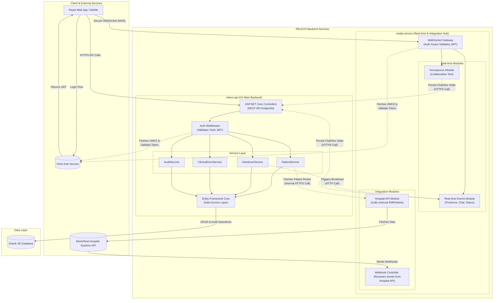

# **RELEVO Backend Architecture**

This document outlines the complete backend architecture for RELEVO, designed to support the full range of specified clinical workflow features. The system's authentication is managed externally by **Clerk** using the **OAuth 2.0** protocol.

The architecture consists of a primary **C\# Backend API** (which validates Clerk's tokens to authorize requests), a specialized **NestJS Service** for all real-time functionalities, and a **NestJS Mock Hospital API** for development.

## **System Architecture & Components**

The architecture strategically separates core business logic (C\# API) from real-time communication and third-party integrations (NestJS Service). This ensures that standard, transactional operations do not interfere with the performance of live collaboration features.

### **High-Level Architecture Diagram**



### **NX Monorepo Workspace Structure**

The monorepo organizes the system into distinct applications and shared libraries.

```
relevo-workspace/
├── apps/
│   ├── relevo-api/           # C# Backend (Main API)
│   ├── nestjs-service/       # NestJS Service (Real-time & Integrations)
│   └── hospital-mock-api/    # NestJS Mock Hospital Systems API
│
├── libs/
│   ├── shared-types/         # Shared TypeScript types for NestJS and Client
│   ├── hospital-sdk/         # SDK for interacting with Hospital APIs
│   └── shared-utils/         # Common utilities
...
```

-----

## **Service Responsibilities & Feature Mapping**

### **`relevo-api` (C\# Main Backend) - The Source of Truth**

This service is the system's core, responsible for all business logic and data persistence. It acts as the authority for clinical data and workflow states.

* **Authentication & Authorization**: Validates JWTs from Clerk on every request. It does not handle user sign-up or password management. User roles (e.g., "Physician", "Nurse") and the user's display name (`userName` or `fullName`) are managed externally within Clerk and included as custom claims within the JWT. This allows both the C# and NestJS services to access necessary user information directly from the token without extra database lookups. The C# backend reads the user's role for permission mapping, while the NestJS service uses the `userName` to enrich real-time event payloads (e.g., for chat messages).
* **Patient & Clinical Data Management (🔵)**: Manages all CRUD operations for patients, clinical notes, and patient assignments to clinicians. To populate initial patient lists for assignment, it fetches roster data via a secure, internal API call to the `nestjs-service` integration hub. This includes managing the persistence of **patient-specific discussion threads**. When persisting chat messages, the service derives the sender's `userId` from the security principal of the request and relies on the database to generate the `timestamp`, ensuring data integrity.
  * **Handover Workflow Logic (🟡)**: Governs the state of the I-PASS handover process (e.g., starting, advancing steps, completing). It handles discrete actions like setting `Illness Severity`, managing the `Action List`, and processing the final `Synthesis by Receiver`.
  * **Data Persistence & Auditing**: Acts as the **sole writer** to the **Oracle Database**. It maintains a comprehensive, immutable audit trail for every state change, crucial for HIPAA compliance. The `AuditService` uses EF Core's `ChangeTracker` to automatically generate detailed audit logs for all data modifications, capturing the before-and-after state of the data. To support the Handover History feature, the AuditService uses a Strategy Pattern to transform raw logs into human-readable text. This transformation is handled by a background service (IHostedService) immediately after an event occurs, persisting the results into the HUMAN_READABLE_HISTORY table. As this background process is an internal data-processing task within the C# service itself, it respects the "sole writer" principle. This ensures that when a user requests the history, the data is already formatted for fast delivery.
  * **Search Functionality (🔵)**: Powers the `CommandPalette` search feature, querying across patients and clinical data using Oracle Text for efficiency.
  * **Triggering Real-time Events**: After successfully processing a state change (e.g., an updated `Action List` item), it sends a secure, server-to-server HTTP request to the `nestjs-service` to trigger a real-time broadcast to connected clients.
  * **In-Memory Caching**: Implements in-process memory caching for frequently accessed, semi-static data (e.g., hospital unit lists, shift data) to reduce database queries and improve response times for common requests like the **Daily Setup**.

---
### **`nestjs-service` (NestJS Real-time & Integration Hub)**

This service offloads all real-time and integration tasks from the main API. It authenticates WebSocket connections using JWTs from Clerk.

* **Real-time Collaboration (🔴)**:
    * **Patient-Scoped Discussions**: Implemented using **Socket.IO**. When a user connects to the chat for a specific patient, they are placed into a dedicated **Socket.IO Room** (e.g., `patient:${patientId}`). This ensures that all chat messages are broadcast only to the clinicians currently viewing that patient, providing a focused and context-specific communication channel.
    * **Collaborative Text Editing**: Hosts the **Hocuspocus server** to power the `FullscreenEditor` in collaborative mode (e.g., for `Situation Awareness`).
    * **Live Event Broadcasting**: Manages other real-time events, such as presence indicators and status updates, for the `CollaborationPanel` and `Shift Hub`.
* **Data Persistence for Real-time Events**: For persisting data from real-time interactions, the NestJS service makes secure, server-to-server HTTP calls to the main C# API. When a new chat message is received via WebSocket, the service's authenticated gateway extracts the `userName` from the user's JWT. This `userName` is then used to populate the payload for the subsequent **`POST /patients/{patientId}/messages`** request to the `relevo-api` to ensure the message is saved to the patient's permanent chat log.
* **External API Integration (🔵)**: Acts as the dedicated gateway for all communication with external hospital systems.
* **Cache Management**: Utilizes in-memory caching to reduce latency for real-time operations.

### **`hospital-mock-api` (NestJS Mock Hospital Systems)**

A development-only application that simulates real hospital EMR/EHR APIs. It provides predictable data for units, shifts, patient rosters, and clinical details, enabling parallel development of the frontend and backend.

-----

## **Detailed Technology Stack**

### **C\# Main Backend (`relevo-api`)**

  * **Runtime**: .NET 8 with ASP.NET Core
  * **Database Access**: Entity Framework Core with the **`Oracle.EntityFrameworkCore`** provider.
  * **Authentication/Authorization**: `Microsoft.AspNetCore.Authentication.JwtBearer` for validating JWTs from Clerk.
  * **API Documentation**: Swashbuckle for OpenAPI/Swagger UI.
  * **Caching**: `IMemoryCache` for built-in, in-process memory caching.

### **NestJS Service (`nestjs-service`)**

* **Runtime**: Node.js 20+ with the NestJS Framework.
* **Chat & Real-time Events**: **Socket.IO**, integrated via the **NestJS WebSockets** module (`@nestjs/websockets`).
* **Collaborative Text Editing**: **Hocuspocus Server** (`@hocuspocus/server`).
* **Authentication/Authorization**: Passport.js with a `passport-jwt` strategy.
  * **Cache Management**: **NestJS Cache Module** (`@nestjs/cache-manager`) for in-memory caching.

### **Database & Storage**

  * **Primary Database**: **Oracle Database XE**
  * **Search Capability**: **Oracle Text** for advanced, efficient text queries to support the `CommandPalette`.

### **Security & Compliance**

  * **Authentication**: Handled by **Clerk**.
  * **Transport Security**: TLS 1.3 for all HTTPS and Secure WebSockets (WSS) traffic.
  * **Authorization**: Role-Based Access Control (RBAC) enforced in the C\# backend.
  * **Data Encryption at Rest**: **Oracle Transparent Data Encryption (TDE)**.
  * **Auditing**: Immutable logging to the `AuditLogs` table is handled by the application's `AuditService` to ensure all data changes are captured for HIPAA compliance.
