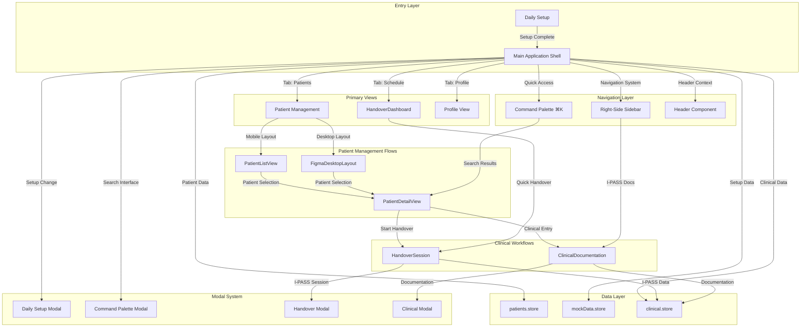

# RELEVO - Medical Handoff Platform UX Documentation

## Overview
RELEVO is a digital medical handoff platform for Hospital Garrahan that implements the I-PASS methodology for safe, standardized patient care transitions between medical professionals. This documentation outlines the complete information architecture, user flows, and interaction patterns that enable healthcare professionals to conduct secure, efficient, and collaborative patient handovers. The platform emphasizes real-time collaboration, comprehensive documentation, and seamless workflow integration while maintaining strict medical data privacy and security standards.

### **Feature Classification Key**

- **🔴 Real-time Features**: Utilizes technologies like WebSockets for live sync status, session timers, auto-save functionality, and multi-user collaboration indicators.
- **🟡 User-Driven Actions**: Standard client-side actions like form submissions, patient selections, or navigation that trigger a one-time data transaction.
- **🔵 External Data Sources**: Involves API calls to fetch data from or persist data to federated hospital services (e.g., EMR/EHR).

## 🏗️ Information Architecture

This document provides a comprehensive overview of the RELEVO application's structure, outlining the hierarchy of its features and the intricate connections between them.

### Application Hierarchy (Detailed)

This hierarchy illustrates the parent-child relationships between the core components and features of the application, from the initial user entry point to the detailed clinical workflows.

```
RELEVO Application
├── 🌎 Global Wrapper (`App.tsx`)
│   ├── State Management (React Context/Hooks)
│   └── Routing Logic (Conditional Rendering)
│
├── 🚀 Setup Phase (`DailySetup.tsx`) [🔵🟡]
│   ├── 1. Enter Clinician Info (`Input`) [🟡]
│   ├── 2. Select Unit (`unitsConfig`) [🔵]
│   ├── 3. Select Shift (`shiftsConfig`) [🔵]
│   └── 4. Assign Patients (`PatientSelectionCard`) [🔵🟡]
│
├── 🏠 Main Application Hub (`FigmaDesktopLayout`, `PatientListView`) [🔴]
│   ├── Sidebar Navigation (`AppSidebar.tsx`) [🟡]
│   ├── Dashboard View (`ContextAwareDashboard.tsx`) [🔴]
│   │   └── Real-time Shift/Patient Status Grid [🔴]
│   └── Patient Management View (`PatientListView`, `DesktopPatientView`)
│       ├── Patient List (All assigned patients) [🔵]
│       └── Patient Detail View (`PatientDetailView.tsx`) [🔵]
│           ├── View Clinical Summary
│           ├── View Action List
│           └── Initiate Handover Action [➡️ to Handover Workflow]
│
├── 🔄 Core Handover Workflow (`HandoverSession.tsx`) [🔴🔵🟡]
│   ├── Header (`Header.tsx`)
│   │   ├── Collaborator Avatars [🔴]
│   │   ├── Sync Status Indicator [🔴]
│   │   └── Focus Mode Toggle [🟡]
│   │
│   ├── Main Content Area (`MainContent.tsx`)
│   │   └── I-PASS Accordion (`Collapsible`)
│   │       ├── I - Illness Severity (`IllnessSeverity.tsx`) [🟡🔴]
│   │       ├── P - Patient Summary (`PatientSummary.tsx`) [🔵🔴]
│   │       ├── A - Action List (`ActionList.tsx`) [🟡🔴]
│   │       ├── S - Situation Awareness (`SituationAwareness.tsx`) [🟡🔴]
│   │       └── S - Synthesis by Receiver (`SynthesisByReceiver.tsx`) [🟡🔴]
│   │
│   └── Side Panels & Modals
│       ├── 💬 Collaboration Panel (`CollaborationPanel.tsx`) [🔴🔵]
│       │   ├── Discussion/Chat Tab [🔴]
│       │   └── Activity Feed Tab [🔴]
│       │
│       ├── 📖 Patient Timeline (`PatientTimeline.tsx`) [🔵🟡]
│       │
│       └── ↔️ Fullscreen Editor (`FullscreenEditor.tsx`) [🔴🔵]
│           ├── Static Mode (for Patient Summary) [🔵🟡]
│           └── Collaborative Mode (for Situation Awareness) [🔴]
│
└── 🛠️ Global Tools & Services
    ├── 🔍 Search (`CommandPalette.tsx`) [🔵🟡]
    │   ├── Keyword Filtering (Client-side) [🟡]
    │   └── Patient & Navigation Data Fetching [🔵]
    │
    ├── 🔔 Notifications System (`NotificationsView.tsx`) [🔴]
    │   ├── Real-time Alert Pushing [🔴]
    │   └── Service Alert Display [🔵]
    │
    └── 👤 Profile & Settings (`ProfileView.tsx`) [🟡]
        ├── View/Edit User Preferences
        └── View Account Information
```

### Feature Interconnection Matrix (Detailed)

This diagram visually maps the flow and dependencies between the application's main features, showing how users navigate and how data is shared across different modules.

```
graph TD
    subgraph "User Entry & Session Setup"
        A[User Opens App] --> B{Daily Setup Complete?};
        B -- No --> C[Daily Setup Workflow];
        C -- Fetches Unit/Shift/Patient Data --> S1[EMR/EHR Service 🔵];
        C -- Saves Session Config --> S3[Local State 🟡];
        B -- Yes --> D;
        C --> D[Dashboard / Main Hub];
    end

    subgraph "Core Application Loop"
        D -- Navigates to --> E[Patient Management View];
        D -- Navigates to --> F[Handover Workflow];
        D -- Triggers --> G[Global Search];
        D -- Navigates to --> H[Profile & Settings];

        E -- Fetches Patient List --> S1;
        H -- Reads/Writes Prefs --> S3;
    end

    subgraph "Handover Workflow (`handover`)"
        F -- Loads Patient Data --> S1;
        F -- Establishes Connection --> S2[Real-time Service 🔴];

        subgraph "I-PASS Components"
            IPASS_I[I. Illness Severity]
            IPASS_P[P. Patient Summary]
            IPASS_A[A. Action List]
            IPASS_S1[S. Situation Awareness]
            IPASS_S2[S. Synthesis]
        end

        F --> IPASS_I;
        F --> IPASS_P;
        F --> IPASS_A;
        F --> IPASS_S1;
        F --> IPASS_S2;

        IPASS_I -- Sends/Receives Updates --> S2;
        IPASS_P -- Fetches History --> S1;
        IPASS_P -- Sends/Receives Edits --> S2;
        IPASS_A -- Sends/Receives Updates --> S2;
        IPASS_S1 -- Sends/Receives Edits --> S2;
        IPASS_S2 -- Sends/Receives Confirmation --> S2;

        F <--> Collab[Collaboration Panel];
        Collab -- Loads History --> S1;
        Collab -- Chat/Activity Sync --> S2;

        IPASS_P & IPASS_S1 --> Fullscreen[Fullscreen Editor];
        Fullscreen -- Auto-saves to --> S1;
        Fullscreen -- Syncs Edits via --> S2;
    end

    subgraph "Global Tools"
        G -- Fetches All Patients --> S1;
        G -- Filters via --> S3;
        Notifications[Notifications Panel] -- Receives Pushed Alerts --> S2;
    end

    %% Final connection to show handover completion updating the dashboard
    F -- Updates Status --> D;
```

### Detailed Architecture Description

### 1\. **Setup Phase (`daily-setup`)**

- **Purpose**: The mandatory entry point for any clinician starting their shift. It configures the user's session by gathering necessary credentials and patient assignments.
- **Data Flow**:
    - Initiates API calls (🔵) to fetch foundational hospital data, including lists of medical units, shift times, and available patients.
    - Captures user input (🟡) for clinician name, credentials, and patient selection. This is a series of standard form submissions.
- **Key Components**: `DailySetup.tsx`, `PatientSelectionCard.tsx`.

### 2\. **Main Application Hub (`dashboard`)**

- **Purpose**: The central navigation and status hub for the clinician's shift. It provides a real-time overview of assigned patients and their handover status.
- **Data Flow**:
    - Maintains a live connection to a real-time service (🔴) to display up-to-the-minute handover statuses for each patient.
    - Serves as the primary navigation point to all other core features.
- **Key Components**: `ContextAwareDashboard.tsx`, `AppSidebar.tsx`, `PatientListView.tsx`.

### 3\. **Core Handover Workflow (`handover`)**

- **Purpose**: The application's cornerstone feature for conducting structured I-PASS handovers. It is a stateful, collaborative environment.
- **Data Flow**:
    - Fetches detailed patient data from the EMR (🔵) to populate sections like the `Patient Summary`.
    - Relies heavily on a real-time service (🔴) to sync all user inputs across the I-PASS sections, from `Illness Severity` selections to the final `Synthesis by Receiver`.
    - User actions like setting severity or checking off tasks (🟡) trigger the real-time synchronization.
- **Key Components**: `HandoverSession.tsx`, `IllnessSeverity.tsx`, `PatientSummary.tsx`, `ActionList.tsx`, `SituationAwareness.tsx`, `SynthesisByReceiver.tsx`.

### 4. **Auxiliary Handover Features**

These features are nested within the `handover` workflow to enhance the user experience.

- **`CollaborationPanel` (🔴🔵)**: A sidebar for real-time chat and an activity feed. It loads initial comment history (🔵) and then receives live messages and presence updates (🔴). State clearly that the "Discussion" tab now displays the persistent chat thread for the currently selected patient, not for the handover session.
- **`PatientTimeline` (🔵🟡)**: A new key feature that replaces the static `HandoverHistory` view. This component is an **interactive timeline** that displays a summary of all past and current handover sessions for a patient. It is populated by an initial API call (`GET /patients/{patientId}/handovers`). When a user clicks on a past handover (🟡), it triggers another API call (`GET /handovers/{handoverId}`) to load the complete, read-only state of that historical session into the main content area.
- **`FullscreenEditor` (🔴🔵)**: A context-aware modal for focused editing. It operates in a static mode (fetching and saving via single actions 🔵🟡) for sections like `Patient Summary` and a real-time collaborative mode (auto-saving and syncing 🔴) for `Situation Awareness`.
- **`Focus Mode` (🟡)**: A purely client-side UI feature that toggles the visibility of non-essential elements to reduce cognitive load. It does not interact with any external data sources or real-time services.

### 5\. **Global Tools**

These are features accessible from multiple points within the application.

- **`CommandPalette` / `search` (🔵🟡)**: A high-efficiency search tool for quick navigation and actions. It fetches a comprehensive list of patients and navigation links (🔵) and performs filtering on the client-side (🟡) for a responsive experience.
- **`Notifications` (🔴)**: An inbox for real-time alerts, such as new lab results or urgent messages, pushed to the user from a central service.

### Feature Interconnection Matrix

