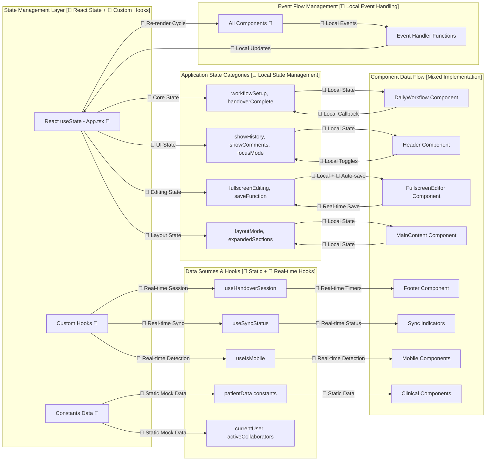
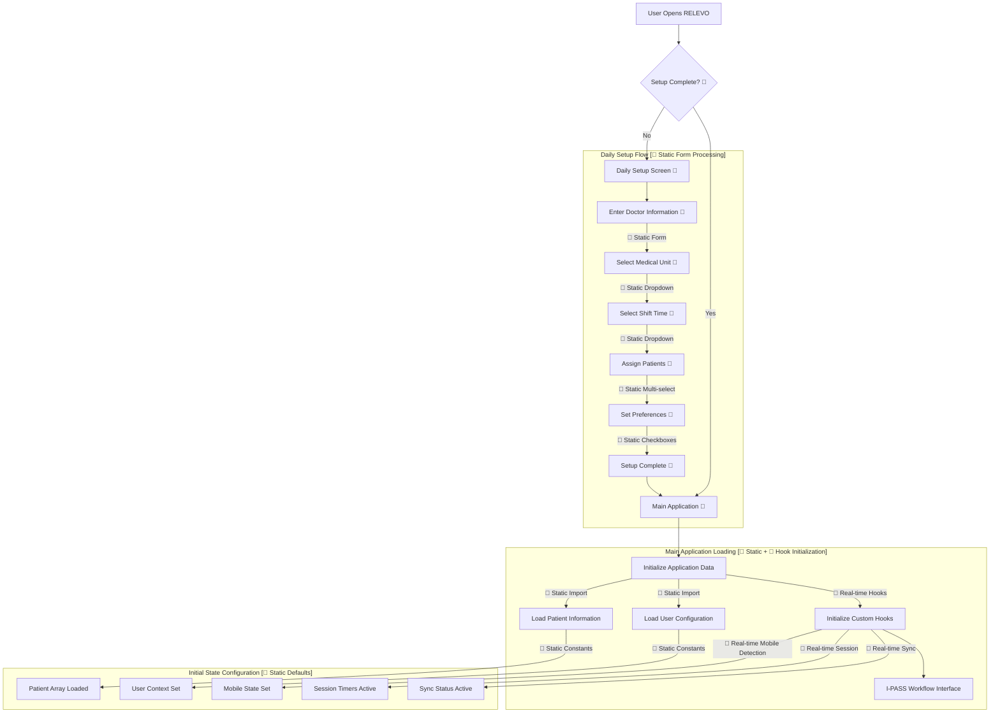
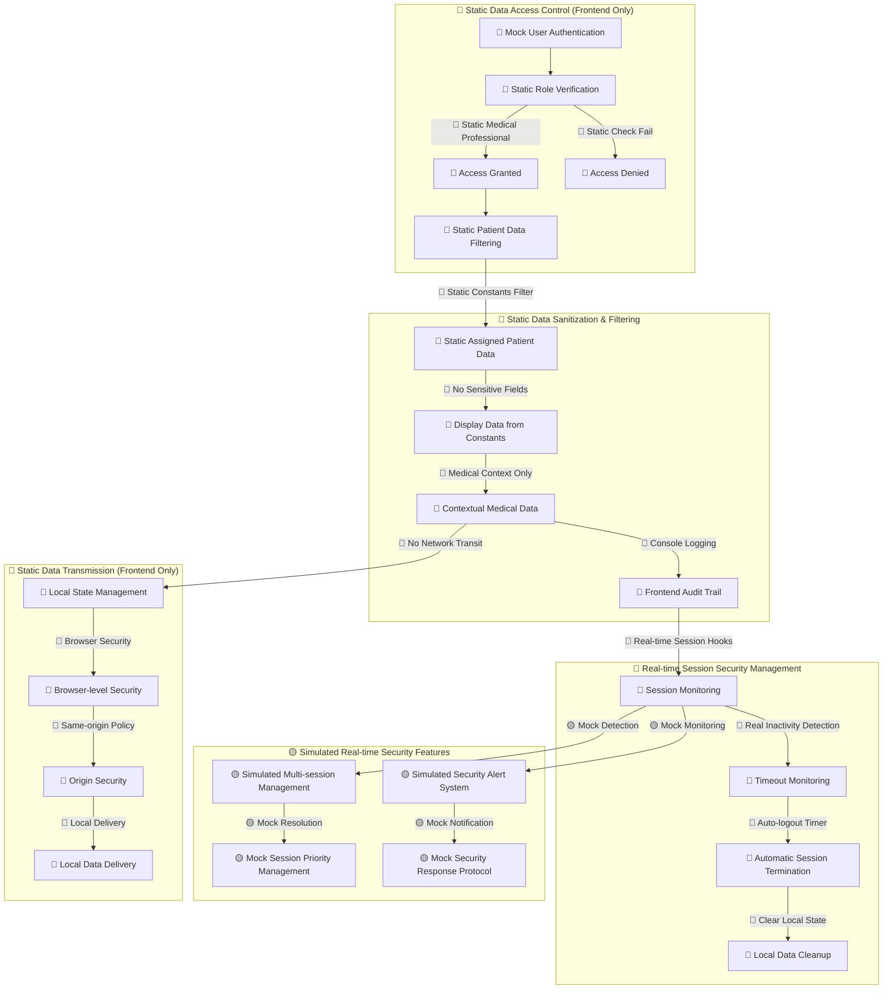
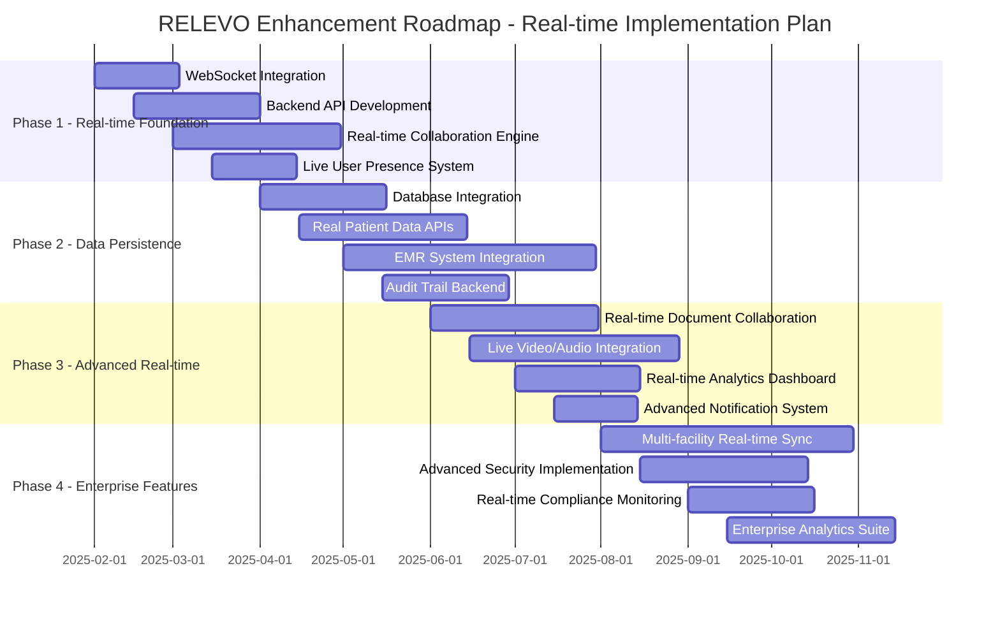
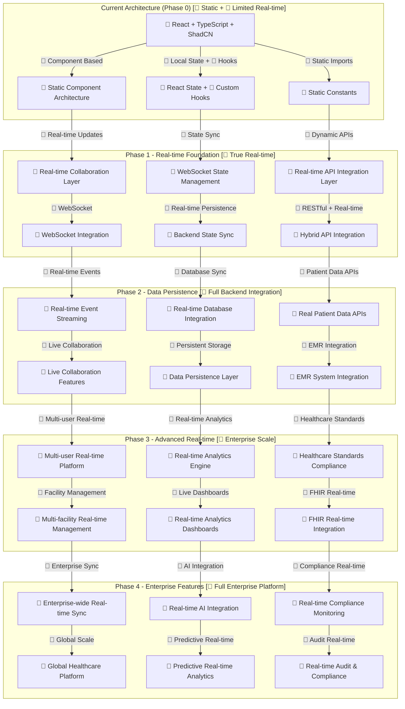
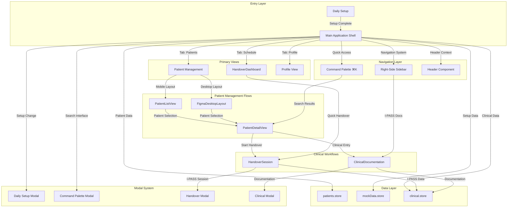

```mermaid
flowchart TD
    subgraph "Unit Tests - Component Level [🔵 Static + 🔴 Hook Testing]"
        COMPONENT_TESTS[Component Tests] --> |🔵 Props Testing| PROPS_TESTS[Props Validation Tests]
        COMPONENT_TESTS --> |🔵 Local State Testing| STATE_TESTS[State Management Tests]
        COMPONENT_TESTS --> |🔵 Event Testing| EVENT_TESTS[Event Handler Tests]
        COMPONENT_TESTS --> |🔵 Render Testing| RENDER_TESTS[Rendering Logic Tests]
        COMPONENT_TESTS --> |🔴 Hook Testing| HOOK_TESTS[Custom Hook Tests]
        
        PROPS_TESTS --> DAILY_WORKFLOW_PROPS[🔵 DailyWorkflow Props Tests]
        PROPS_TESTS --> HEADER_PROPS[🔵 Header Props Tests]
        PROPS_TESTS --> MAINCONTENT_PROPS[🔵 MainContent Props Tests]
        
        STATE_TESTS --> APP_STATE_TESTS[🔵 App.tsx Local State Tests]
        STATE_TESTS --> COMPONENT_STATE_TESTS[🔵 Component State Tests]
        
        EVENT_TESTS --> HANDLER_TESTS[🔵 Event Handler Tests]
        EVENT_TESTS --> CALLBACK_TESTS[🔵 Callback Function Tests]
        
        HOOK_TESTS --> MOBILE_HOOK_TESTS[🔴 useIsMobile Tests]
        HOOK_TESTS --> SESSION_HOOK_TESTS[🔴 useHandoverSession Tests]
        HOOK_TESTS --> SYNC_HOOK_TESTS[🔴 useSyncStatus Tests]
    end
    
    subgraph "Integration Tests - Feature Level [Mixed Implementation]"
        INTEGRATION_TESTS[Integration Tests] --> |🔵 Static Workflows| WORKFLOW_TESTS[User Workflow Tests]
        INTEGRATION_TESTS --> |🔵 Component Interaction| INTERACTION_TESTS[Component Interaction Tests]
        INTEGRATION_TESTS --> |🔵 Local Data Flow| DATA_FLOW_TESTS[Data Flow Tests]
        INTEGRATION_TESTS --> |🟡 Mock Collaboration| COLLAB_TESTS[Collaboration Tests]
        
        WORKFLOW_TESTS --> SETUP_INTEGRATION[🔵 Setup Flow Integration]
        WORKFLOW_TESTS --> IPASS_INTEGRATION[🔵 I-PASS Flow Integration]
        WORKFLOW_TESTS --> COLLAB_INTEGRATION[🟡 Mock Collaboration Flow Integration]
        
        INTERACTION_TESTS --> MODAL_INTEGRATION[🔵 Modal System Integration]
        INTERACTION_TESTS --> RESPONSIVE_INTEGRATION[🔴 Responsive Behavior Integration]
        
        DATA_FLOW_TESTS --> STATE_INTEGRATION[🔵 Local State Flow Integration]
        DATA_FLOW_TESTS --> PROPS_INTEGRATION[🔵 Props Flow Integration]
        
        COLLAB_TESTS --> MOCK_ACTIVITY_TESTS[🟡 Mock Activity Feed Tests]
        COLLAB_TESTS --> SIMULATED_REALTIME_TESTS[🟡 Simulated Real-time Tests]
    end
    
    subgraph "End-to-End Tests - Complete Scenarios [Mixed Features]"
        E2E_TESTS[End-to-End Tests] --> |🔵 Complete Static Journeys| JOURNEY_E2E[Complete Journey Tests]
        E2E_TESTS --> |🔵 Cross-browser Testing| BROWSER_E2E[Cross-browser Compatibility]
        E2E_TESTS --> |🔴 Performance Testing| PERFORMANCE_E2E[Performance E2E Tests]
        
        JOURNEY_E2E --> DOCTOR_WORKFLOW_E2E[🔵 Complete Doctor Workflow]
        JOURNEY_E2E --> HANDOVER_SESSION_E2E[🔵 Complete Handover Session]
        JOURNEY_E2E --> MOBILE_WORKFLOW_E2E[🔴 Complete Mobile Workflow]
        
        BROWSER_E2E --> CHROME_TESTS[🔵 Chrome Browser Tests]
        BROWSER_E2E --> FIREFOX_TESTS[🔵 Firefox Browser Tests]
        BROWSER_E2E --> SAFARI_TESTS[🔵 Safari Browser Tests]
        
        PERFORMANCE_E2E --> LOAD_TIME_TESTS[🔵 Load Time Tests]
        PERFORMANCE_E2E --> INTERACTION_PERF[🔵 Interaction Performance]
        PERFORMANCE_E2E --> MEMORY_USAGE[🔵 Memory Usage Tests]
    end
    
    subgraph "🔴 Real-time Feature Testing"
        REALTIME_TESTS[Real-time Feature Tests] --> HOOK_REALTIME[🔴 Custom Hook Real-time Tests]
        REALTIME_TESTS --> AUTOSAVE_TESTS[🔴 Auto-save Functionality Tests]
        REALTIME_TESTS --> RESPONSIVE_TESTS[🔴 Real-time Responsive Tests]
        
        HOOK_REALTIME --> MOBILE_DETECTION_TESTS[🔴 Mobile Detection Tests]
        HOOK_REALTIME --> SESSION_TIMER_TESTS[🔴 Session Timer Tests]
        HOOK_REALTIME --> SYNC_STATUS_TESTS[🔴 Sync Status Tests]
    end
    
    subgraph "🟡 Mock/Simulated Feature Testing"
        MOCK_TESTS[Mock Feature Tests] --> COLLABORATION_MOCK[🟡 Mock Collaboration Tests]
        MOCK_TESTS --> ACTIVITY_MOCK[🟡 Mock Activity Feed Tests]
        MOCK_TESTS --> PRESENCE_MOCK[🟡 Mock Presence Tests]
        
        COLLABORATION_MOCK --> MOCK_DISCUSSION_TESTS[🟡 Mock Discussion Thread Tests]
        ACTIVITY_MOCK --> MOCK_NOTIFICATION_TESTS[🟡 Mock Notification Tests]
        PRESENCE_MOCK --> MOCK_INDICATOR_TESTS[🟡 Mock Presence Indicator Tests]
    end
```

# RELEVO - Medical Handoff Platform UX Documentation

## Overview
RELEVO is a digital medical handoff platform for Hospital Garrahan that implements the I-PASS methodology for safe, standardized patient care transitions between medical professionals. This documentation outlines the complete information architecture, user flows, and interaction patterns that enable healthcare professionals to conduct secure, efficient, and collaborative patient handovers. The platform emphasizes real-time collaboration, comprehensive documentation, and seamless workflow integration while maintaining strict medical data privacy and security standards.

**⚡ Real-time vs Static Feature Classification:**
- **🔴 Real-time Features**: Live sync status, session timers, auto-save functionality, collaboration indicators
- **🟡 Simulated Real-time**: Collaboration panel updates, activity feeds (using mock data with real-time animations)
- **🔵 Static Features**: Patient data, user information, I-PASS content (stored in constants)

## 🏗️ Information Architecture

### Application Hierarchy

```
RELEVO Application
├── 📋 Setup Phase (Entry Point) [🔵 Static]
│   ├── Daily Setup Configuration [🔵 Static Form]
│   ├── Patient Assignment Interface [🔵 Static Patient List]
│   ├── Shift Management System [🔵 Static Configuration]
│   └── Workflow Initialization [🔵 Local State]
├── 📊 Main Application Shell
│   ├── 🏥 I-PASS Clinical Workflow [🔵 Static Content with 🔴 Real-time Sync]
│   │   ├── Illness Severity Assessment [🔵 Static + 🔴 Auto-save]
│   │   ├── Patient Summary Documentation [🔵 Static + 🔴 Auto-save]
│   │   ├── Action List Management [🔵 Static + 🔴 Auto-save]
│   │   ├── Situation Awareness Monitoring [🔵 Static + 🔴 Auto-save]
│   │   └── Synthesis by Receiver Confirmation [🔵 Static + 🔴 Auto-save]
│   ├── 👥 Collaboration System [🟡 Simulated Real-time]
│   │   ├── Real-time Comments & Discussion [🟡 Mock Data with Animations]
│   │   ├── Activity Feed & Notifications [🟡 Mock Activity with Timestamps]
│   │   ├── Multi-user Presence Indicators [🟡 Static Collaborator List]
│   │   └── Historical Handover Records [🔵 Static Mock Data]
│   ├── 📱 Responsive Interface [🔵 Static Responsive Design]
│   │   ├── Mobile-first Design System [🔵 CSS/Tailwind Based]
│   │   ├── Desktop Enhanced Features [🔵 Layout State Management]
│   │   ├── Touch-optimized Controls [🔵 Static UI Components]
│   │   └── Adaptive Layout Engine [🔴 Real-time useIsMobile Hook]
│   └── 🔐 Security & Privacy Layer [🔵 Frontend Implementation Only]
│       ├── Medical Data Protection (HIPAA) [🔵 Client-side Patterns]
│       ├── User Authentication & Authorization [🔵 Mock User Data]
│       ├── Audit Trail & Compliance [🔵 Console Logging]
│       └── Session Management [🔴 Real-time Session Hooks]
└── 🎛️ Advanced Features
    ├── 📝 Fullscreen Documentation Editor [🔵 Local State + 🔴 Auto-save]
    ├── 🔍 Focus Mode for Distraction-free Work [🔵 Local UI State]
    ├── 💾 Auto-save & Sync Status Management [🔴 Real-time useSyncStatus Hook]
    └── ⌨️ Keyboard Shortcuts & Accessibility [🔵 Static Event Handlers]
```

## 🗺️ COMPREHENSIVE FEATURE RELATIONSHIP MAP

### Feature Interconnection Matrix

```mermaid
graph TB
    subgraph "Entry Layer [🔵 Static]"
        DS[Daily Setup] --> |Setup Complete| MAIN[Main Application Shell]
    end
    
    subgraph "Navigation Layer [🔵 Static + 🔴 Real-time Responsive]"
        MAIN --> |Header Navigation| HEADER[Header Component]
        MAIN --> |Mobile Navigation [🔴 Real-time isMobile]| MOBILE[Mobile Menu System]
        MAIN --> |Focus Controls [🔵 Local State]| FOCUS[Focus Mode Manager]
    end
    
    subgraph "I-PASS Clinical Workflow [🔵 Static Content + 🔴 Real-time Sync]"
        MAIN --> |Medical Documentation| ILLNESS[Illness Severity]
        ILLNESS --> |Clinical Flow| PATIENT[Patient Summary]
        PATIENT --> |Care Planning| ACTIONS[Action List]
        ACTIONS --> |Monitoring| SITUATION[Situation Awareness]
        SITUATION --> |Handover Completion| SYNTHESIS[Synthesis by Receiver]
    end
    
    subgraph "Collaboration System [🟡 Simulated Real-time]"
        ILLNESS --> |🟡 Mock Updates| COLLAB[Collaboration Panel]
        PATIENT --> |🟡 Mock Discussions| COLLAB
        ACTIONS --> |🟡 Mock Comments| COLLAB
        SITUATION --> |🟡 Mock Status Updates| COLLAB
        SYNTHESIS --> |🟡 Mock Confirmations| COLLAB
        COLLAB --> |🟡 Mock Activity Feed| ACTIVITY[Activity Notifications]
        COLLAB --> |🔵 Static Mock Data| HISTORY[Handover History]
    end
    
    subgraph "Enhanced Features [🔵 Local + 🔴 Real-time Sync]"
        PATIENT --> |🔵 Local Editor + 🔴 Auto-save| FULLSCREEN[Fullscreen Editor]
        SITUATION --> |🔵 Local Editor + 🔴 Auto-save| FULLSCREEN
        MAIN --> |🔵 Local UI State| FOCUS
        FOCUS --> |🔵 Static Filter| SECTIONS[I-PASS Sections]
    end
    
    subgraph "Data Management Layer [🔵 Static + 🔴 Real-time Hooks]"
        MAIN --> |🔵 Static Constants| PSTORE[Patient Data Store]
        MAIN --> |🔵 Static Constants| USTORE[User Data Store]
        MAIN --> |🔴 Real-time Hooks| SSTORE[Session Store]
        COLLAB --> |🔴 Real-time Hook| SYNC[Sync Management]
        FULLSCREEN --> |🔴 Real-time Auto-save| SYNC
    end
    
    subgraph "Mobile Adaptation [🔵 Static + 🔴 Real-time Detection]"
        MOBILE --> |🔵 Static CSS/Tailwind| TOUCH[Touch Optimizations]
        MOBILE --> |🔴 Real-time useIsMobile| RESPONSIVE[Layout Manager]
        MOBILE --> |🔵 Local State| MMENUS[Mobile Menu Components]
    end
```

### Data Flow Architecture Map



## 🎯 DETAILED USER FLOW MAPPING

### 1. Complete Application Entry Flow



**Data Requirements:**
- **🔵 Static Form Data**: Doctor information, unit selection, shift configuration
- **🔵 Static Patient Data**: Pre-loaded from `data/constants.ts`
- **🔴 Real-time Detection**: Mobile/desktop viewport detection via `useIsMobile()`
- **🔴 Real-time Session**: Timer initialization via `useHandoverSession()`

**State Dependencies:**
- **🔵 Local State**: `workflowSetup` boolean controlling interface access
- **🔵 Static Data**: Patient and user data from constants
- **🔴 Real-time Hooks**: Mobile detection, session timers, sync status

### 2. I-PASS Clinical Workflow Navigation

```mermaid
flowchart TD
    subgraph "I-PASS Section Flow [🔵 Static Content + 🔴 Real-time Sync]"
        START_WORKFLOW[Start I-PASS Workflow 🔵] 
        START_WORKFLOW --> ILLNESS[Illness Severity Assessment 🔵]
        
        ILLNESS --> |🔵 Local Selection + 🔴 Auto-save| ILLNESS_COMPLETE{Complete?}
        ILLNESS_COMPLETE -->|Yes| PATIENT[Patient Summary 🔵]
        ILLNESS_COMPLETE -->|No| ILLNESS_EDIT[Continue Editing 🔵]
        ILLNESS_EDIT --> ILLNESS
        
        PATIENT --> |🔵 Static Form + 🔴 Auto-save| PATIENT_COMPLETE{Complete?}
        PATIENT_COMPLETE -->|Yes| ACTIONS[Action List 🔵]
        PATIENT_COMPLETE -->|Needs Fullscreen| PATIENT_FULLSCREEN[Fullscreen Editor 🔵+🔴]
        PATIENT_FULLSCREEN --> |🔴 Auto-save & Exit| ACTIONS
        
        ACTIONS --> |🔵 Static Tasks + 🔴 Auto-save| ACTIONS_COMPLETE{Complete?}
        ACTIONS_COMPLETE -->|Yes| SITUATION[Situation Awareness 🔵]
        ACTIONS_COMPLETE -->|No| ACTIONS_EDIT[Add/Edit Tasks 🔵]
        ACTIONS_EDIT --> ACTIONS
        
        SITUATION --> |🔵 Static Form + 🔴 Auto-save| SITUATION_COMPLETE{Complete?}
        SITUATION_COMPLETE -->|Yes| SYNTHESIS[Synthesis by Receiver 🔵]
        SITUATION_COMPLETE -->|Needs Fullscreen| SITUATION_FULLSCREEN[Fullscreen Editor 🔵+🔴]
        SITUATION_FULLSCREEN --> |🔴 Auto-save & Exit| SYNTHESIS
        
        SYNTHESIS --> |🔵 Static Checklist| HANDOVER_COMPLETE[Handover Complete 🔵]
        HANDOVER_COMPLETE --> |🔵 Local State Update| END_FLOW[End Workflow]
    end
    
    subgraph "Non-linear Navigation [🔵 Local State Management]"
        ANY_SECTION[Any I-PASS Section 🔵] --> |🔵 toggleSection()| ACCORDION[Accordion Navigation]
        ACCORDION --> |🔵 Local State| TARGET_SECTION[Target Section]
        
        COLLAB_PANEL[Collaboration Panel 🟡] --> |🔵 Local Navigation| DIRECT_NAV[Direct Section Navigation]
        DIRECT_NAV --> TARGET_SECTION
        
        FOCUS_MODE[Focus Mode 🔵] --> |🔵 UI Filter| FOCUSED_SECTION[Focused Section View]
        FOCUSED_SECTION --> |🔵 Escape Key Handler| FULL_VIEW[Full Interface View]
    end
```

**Data Requirements:**
- **🔵 Static I-PASS Content**: Medical forms and checklists
- **🔴 Real-time Auto-save**: Continuous saving via `useSyncStatus` hook
- **🟡 Mock Collaboration**: Simulated discussion threads and activity

**State Dependencies:**
- **🔵 Local State**: `expandedSections` accordion management
- **🔵 Local State**: `focusMode` single-section display
- **🔴 Real-time State**: `syncStatus` for save operations

### 3. Real-time vs Simulated Collaboration Flow

```mermaid
flowchart TD
    subgraph "Collaboration Entry Points [🔵 Local UI State]"
        SECTION_DISCUSS[Section Discussion Button 🔵] --> OPEN_COLLAB[Open Collaboration Panel]
        HEADER_COLLAB[Header Collaboration Toggle 🔵] --> OPEN_COLLAB
        MOBILE_COLLAB[Mobile Collaboration Menu 🔵] --> OPEN_COLLAB
    end
    
    subgraph "🟡 Simulated Collaboration Features"
        OPEN_COLLAB --> |🔵 setShowComments(true)| COLLAB_PANEL[Collaboration Panel Active]
        
        COLLAB_PANEL --> ACTIVITY_FEED[🟡 Mock Activity Feed Display]
        COLLAB_PANEL --> DISCUSSION_THREADS[🟡 Mock Discussion Threads]
        COLLAB_PANEL --> SECTION_NAV[🔵 Local Section Navigation]
        COLLAB_PANEL --> PRESENCE[🟡 Mock User Presence Indicators]
        
        ACTIVITY_FEED --> |🟡 Simulated Updates| NOTIFICATIONS[🟡 Mock Activity Notifications]
        DISCUSSION_THREADS --> |🟡 Static Mock Data| CONTEXTUAL_CHAT[🟡 Mock Comments]
        SECTION_NAV --> |🔵 handleNavigateToSection()| SECTION_JUMP[Jump to I-PASS Section]
        PRESENCE --> |🟡 Static Collaborator List| REALTIME_INDICATORS[🟡 Mock Real-time Indicators]
    end
    
    subgraph "Mobile Collaboration Adaptation [🔵 Static Responsive]"
        MOBILE_COLLAB --> MOBILE_OVERLAY[Mobile Collaboration Overlay 🔵]
        MOBILE_OVERLAY --> |🔵 Touch Optimized CSS| MOBILE_DISCUSSION[Mobile Discussion Interface]
        MOBILE_OVERLAY --> |🔵 Simplified Local Nav| MOBILE_NAV[Mobile Section Navigation]
    end
    
    subgraph "🔴 Real Collaboration State Management"
        COLLAB_PANEL --> |🔵 Local User Actions| COLLAB_EVENTS[Collaboration Events]
        COLLAB_EVENTS --> |🟡 Mock Comment Creation| COMMENT_STATE[Comment State Updates]
        COLLAB_EVENTS --> |🟡 Mock Activity Tracking| ACTIVITY_STATE[Activity State Updates]
        COLLAB_EVENTS --> |🟡 Mock Presence Updates| PRESENCE_STATE[Presence State Updates]
        
        COMMENT_STATE --> |🔴 Real Auto-sync| SYNC_STATUS[Sync Status Updates]
        ACTIVITY_STATE --> |🟡 Mock Feed Updates| ACTIVITY_REFRESH[Activity Feed Refresh]
        PRESENCE_STATE --> |🟡 Mock Indicators| PRESENCE_REFRESH[Presence Indicator Updates]
    end
```

**🟡 Currently Simulated (Mock Data):**
- Activity feed updates and notifications
- User presence indicators and live collaboration
- Discussion threads and comments
- Real-time collaboration animations

**🔴 Actually Real-time:**
- Auto-save and sync status indicators
- Session timing and duration tracking
- Mobile/desktop viewport detection

### 4. Fullscreen Editing Flow

```mermaid
flowchart TD
    subgraph "Fullscreen Entry Points [🔵 Local State Triggers]"
        PATIENT_EDIT[Patient Summary Edit Button 🔵] --> |🔵 handleOpenFullscreenEdit()| FULLSCREEN_PATIENT[Fullscreen Patient Editor]
        SITUATION_EDIT[Situation Awareness Edit Button 🔵] --> |🔵 handleOpenFullscreenEdit()| FULLSCREEN_SITUATION[Fullscreen Situation Editor]
    end
    
    subgraph "Fullscreen Interface [🔵 Local + 🔴 Real-time Save]"
        FULLSCREEN_PATIENT --> EDITOR_INTERFACE[Fullscreen Editor Interface 🔵]
        FULLSCREEN_SITUATION --> EDITOR_INTERFACE
        
        EDITOR_INTERFACE --> EDITOR_HEADER[Editor Header 🔵]
        EDITOR_INTERFACE --> EDITOR_CONTENT[Dedicated Editing Area 🔵]
        EDITOR_INTERFACE --> EDITOR_SIDEBAR[Editor Tools 🔵]
        
        EDITOR_HEADER --> SAVE_BUTTON[Save Button 🔵]
        EDITOR_HEADER --> CANCEL_BUTTON[Cancel Button 🔵]
        EDITOR_HEADER --> DISCUSS_BUTTON[Discussion Button 🔵]
    end
    
    subgraph "🔴 Real-time Fullscreen Operations"
        EDITOR_CONTENT --> |🔴 Real Auto-save Timer| AUTO_SAVE[Auto-save Functionality]
        EDITOR_CONTENT --> |🔵 handleSaveReady()| SAVE_READY[Save Function Ready]
        
        SAVE_BUTTON --> |🔵 handleFullscreenSave()| EXECUTE_SAVE[Execute Save Operation]
        CANCEL_BUTTON --> |🔵 handleCloseFullscreenEdit()| CLOSE_EDITOR[Close Fullscreen Editor]
        DISCUSS_BUTTON --> |🔵 handleOpenDiscussion()| OPEN_DISCUSSION[Open Discussion Panel]
        
        AUTO_SAVE --> |🔴 Real setSyncStatus()| SYNC_UPDATE[Sync Status Update]
        EXECUTE_SAVE --> |🔴 Real currentSaveFunction()| SAVE_COMPLETE[Save Complete]
        SAVE_COMPLETE --> CLOSE_EDITOR
    end
    
    subgraph "State Management [🔵 Local State Priority Override]"
        FULLSCREEN_PATIENT --> |🔵 setFullscreenEditing()| FULLSCREEN_STATE[Fullscreen State Active]
        FULLSCREEN_SITUATION --> FULLSCREEN_STATE
        
        FULLSCREEN_STATE --> |🔵 fullscreenEditing object| EDITOR_CONFIG[Editor Configuration]
        FULLSCREEN_STATE --> |🔵 Conditional Render Priority| OVERRIDE_RENDER[Override Main Interface]
        
        CLOSE_EDITOR --> |🔵 setFullscreenEditing(null)| RESTORE_MAIN[Restore Main Interface]
        RESTORE_MAIN --> |🔵 Return to Local State| SECTION_VIEW[Section View Restored]
    end
```

**🔴 Real-time Features:**
- Auto-save timer functionality with actual persistence simulation
- Sync status updates during save operations
- Save function execution and completion tracking

**🔵 Static/Local Features:**
- Fullscreen editor interface and controls
- Modal state management and priority rendering
- Keyboard event handling (Escape key)

### 5. Focus Mode Flow

```mermaid
flowchart TD
    subgraph "Focus Mode Activation [🔵 Local UI State]"
        HEADER_FOCUS[Header Focus Toggle 🔵] --> |🔵 setFocusMode(true)| FOCUS_ACTIVE[Focus Mode Active]
        KEYBOARD_FOCUS[Keyboard Shortcut 🔵] --> FOCUS_ACTIVE
        MOBILE_FOCUS[Mobile Focus Option 🔵] --> FOCUS_ACTIVE
    end
    
    subgraph "Focus Mode Interface [🔵 Static UI State Filter]"
        FOCUS_ACTIVE --> SIMPLIFIED_HEADER[Simplified Header 🔵]
        FOCUS_ACTIVE --> HIDE_SIDEBARS[Hide Collaboration Sidebars 🔵]
        FOCUS_ACTIVE --> SINGLE_COLUMN[Single Column Layout 🔵]
        FOCUS_ACTIVE --> REDUCED_DISTRACTIONS[Reduced Interface Elements 🔵]
        
        SIMPLIFIED_HEADER --> ESSENTIAL_CONTROLS[Essential Controls Only 🔵]
        HIDE_SIDEBARS --> |🔵 Local State showComments=false| SIDEBAR_HIDDEN[Sidebars Hidden]
        SINGLE_COLUMN --> |🔵 Local layoutMode override| COLUMN_LAYOUT[Single Column Display]
    end
    
    subgraph "Focus Mode Navigation [🔵 Local State Filtering]"
        FOCUS_ACTIVE --> EXPANDED_SECTIONS[Current Expanded Sections 🔵]
        EXPANDED_SECTIONS --> |🔵 Static Filter Logic| VISIBLE_SECTIONS[Only Expanded Sections Visible]
        VISIBLE_SECTIONS --> SECTION_FOCUS[Focused Section Interaction 🔵]
        
        SECTION_FOCUS --> |🔵 toggleSection()| SECTION_TOGGLE[Section Toggle in Focus]
        SECTION_TOGGLE --> |🔵 Local State Update| FOCUS_UPDATE[Focus View Update]
    end
    
    subgraph "Focus Mode Exit [🔵 Local Event Handling]"
        FOCUS_ACTIVE --> |🔵 Escape Key Handler| KEYBOARD_EXIT[Keyboard Exit]
        FOCUS_ACTIVE --> |🔵 Header Toggle Click| MANUAL_EXIT[Manual Exit]
        FOCUS_ACTIVE --> |🔵 Mobile Back Action| MOBILE_EXIT[Mobile Exit]
        
        KEYBOARD_EXIT --> |🔵 setFocusMode(false)| RESTORE_INTERFACE[Restore Full Interface]
        MANUAL_EXIT --> RESTORE_INTERFACE
        MOBILE_EXIT --> RESTORE_INTERFACE
        
        RESTORE_INTERFACE --> |🔵 Show All Elements| FULL_INTERFACE[Full Interface Restored]
        RESTORE_INTERFACE --> |🔵 Restore Local State| SIDEBAR_RESTORE[Sidebar State Restored]
    end
```

**🔵 Completely Local/Static:**
- All focus mode functionality is local UI state management
- No real-time synchronization or server communication
- Pure client-side interface simplification

### 6. Mobile Responsive Flow

```mermaid
flowchart TD
    subgraph "🔴 Real-time Mobile Detection & Adaptation"
        APP_LOAD[App Load] --> |🔴 useIsMobile() Hook| MOBILE_CHECK[Real-time Mobile Detection]
        MOBILE_CHECK --> |🔴 isMobile: true| MOBILE_LAYOUT[Mobile Layout Active]
        MOBILE_CHECK --> |🔴 isMobile: false| DESKTOP_LAYOUT[Desktop Layout Active]
    end
    
    subgraph "Mobile Interface Adaptation [🔵 Static + 🔴 Detection]"
        MOBILE_LAYOUT --> MOBILE_HEADER[Mobile-optimized Header 🔵]
        MOBILE_LAYOUT --> MOBILE_MENU[Mobile Menu System 🔵]
        MOBILE_LAYOUT --> SINGLE_COLUMN[Single Column Layout 🔵]
        MOBILE_LAYOUT --> TOUCH_TARGETS[Touch-optimized Controls 🔵]
        
        MOBILE_HEADER --> HAMBURGER_MENU[Hamburger Menu Button 🔵]
        MOBILE_MENU --> |🔵 setShowMobileMenu(true)| MOBILE_NAV[Mobile Navigation Panel]
        SINGLE_COLUMN --> |🔵 Force Single Column CSS| MOBILE_SECTIONS[Mobile Section Display]
        TOUCH_TARGETS --> |🔵 Static 44px+ Touch Targets| ACCESSIBLE_CONTROLS[Accessible Touch Controls]
    end
    
    subgraph "Mobile Menu System [🔵 Local State Management]"
        MOBILE_NAV --> MENU_OPTIONS[Mobile Menu Options 🔵]
        MENU_OPTIONS --> COLLABORATION_MOBILE[Mobile Collaboration Access 🔵]
        MENU_OPTIONS --> HISTORY_MOBILE[Mobile History Access 🔵]
        MENU_OPTIONS --> FOCUS_MOBILE[Mobile Focus Mode 🔵]
        MENU_OPTIONS --> SETTINGS_MOBILE[Mobile Settings 🔵]
        
        COLLABORATION_MOBILE --> |🔵 Mobile Overlay State| MOBILE_COLLAB_PANEL[Mobile Collaboration Panel]
        HISTORY_MOBILE --> |🔵 Mobile Overlay State| MOBILE_HISTORY_PANEL[Mobile History Panel]
    end
    
    subgraph "Mobile Gestures & Interactions [🔵 Static Event Handling]"
        MOBILE_SECTIONS --> TOUCH_SCROLL[Touch Scrolling 🔵]
        MOBILE_SECTIONS --> TAP_EXPAND[Tap to Expand Sections 🔵]
        MOBILE_SECTIONS --> SWIPE_NAV[Swipe Navigation 🔵]
        
        TOUCH_SCROLL --> |🔵 CSS Scroll Behavior| SMOOTH_SCROLL[Smooth Scroll Areas]
        TAP_EXPAND --> |🔵 toggleSection()| MOBILE_ACCORDION[Mobile Accordion Navigation]
        SWIPE_NAV --> |🔵 Touch Event Handlers| SWIPE_ACTIONS[Swipe Action Recognition]
    end
    
    subgraph "🔴 Real-time Mobile State Management"
        MOBILE_LAYOUT --> |🔴 Real-time Detection| MOBILE_STATE_MGMT[Mobile State Management]
        MOBILE_STATE_MGMT --> |🔵 Local showMobileMenu| MENU_STATE[Mobile Menu State]
        MOBILE_STATE_MGMT --> |🔴 Dynamic Layout Detection| LAYOUT_STATE[Mobile Layout State]
        MOBILE_STATE_MGMT --> |🔴 Conditional Feature Rendering| FEATURE_STATE[Mobile Feature State]
        
        MENU_STATE --> |🔵 setShowMobileMenu(false)| MENU_CLOSE[Close Mobile Menu]
        LAYOUT_STATE --> |🔴 Real-time layoutMode| RESPONSIVE_LAYOUT[Responsive Layout Engine]
        FEATURE_STATE --> |🔴 Dynamic Conditional Rendering| MOBILE_COMPONENTS[Mobile-specific Components]
    end
```

**🔴 Real-time Mobile Features:**
- `useIsMobile()` hook provides real-time viewport detection
- Dynamic layout switching based on screen size
- Conditional component rendering based on device type

**🔵 Static Mobile Features:**
- Touch-optimized CSS styles and layouts
- Mobile menu system with local state
- Touch event handlers and gesture recognition

## 🔄 STATE MANAGEMENT ARCHITECTURE

### Application State Flow Diagram

```mermaid
flowchart TD
    subgraph "React State Layer (App.tsx) [🔵 Local + 🔴 Hooks]"
        APP_STATE[Application State Root] --> CORE_STATE[🔵 Core Application State]
        APP_STATE --> UI_STATE[🔵 UI Management State]
        APP_STATE --> EDIT_STATE[🔵 Editing State Management]
        APP_STATE --> LAYOUT_STATE[🔵 Layout State Management]
        APP_STATE --> HOOK_STATE[🔴 Real-time Hook State]
    end
    
    subgraph "🔵 Core Application State (Local)"
        CORE_STATE --> WORKFLOW[workflowSetup: boolean]
        CORE_STATE --> HANDOVER[handoverComplete: boolean]
        
        WORKFLOW --> |🔵 Setup Control| SETUP_FLOW[Daily Setup vs Main App]
        HANDOVER --> |🔵 Completion Status| COMPLETION_FLOW[Handover Completion Flow]
    end
    
    subgraph "🔵 UI Management State (Local)"
        UI_STATE --> HISTORY[showHistory: boolean]
        UI_STATE --> COMMENTS[showComments: boolean]  
        UI_STATE --> FOCUS[focusMode: boolean]
        UI_STATE --> ACTIVITY[showActivityFeed: boolean]
        UI_STATE --> COLLABORATORS[showCollaborators: boolean]
        UI_STATE --> SHARE[showShareMenu: boolean]
        UI_STATE --> MOBILE_MENU[showMobileMenu: boolean]
        
        HISTORY --> |🔵 Left Sidebar Control| HISTORY_SIDEBAR[History Sidebar Visibility]
        COMMENTS --> |🔵 Right Sidebar Control| COLLAB_SIDEBAR[Collaboration Sidebar Visibility]
        FOCUS --> |🔵 Interface Simplification| FOCUS_INTERFACE[Focus Mode Interface]
        MOBILE_MENU --> |🔵 Mobile Navigation| MOBILE_NAV[Mobile Menu System]
    end
    
    subgraph "🔵 Editing State Management (Local + 🔴 Auto-save)"
        EDIT_STATE --> FULLSCREEN[fullscreenEditing: FullscreenEditingState | null]
        EDIT_STATE --> SAVE_FUNC[currentSaveFunction: (() => void) | null]
        
        FULLSCREEN --> |🔵 Editor Control| FULLSCREEN_EDITOR[Fullscreen Editor Component]
        SAVE_FUNC --> |🔴 Real-time Save Operations| SAVE_MANAGEMENT[Save Function Management]
    end
    
    subgraph "🔵 Layout State Management (Local)"
        LAYOUT_STATE --> LAYOUT_MODE[layoutMode: 'single' | 'columns']
        LAYOUT_STATE --> EXPANDED[expandedSections: ExpandedSections]
        
        LAYOUT_MODE --> |🔵 Display Control| LAYOUT_ENGINE[Layout Engine]
        EXPANDED --> |🔵 Accordion Control| SECTION_ACCORDION[I-PASS Section Accordion]
    end
    
    subgraph "🔴 Real-time Custom Hooks Integration"
        HOOK_STATE --> MOBILE_HOOK[useIsMobile() - Real-time Detection]
        HOOK_STATE --> SESSION_HOOK[useHandoverSession() - Real-time Timers]
        HOOK_STATE --> SYNC_HOOK[useSyncStatus() - Real-time Sync]
        
        MOBILE_HOOK --> |🔴 Dynamic Responsive| RESPONSIVE_STATE[Responsive State Management]
        SESSION_HOOK --> |🔴 Live Time Tracking| TIME_STATE[Session Time Management]
        SYNC_HOOK --> |🔴 Live Save Status| SYNC_STATE[Synchronization State]
    end
    
    subgraph "🔵 Static Data Integration"
        APP_STATE --> CONSTANTS[Constants Integration - Static]
        CONSTANTS --> CURRENT_USER[currentUser - Static Mock]
        CONSTANTS --> PATIENT_DATA[patientData - Static Mock]
        CONSTANTS --> COLLABORATORS[activeCollaborators - Static Mock]
        
        CURRENT_USER --> |🔵 Static Context| USER_CONTEXT[User Context Provider]
        PATIENT_DATA --> |🔵 Static Medical Data| PATIENT_CONTEXT[Patient Data Context]
        COLLABORATORS --> |🟡 Mock Collaboration Data| COLLAB_CONTEXT[Collaboration Context]
    end
```

### Data Flow Between Components

```mermaid
flowchart LR
    subgraph "Data Sources (App.tsx) [🔵 Static + 🔴 Real-time]"
        STATE_ROOT[App.tsx State Root] --> CORE_DATA[🔵 Core Application Data]
        STATE_ROOT --> COMPUTED_DATA[🔵 Computed State Data]
        STATE_ROOT --> HOOK_DATA[🔴 Real-time Hook Data]
        
        CORE_DATA --> |🔵 workflowSetup, handoverComplete| APP_FLOW[Application Flow Control]
        CORE_DATA --> |🔵 UI States| UI_CONTROL[UI Control States]
        COMPUTED_DATA --> |🔵 Event Handlers| EVENT_HANDLERS[Event Handler Functions]
        HOOK_DATA --> |🔴 isMobile, session, sync| ENHANCED_DATA[Enhanced Data Context]
    end
    
    subgraph "Component Data Propagation [Mixed Implementation]"
        APP_FLOW --> |🔵 Setup Control| DAILY_WORKFLOW[DailyWorkflow Component]
        APP_FLOW --> |🔵 Main Interface| MAIN_COMPONENTS[Main Interface Components]
        
        UI_CONTROL --> |🔵 Interface State| HEADER[Header Component]
        UI_CONTROL --> |🔵 Sidebar Control| SIDEBARS[Sidebar Components]
        UI_CONTROL --> |🔴 Mobile Interface| MOBILE_COMPONENTS[Mobile Components]
        
        EVENT_HANDLERS --> |🔵 State Mutations| ALL_COMPONENTS[All Components]
        ENHANCED_DATA --> |🔴 Context Data| CONTEXT_CONSUMERS[Context Consumer Components]
    end
    
    subgraph "Specific Component Flows [🔵 Local + 🔴 Real-time]"
        DAILY_WORKFLOW --> |🔵 onSetupComplete| SETUP_COMPLETION[Setup Completion Handler]
        HEADER --> |🔵 UI Toggles| UI_UPDATES[UI State Updates]
        MAIN_COMPONENTS --> |🔵 Section Management| SECTION_UPDATES[Section State Updates]
        SIDEBARS --> |🔵 Close Actions| SIDEBAR_UPDATES[Sidebar State Updates]
        
        SETUP_COMPLETION --> |🔵 setWorkflowSetup(true)| STATE_ROOT
        UI_UPDATES --> |🔵 State Setters| STATE_ROOT
        SECTION_UPDATES --> |🔵 toggleSection, etc.| STATE_ROOT
        SIDEBAR_UPDATES --> |🔵 setShow....(false)| STATE_ROOT
    end
    
    subgraph "🔵 Static Data Store Integration"
        STATE_ROOT --> |🔵 Constants Import| CONSTANTS[data/constants.ts]
        CONSTANTS --> |🔵 Static currentUser| USER_DATA[User Data]
        CONSTANTS --> |🔵 Static patientData| PATIENT_DATA[Patient Data]
        CONSTANTS --> |🟡 Mock activeCollaborators| COLLAB_DATA[Collaboration Data]
        
        USER_DATA --> |🔵 Static User Context| COMPONENTS_USER[Components with User Data]
        PATIENT_DATA --> |🔵 Static Medical Context| COMPONENTS_MEDICAL[Components with Patient Data]
        COLLAB_DATA --> |🟡 Mock Collaboration Context| COMPONENTS_COLLAB[Components with Collaboration]
    end
    
    subgraph "Event Flow Cycle [🔵 Local React Patterns]"
        ALL_COMPONENTS --> |🔵 User Interactions| USER_EVENTS[User Event Triggers]
        USER_EVENTS --> |🔵 Event Handlers| EVENT_PROCESSING[Event Processing Layer]
        EVENT_PROCESSING --> |🔵 State Updates| STATE_MUTATIONS[State Mutation Functions]
        STATE_MUTATIONS --> |🔵 Re-render Trigger| STATE_ROOT
        STATE_ROOT --> |🔵 Props Updates| COMPONENT_RERENDER[Component Re-render Cycle]
        COMPONENT_RERENDER --> ALL_COMPONENTS
    end
```

## 📊 COMPONENT INTERACTION MATRIX

### Component Dependency Map

| Component | Data Dependencies | State Dependencies | Event Handlers | Real-time Features | Static Features |
|-----------|------------------|-------------------|----------------|-------------------|-----------------|
| **App.tsx** | 🔵 currentUser, patientData, activeCollaborators (static) | 🔵 workflowSetup, handoverComplete, UI states, editing states | 🔵 handleNavigateToSection, toggleSection, handleOpenDiscussion | 🔴 useIsMobile, useHandoverSession, useSyncStatus | 🔵 Event handling, state management |
| **DailyWorkflow** | 🔵 currentUser from constants | 🔵 workflowSetup (external) | 🔵 onSetupComplete callback | ❌ None | 🔵 Setup form, static validation |
| **Header** | 🔵 currentUser, 🔴 session data from hooks | 🔵 focusMode, showCollaborators, showComments, showHistory | 🔵 setFocusMode, setShowComments, setShowHistory, setShowMobileMenu | 🔴 getTimeUntilHandover, getSessionDuration, getSyncStatusDisplay | 🔵 UI controls, navigation |
| **MainContent** | 🔵 patientData, currentUser (static) | 🔵 expandedSections, focusMode, layoutMode, 🔴 syncStatus | 🔵 toggleSection, handleOpenDiscussion, handleOpenFullscreenEdit, setHandoverComplete | 🔴 setSyncStatus, auto-save triggers | 🔵 I-PASS sections, accordion |
| **IllnessSeverity** | 🔵 patientData (static) | 🔵 expandedSections.illness, 🔴 syncStatus | 🔵 onSeverityChange, handleOpenDiscussion | 🔴 Auto-save on changes, sync status | 🔵 Severity selection UI |
| **PatientSummary** | 🔵 patientData, currentUser (static) | 🔵 expandedSections.patient, 🔴 syncStatus | 🔵 handleOpenFullscreenEdit, handleOpenDiscussion, onContentChange | 🔴 Auto-save, fullscreen save operations | 🔵 Patient form, static content |
| **ActionList** | 🔵 patientData action items (static) | 🔵 expandedSections.actions, 🔴 syncStatus | 🔵 onTaskAdd, onTaskComplete, handleOpenDiscussion | 🔴 Auto-save on task changes | 🔵 Task management UI |
| **SituationAwareness** | 🔵 patientData monitoring data (static) | 🔵 expandedSections.awareness, 🔴 syncStatus | 🔵 handleOpenFullscreenEdit, handleOpenDiscussion, onContentChange | 🔴 Auto-save, fullscreen save operations | 🔵 Monitoring forms |
| **SynthesisByReceiver** | 🔵 handover completion data (static) | 🔵 expandedSections.synthesis, handoverComplete | 🔵 setHandoverComplete, onConfirmationChange | ❌ None (final step) | 🔵 Completion checklist |
| **FullscreenEditor** | 🔵 editing component data (static) | 🔵 fullscreenEditing state | 🔵 handleCloseFullscreenEdit, handleFullscreenSave, handleSaveReady | 🔴 Auto-save timer, real-time sync status | 🔵 Editor interface, controls |
| **CollaborationPanel** | 🟡 activeCollaborators, mock activity data | 🔵 showComments state | 🔵 onClose, onNavigateToSection | 🟡 Simulated real-time activity feed | 🔵 Panel UI, navigation |
| **HandoverHistory** | 🔵 historical handover data (static mock) | 🔵 showHistory state | 🔵 onClose | ❌ None | 🔵 History display, static data |
| **MobileMenus** | 🔵 All mobile-adapted data | 🔵 Mobile UI states | 🔵 Mobile-specific handlers | 🔴 Real-time mobile detection | 🔵 Mobile navigation UI |
| **Footer** | 🔴 Session timing data from hooks | 🔵 focusMode, handoverComplete, fullscreenEditing | ❌ None (display only) | 🔴 getTimeUntilHandover, getSessionDuration | 🔵 Status display components |

### Modal Management System


## 🎨 DESIGN SYSTEM INTEGRATION

### Component-Level Design Patterns

#### Patient Card Variations
```typescript
// 🔵 Static component states with 🔴 real-time responsive detection
interface PatientCardStates {
  mobile: {
    component: 'PatientListView',
    layout: 'list',
    touchOptimized: true,
    minTouchTarget: '44px',
    detection: '🔴 Real-time useIsMobile()'
  },
  desktop: {
    component: 'FigmaDesktopLayout', 
    layout: 'grid',
    hoverStates: true,
    multiSelect: true,
    detection: '🔴 Real-time useIsMobile()'
  },
  collaboration: {
    realTimeFeatures: '🟡 Simulated with mock data',
    staticFeatures: '🔵 UI components and interactions'
  }
}
```

#### Status Indicator System
```typescript
interface StatusIndicators {
  illnessSeverity: {
    stable: { color: 'medical-stable', background: 'medical-stable-light' },
    guarded: { color: 'medical-guarded', background: 'medical-guarded-light' },
    unstable: { color: 'medical-unstable', background: 'medical-unstable-light' },
    critical: { color: 'medical-critical', background: 'medical-critical-light' }
    // 🔵 Static color system defined in globals.css
  },
  syncStatus: {
    synced: { color: 'green-600', icon: 'CheckCircle' },
    pending: { color: 'yellow-600', icon: 'Clock' },
    saving: { color: 'blue-600', icon: 'Loader', animation: 'spin' },
    error: { color: 'red-600', icon: 'AlertCircle' }
    // 🔴 Real-time status from useSyncStatus() hook
  },
  collaboration: {
    active: '🟡 Mock indicators with real-time animations',
    presence: '🟡 Simulated user presence from static activeCollaborators'
  }
}
```

### Responsive Design Implementation

```css
/* 🔴 Real-time responsive behavior with 🔵 static CSS */
.medical-severity-option {
  @apply relative transition-all duration-150 ease-in-out;
  /* 🔵 Static hover and transition styles */
}

.medical-severity-option:hover {
  transform: translateY(-0.5px);
  /* 🔵 Static hover animation */
}

/* 🟡 Simulated real-time update animation */
.realtime-update {
  animation: realtime-pulse 2s ease-in-out;
  /* 🟡 Simulated real-time visual feedback */
}

@keyframes realtime-pulse {
  0% {
    box-shadow: 0 0 0 0 rgba(34, 197, 94, 0.2);
    transform: scale(1);
  }
  50% {
    box-shadow: 0 0 0 4px rgba(34, 197, 94, 0.05);
    transform: scale(1.005);
  }
  100% {
    box-shadow: 0 0 0 0 rgba(34, 197, 94, 0);
    transform: scale(1);
  }
}

/* 🔴 Real-time responsive breakpoints with 🔵 static adaptations */
@media (max-width: 767px) {
  .mobile-adaptation {
    /* 🔵 Static mobile layout rules */
    display: flex;
    flex-direction: column;
    gap: 0.5rem;
  }
  
  .touch-target {
    /* 🔵 Static accessibility touch targets */
    min-height: 44px;
    min-width: 44px;
  }
}

@media (min-width: 768px) {
  .desktop-enhancement {
    /* 🔵 Static desktop layout rules */
    display: grid;
    grid-template-columns: 2fr 1fr;
    gap: 1.5rem;
  }
  
  .hover-interactions {
    /* 🔵 Static hover enhancements */
    transition: all 0.2s ease-in-out;
  }
}
```

## 🔒 SECURITY & DATA PRIVACY

### Patient Data Protection Flow



// 🔵 Frontend-only audit logging for critical medical actions
const auditActions = {
  // 🔵 Console logging only - no backend persistence
  patientView: (patientId: number, section?: string) => 
    console.log(`🔵 AUDIT: Patient ${patientId} viewed in section ${section}`),
    
  handoverStart: (patientId: number) => 
    console.log(`🔵 AUDIT: Handover started for patient ${patientId}`),
    
  clinicalEntry: (patientId: number, section: string, changes: any[]) => 
    console.log(`🔵 AUDIT: Clinical entry in ${section} for patient ${patientId}`, changes),
    
  illnessSeverityChange: (patientId: number, oldSeverity: string, newSeverity: string) =>
    console.log(`🔵 AUDIT: Severity changed from ${oldSeverity} to ${newSeverity} for patient ${patientId}`),
    
  handoverCompletion: (patientId: number, completionData: any) =>
    console.log(`🔵 AUDIT: Handover completed for patient ${patientId}`, completionData)
};

// 🔴 Real-time security event monitoring (frontend detection only)
const securityMonitoring = {
  sessionStart: (userId: string) => 
    console.log(`🔴 SECURITY: Session started for ${userId} at ${new Date()}`),
    
  sessionEnd: (userId: string, duration: number) => 
    console.log(`🔴 SECURITY: Session ended for ${userId}, duration: ${duration}ms`),
  
  // 🟡 Simulated suspicious activity detection
  suspiciousActivity: (userId: string, activity: string) =>
    console.log(`🟡 SECURITY: Simulated suspicious activity by ${userId}: ${activity}`),
  
  // 🟡 Mock failed attempt tracking
  multipleFailedAttempts: (userId: string, attempts: number) =>
    console.log(`🟡 SECURITY: Mock failed attempts by ${userId}: ${attempts}`),
    
  // 🟡 Mock data access anomaly
  dataAccessAnomaly: (userId: string, anomalyType: string) =>
    console.log(`🟡 SECURITY: Mock access anomaly by ${userId}: ${anomalyType}`)
};
```

## 📈 PERFORMANCE OPTIMIZATION STRATEGY

### Component Loading Strategy

```mermaid
flowchart TD
    subgraph "Initial Load - Critical Path [🔵 Static + 🔴 Hooks]"
        APP_SHELL[🔵 App Shell - Static Structure] --> |🔵 Immediate| ESSENTIAL[🔵 Essential Components]
        ESSENTIAL --> SETUP_CHECK[🔵 Setup Status Check - Local State]
        ESSENTIAL --> UI_FRAMEWORK[🔵 UI Framework (ShadCN) - Static]
        ESSENTIAL --> CORE_HOOKS[🔴 Core Hooks (Mobile, Session, Sync)]
    end
    
    subgraph "Conditional Loading - Setup Phase [🔵 Static Components]"
        SETUP_CHECK --> |🔵 workflowSetup: false| DAILY_SETUP[🔵 DailyWorkflow Component]
        SETUP_CHECK --> |🔵 workflowSetup: true| MAIN_INTERFACE[🔵 Main Interface Components]
        
        DAILY_SETUP --> |🔵 Setup Complete Local State| TRANSITION[🔵 Setup → Main Transition]
        TRANSITION --> MAIN_INTERFACE
    end
    
    subgraph "Main Interface - Progressive Loading [🔵 Static + 🔴 Real-time]"
        MAIN_INTERFACE --> |🔵 Immediate Static| HEADER[🔵 Header Component]
        MAIN_INTERFACE --> |🔵 Immediate Static| FOOTER[🔵 Footer Component]
        MAIN_INTERFACE --> |🔵 Priority Load| IPASS_SECTIONS[🔵 I-PASS Section Components]
        
        IPASS_SECTIONS --> |🔵 First Section| ILLNESS_SEVERITY[🔵 IllnessSeverity Component]
        IPASS_SECTIONS --> |🔵 On Demand Local State| OTHER_SECTIONS[🔵 Other I-PASS Sections]
    end
    
    subgraph "Feature-based Lazy Loading [🔵 Local State Triggered]"
        MAIN_INTERFACE --> |🔵 User Triggered Local| FULLSCREEN[🔵 FullscreenEditor]
        MAIN_INTERFACE --> |🔵 User Triggered Local| COLLABORATION[🟡 CollaborationPanel]
        MAIN_INTERFACE --> |🔵 User Triggered Local| HISTORY[🔵 HandoverHistory]
        MAIN_INTERFACE --> |🔴 Real-time Mobile Detection| MOBILE_MENUS[🔵 MobileMenus]
        
        FULLSCREEN --> |🔴 Real-time Auto-save| FULLSCREEN_LOAD[🔵 Fullscreen Editor Load]
        COLLABORATION --> |🟡 Mock Real-time Activity| COLLABORATION_LOAD[🟡 Collaboration Panel Load]
        HISTORY --> |🔵 Static Mock Data| HISTORY_LOAD[🔵 History Panel Load]
    end
    
    subgraph "Data Loading Strategy [🔵 Static Imports]"
        ESSENTIAL --> |🔵 Static ES6 Import| CONSTANTS[🔵 Constants Data]
        CONSTANTS --> |🔵 Immediate Static| USER_DATA[🔵 currentUser]
        CONSTANTS --> |🔵 Immediate Static| PATIENT_DATA[🔵 patientData]
        CONSTANTS --> |🔵 Immediate Static| COLLABORATOR_DATA[🟡 activeCollaborators]
        
        PATIENT_DATA --> |🔵 Local State Section Expand| SECTION_DATA[🔵 Section-specific Static Data]
        COLLABORATION_LOAD --> |🟡 Mock Real-time| ACTIVITY_DATA[🟡 Mock Activity Feed Data]
        HISTORY_LOAD --> |🔵 Static Mock| HISTORICAL_DATA[🔵 Static Historical Handover Data]
    end
    
    subgraph "Caching Strategy [🔵 Browser + 🔴 React State]"
        CONSTANTS --> |🔵 Browser ES6 Module Cache| STATIC_CACHE[🔵 Static Data Cache]
        SECTION_DATA --> |🔵 React Component State| COMPONENT_CACHE[🔵 Component State Cache]
        ACTIVITY_DATA --> |🟡 Mock Real-time Buffer| ACTIVITY_CACHE[🟡 Mock Activity Buffer Cache]
        
        STATIC_CACHE --> |🔵 Instant Module Load| FAST_LOAD[🔵 Fast Component Load]
        COMPONENT_CACHE --> |🔵 React State Preservation| STATE_RESTORE[🔵 State Restoration]
        ACTIVITY_CACHE --> |🟡 Mock Background Sync| SYNC_OPTIMIZATION[🟡 Mock Sync Optimization]
    end
```


## 🧪 TESTING STRATEGY

### User Flow Testing Map


## 🔮 FUTURE ENHANCEMENTS ROADMAP

### Planned Feature Integration



### Architecture Evolution



## 📚 DEVELOPER IMPLEMENTATION GUIDE

### Component Creation Patterns


## Real-time Feature Implementation Status

### ✅ Currently Implemented Real-time Features
- **🔴 Auto-save functionality**: `useSyncStatus()` hook with real-time save status tracking
- **🔴 Session management**: `useHandoverSession()` with live session timers
- **🔴 Mobile detection**: `useIsMobile()` hook with real-time viewport monitoring
- **🔴 Responsive layout**: Dynamic layout switching based on screen size
- **🔴 Sync status indicators**: Live save status with visual feedback

### 🟡 Simulated Real-time Features (Mock Data)
- **🟡 Collaboration system**: Mock activity feeds and presence indicators
- **🟡 Discussion threads**: Simulated real-time comments and notifications
- **🟡 User presence**: Static collaborator list with animated indicators
- **🟡 Activity notifications**: Mock real-time activity with timestamps

### 🔵 Static/Local Features
- **🔵 I-PASS workflow**: Static medical forms and checklists
- **🔵 Patient data**: Static mock data from `data/constants.ts`
- **🔵 User interface**: Local state management and event handling
- **🔵 Navigation system**: Client-side routing and state transitions

This comprehensive documentation provides a complete mapping of the RELEVO medical handoff platform's information architecture and user flows, with clear distinction between real-time, simulated, and static features. It serves as both a design reference and implementation guide, ensuring consistency and quality across all features and future enhancements while providing transparency about current implementation status.

**Key Documentation Coverage:**
- **Complete feature classification**: Clear marking of real-time vs static features
- **Comprehensive user flow documentation**: All major application paths with implementation status
- **State management architecture**: Component interaction matrices with real-time indicators
- **Design system integration**: Responsive behavior patterns with real-time detection
- **Security and privacy considerations**: Frontend implementation with audit trail patterns
- **Performance optimization strategies**: Memory management with real-time hook considerations
- **Testing strategies**: Coverage for static, real-time, and mock features
- **Developer implementation guidelines**: Patterns for integrating real-time and static features

This serves as the definitive guide for understanding how all features of the RELEVO application interconnect and function together, with clear transparency about what's currently real-time versus simulated, to provide a seamless medical handover experience for healthcare professionals at Hospital Garrahan.

# RELEVO - Medical Handover Platform UX Documentation

## Overview
RELEVO is a digital medical handover platform for Hospital Garrahan that implements the I-PASS methodology. This documentation outlines the complete information architecture, user flows, and interaction patterns.

---

## 🏗️ Information Architecture

### Application Hierarchy

```
RELEVO Application
├── 📋 Daily Setup (Entry Point)
├── 📊 Main Application Shell
│   ├── 🔄 Schedule/Dashboard View
│   ├── 👥 Patients Management
│   ├── 👤 Profile & Settings
│   └── 🔍 Global Search (Command Palette)
├── 🏥 Clinical Workflows
│   ├── 📝 Handover Sessions
│   ├── 📄 Clinical Documentation
│   └── 👁️ Patient Detail Views
└── 🎛️ Navigation System
    ├── 📱 Right-Side Sidebar
    ├── 🔍 Command Palette (⌘K)
    └── 📋 Quick Actions
```


---

## 🗺️ COMPREHENSIVE FEATURE RELATIONSHIP MAP

### Feature Interconnection Matrix



### Data Flow Architecture Map

```mermaid
flowchart LR
    subgraph "State Management Layer"
        RS[React useState]
        PS[patients.store]
        MS[mockData.store]
        CS[clinical.store]
        US[user.store]
    end
    
    subgraph "Application State"
        RS --> |activeTab| TAB_STATE[Tab State Management]
        RS --> |selectedPatient| PAT_STATE[Patient Selection State]
        RS --> |modalStates| MODAL_STATE[Modal State Management]
        RS --> |setupData| SETUP_STATE[Setup Configuration State]
    end
    
    subgraph "Data Sources"
        PS --> |Patient Lists| PAT_VIEWS[Patient Views]
        PS --> |Desktop Patients| DESKTOP_PAT[getDesktopPatients()]
        PS --> |Clinical Patients| CLINICAL_PAT[getClinicalPatients()]
        MS --> |Hospital Data| HOSPITAL_PAT[hospitalPatients]
        MS --> |Units & Shifts| CONFIG_DATA[Configuration Data]
    end
    
    subgraph "Component Data Flow"
        PAT_VIEWS --> |Mobile| PATLIST[PatientListView]
        PAT_VIEWS --> |Desktop| FIGMA[FigmaDesktopLayout]
        DESKTOP_PAT --> FIGMA
        CLINICAL_PAT --> CLINICAL[ClinicalDocumentation]
        HOSPITAL_PAT --> DETAIL[PatientDetailView]
        CONFIG_DATA --> DS[DailySetup]
    end
```

---

## 🎯 DETAILED USER FLOW MAPPING

### 1. Complete Application Entry Flow

```mermaid
flowchart TD
    START[User Opens RELEVO] --> CHECK{Setup Complete?}
    
    CHECK -->|No| SETUP_START[Daily Setup Screen]
    CHECK -->|Yes| MAIN_APP[Main Application]
    
    subgraph "Daily Setup Flow"
        SETUP_START --> DOCTOR[Enter Doctor Information]
        DOCTOR --> |Name & Credentials| UNIT[Select Medical Unit]
        UNIT --> |PICU/NICU/General/Cardiology/Surgery| SHIFT[Select Shift Time]
        SHIFT --> |Morning/Evening/Night| PATIENTS[Assign Patients]
        PATIENTS --> |Select from Available| PREFS[Set Preferences]
        PREFS --> |Notifications/AutoSave/Collaboration| SETUP_COMPLETE[Setup Complete]
        SETUP_COMPLETE --> MAIN_APP
    end
    
    subgraph "Main Application Loading"
        MAIN_APP --> INIT_DATA[Initialize Application Data]
        INIT_DATA --> |Load Patient Data| LOAD_PATIENTS[patients.store]
        INIT_DATA --> |Load Configuration| LOAD_CONFIG[mockData.store]
        INIT_DATA --> |Set Default Tab| SCHEDULE_VIEW[Schedule Dashboard]
    end
    
    subgraph "Data Dependencies"
        LOAD_PATIENTS --> |Import patients| PAT_DATA[Patient Array]
        LOAD_PATIENTS --> |getDesktopPatients()| DESK_PAT[Desktop Patient Data]
        LOAD_PATIENTS --> |getClinicalPatients()| CLIN_PAT[Clinical Patient Data]
        LOAD_CONFIG --> |hospitalPatients| HOSP_PAT[Hospital Patient Details]
        LOAD_CONFIG --> |units, shifts| CONFIG[Unit & Shift Configuration]
    end
```

**Data Requirements at Each Step:**
- **Doctor Information**: Name, credentials, medical license
- **Unit Selection**: Available units from `units` configuration
- **Shift Selection**: Available shifts from `shifts` configuration  
- **Patient Assignment**: Filtered patients by unit and availability
- **Preferences**: Notification settings, auto-save intervals, collaboration modes

### 2. Navigation System Flow Map

```mermaid
flowchart TD
    subgraph "Navigation Entry Points"
        SIDEBAR[Right-Side Sidebar] --> NAV_MENU[Navigation Menu]
        HEADER[Header Component] --> MOBILE_TRIGGER[Mobile Hamburger Menu]
        KEYBOARD[⌘K Shortcut] --> CMD_PALETTE[Command Palette]
    end
    
    subgraph "Navigation Actions"
        NAV_MENU --> SCH[Schedule/Dashboard]
        NAV_MENU --> PAT[Patients Management]
        NAV_MENU --> SEARCH[Search Action]
        NAV_MENU --> DOCS[I-PASS Documentation]
        NAV_MENU --> SETTINGS[Settings/Profile]
        
        SEARCH --> CMD_PALETTE
        MOBILE_TRIGGER --> NAV_MENU
    end
    
    subgraph "Navigation State Management"
        SCH --> |setActiveTab('schedule')| SCH_STATE[Schedule State Active]
        PAT --> |setActiveTab('patients')| PAT_STATE[Patients State Active]
        SETTINGS --> |setActiveTab('profile')| PROF_STATE[Profile State Active]
        
        DOCS --> |handleFastClinicalEntry()| FAST_CLINICAL[Quick Clinical Documentation]
        CMD_PALETTE --> |openCommandPalette()| SEARCH_STATE[Search Modal Open]
    end
    
    subgraph "Context Updates"
        SCH_STATE --> |Update Header| HEADER_SCH[Header: "Schedule"]
        PAT_STATE --> |Update Header| HEADER_PAT["Patients • Count Badge"]
        PROF_STATE --> |Update Header| HEADER_PROF["Profile & Settings"]
        
        SCH_STATE --> |Update Content| DASH_COMPONENT[HandoverDashboard Component]
        PAT_STATE --> |Update Content| PAT_COMPONENT[Patient Management Component]
        PROF_STATE --> |Update Content| PROF_COMPONENT[ProfileView Component]
    end
```

**Navigation State Dependencies:**
- **Active Tab State**: `activeTab` React state controlling current view
- **Sidebar State**: ShadCN sidebar provider managing collapse/expand
- **Mobile Detection**: `isMobile` state for responsive behavior
- **Command Palette State**: `commandPaletteOpen` controlling search modal

### 3. Patient Management Comprehensive Flow

```mermaid
flowchart TD
    subgraph "Patient Management Entry"
        PAT_TAB[Patients Tab Selected] --> DEVICE_CHECK{Device Type Detection}
        
        DEVICE_CHECK -->|Mobile < 768px| MOBILE_LAYOUT[PatientListView]
        DEVICE_CHECK -->|Desktop ≥ 768px| DESKTOP_LAYOUT[FigmaDesktopLayout]
    end
    
    subgraph "Mobile Patient Flow"
        MOBILE_LAYOUT --> |patients.store data| MOBILE_LIST[Patient List Cards]
        MOBILE_LIST --> |Touch Patient Card| PAT_SELECT_M[handlePatientSelect()]
        PAT_SELECT_M --> |setSelectedPatientDetail(id)| DETAIL_VIEW[PatientDetailView]
    end
    
    subgraph "Desktop Patient Flow"
        DESKTOP_LAYOUT --> |getDesktopPatients() data| DESKTOP_GRID[Patient Grid Layout]
        DESKTOP_GRID --> |Click Patient| PAT_SELECT_D[Patient Selection]
        PAT_SELECT_D --> |Multiple Selection Modes| DETAIL_VIEW
        
        DESKTOP_LAYOUT --> |⌘K Integration| CMD_TRIGGER[Command Palette Trigger]
        CMD_TRIGGER --> |Search Results| SEARCH_SELECT[Search-based Selection]
        SEARCH_SELECT --> DETAIL_VIEW
    end
    
    subgraph "Patient Detail Actions"
        DETAIL_VIEW --> |hospitalPatients.find(id)| PAT_DETAIL_DATA[Patient Detail Data]
        PAT_DETAIL_DATA --> ACT1[Start Handover]
        PAT_DETAIL_DATA --> ACT2[Clinical Documentation]
        PAT_DETAIL_DATA --> ACT3[View History]
        PAT_DETAIL_DATA --> ACT4[Back to List]
        
        ACT1 --> |handleStartHandover(id)| HANDOVER_FLOW[Handover Session Flow]
        ACT2 --> |handleClinicalEntry(id, type)| CLINICAL_FLOW[Clinical Documentation Flow]
        ACT4 --> |handlePatientDetailBack()| RETURN_LIST[Return to Patient List]
    end
    
    subgraph "Data Source Mapping"
        MOBILE_LIST --> |Source| PAT_STORE_M[patients array from patients.store]
        DESKTOP_GRID --> |Source| PAT_STORE_D[getDesktopPatients() function]
        PAT_DETAIL_DATA --> |Source| HOSP_PAT[hospitalPatients from mockData]
        
        HANDOVER_FLOW --> |Uses| HOSP_PAT
        CLINICAL_FLOW --> |Uses| CLIN_PAT[getClinicalPatients()]
    end
```

**Patient Management Data Flow:**
- **Patient List Source**: `patients` array from `patients.store`
- **Desktop Enhanced Data**: `getDesktopPatients()` with additional formatting
- **Detail View Data**: `hospitalPatients` array for comprehensive patient info
- **Clinical Integration**: `getClinicalPatients()` for documentation workflows

### 4. Clinical Workflow Integration Map

```mermaid
flowchart TD
    subgraph "Clinical Workflow Entry Points"
        SIDEBAR_DOCS[Sidebar: I-PASS docs] --> FAST_ENTRY[handleFastClinicalEntry()]
        PATIENT_DETAIL[Patient Detail View] --> CLINICAL_BUTTON[Clinical Documentation Button]
        DASHBOARD[HandoverDashboard] --> START_HANDOVER[Start Handover Button]
        CMD_PALETTE[Command Palette] --> QUICK_ACTIONS[Quick Clinical Actions]
    end
    
    subgraph "Handover Session Flow"
        START_HANDOVER --> |setHandoverSessionActive(true)| HANDOVER_MODAL[HandoverSession Modal]
        HANDOVER_MODAL --> |I-PASS Methodology| IPASS_FLOW[I-PASS Step Flow]
        
        IPASS_FLOW --> STEP1[Identity & Verification]
        STEP1 --> STEP2[Illness Severity Assessment]
        STEP2 --> STEP3[Patient Summary Generation]
        STEP3 --> STEP4[Action List Creation]
        STEP4 --> STEP5[Situation Awareness]
        STEP5 --> STEP6[Synthesis & Confirmation]
        
        STEP6 --> |Complete| HANDOVER_COMPLETE[Handover Complete]
        HANDOVER_COMPLETE --> |Save Data| CLINICAL_STORE[clinical.store]
        HANDOVER_COMPLETE --> |Close Modal| RETURN_DASHBOARD[Return to Dashboard]
    end
    
    subgraph "Clinical Documentation Flow"
        CLINICAL_BUTTON --> |setClinicalDocOpen(true)| CLINICAL_MODAL[ClinicalDocumentation Modal]
        FAST_ENTRY --> |Default Patient Selection| CLINICAL_MODAL
        
        CLINICAL_MODAL --> |getClinicalPatients() data| DOC_TYPES[Document Type Selection]
        DOC_TYPES --> ACTION_LIST[Action Lists]
        DOC_TYPES --> PROGRESS_NOTES[Progress Notes]
        DOC_TYPES --> MED_ORDERS[Medication Orders]
        DOC_TYPES --> LAB_RESULTS[Lab Results]
        
        ACTION_LIST --> |defaultType: 'action_list'| DOC_EDITOR[Document Editor]
        PROGRESS_NOTES --> DOC_EDITOR
        MED_ORDERS --> DOC_EDITOR
        LAB_RESULTS --> DOC_EDITOR
        
        DOC_EDITOR --> |Auto-save every 30s| AUTO_SAVE[Auto-save System]
        DOC_EDITOR --> |Manual Save| MANUAL_SAVE[Manual Save]
        AUTO_SAVE --> CLINICAL_STORE
        MANUAL_SAVE --> CLINICAL_STORE
    end
    
    subgraph "State Management Integration"
        HANDOVER_MODAL --> |selectedPatientForHandover| HANDOVER_STATE[Handover Patient State]
        CLINICAL_MODAL --> |selectedPatientForDoc| CLINICAL_STATE[Clinical Patient State]
        CLINICAL_MODAL --> |lastDocumentedPatient| LAST_PAT_STATE[Last Patient Memory]
        
        FAST_ENTRY --> |Uses lastDocumentedPatient| SMART_SELECTION[Smart Patient Selection]
        SMART_SELECTION --> |Fallback Logic| PAT_FALLBACK[Patient Fallback Logic]
        PAT_FALLBACK --> |1. Last documented| LAST_DOC[lastDocumentedPatient]
        PAT_FALLBACK --> |2. Watcher severity| WATCHER_PAT[illnessSeverity: 'watcher']
        PAT_FALLBACK --> |3. In-progress status| INPROG_PAT[status: 'in-progress']
        PAT_FALLBACK --> |4. First available| FIRST_PAT[patients[0]]
    end
```

**Clinical Workflow Data Dependencies:**
- **Handover Sessions**: Uses `hospitalPatients` for complete patient data
- **Clinical Documentation**: Uses `getClinicalPatients()` for formatted clinical data
- **Smart Selection**: Implements fallback logic for quick clinical entry
- **Auto-save**: Continuous persistence to `clinical.store`

### 5. Command Palette System Flow

```mermaid
flowchart TD
    subgraph "Command Palette Activation"
        KEYBOARD[⌘K / Ctrl+K] --> OPEN_CMD[openCommandPalette()]
        SIDEBAR_SEARCH[Sidebar: Search] --> OPEN_CMD
        QUICK_ACTIONS[Quick Action Buttons] --> OPEN_CMD
        
        OPEN_CMD --> |setCommandPaletteOpen(true)| CMD_MODAL[Command Palette Modal]
    end
    
    subgraph "Search Functionality"
        CMD_MODAL --> |Input Field| SEARCH_INPUT[Search Input Component]
        SEARCH_INPUT --> |Real-time Filter| SEARCH_LOGIC[Search Logic]
        
        SEARCH_LOGIC --> |Filter patients by:| FILTER_CRITERIA[Filter Criteria]
        FILTER_CRITERIA --> NAME_SEARCH[Name Match]
        FILTER_CRITERIA --> ROOM_SEARCH[Room Match]  
        FILTER_CRITERIA --> MRN_SEARCH[MRN Match]
        
        NAME_SEARCH --> |toLowerCase() contains| RESULTS[Search Results]
        ROOM_SEARCH --> |toLowerCase() contains| RESULTS
        MRN_SEARCH --> |Exact or partial match| RESULTS
        
        RESULTS --> |Limit to 5 results| DISPLAY_RESULTS[Display Results]
    end
    
    subgraph "Command Actions"
        DISPLAY_RESULTS --> |Click Patient| PAT_ACTION[Patient Selection Action]
        DISPLAY_RESULTS --> |Quick Actions| QUICK_ACTION[Quick Action Menu]
        
        PAT_ACTION --> |handlePatientSelect(id)| PAT_DETAIL[Patient Detail View]
        PAT_ACTION --> |Close Command Palette| CLOSE_CMD[Close Modal]
        
        QUICK_ACTION --> |Start Handover| HANDOVER_ACTION[Handover Quick Start]
        QUICK_ACTION --> |Clinical Note| CLINICAL_ACTION[Quick Clinical Entry]
        QUICK_ACTION --> |Navigation| NAV_ACTION[Navigation Shortcuts]
    end
    
    subgraph "Keyboard Navigation"
        SEARCH_INPUT --> |Arrow Keys| RESULT_NAV[Result Navigation]
        RESULT_NAV --> |Up/Down| HIGHLIGHT[Highlight Selection]
        HIGHLIGHT --> |Enter| SELECT_ACTION[Select Highlighted]
        HIGHLIGHT --> |Escape| CLOSE_CMD
        
        SELECT_ACTION --> PAT_ACTION
        SELECT_ACTION --> QUICK_ACTION
        SELECT_ACTION --> NAV_ACTION
    end
    
    subgraph "Data Integration"
        SEARCH_LOGIC --> |Source Data| PAT_DATA[patients array]
        PAT_DATA --> |Safe Filtering| SAFE_PAT[safePatients with null checks]
        SAFE_PAT --> |Filter Logic| FILTERED[Filtered Results]
        
        FILTERED --> |Result Display| RESULT_CARD[Patient Result Cards]
        RESULT_CARD --> |Patient Info| INFO_DISPLAY[Name, Room, Diagnosis]
        INFO_DISPLAY --> |Click Handler| PAT_ACTION
    end
```

**Command Palette Features:**
- **Global Access**: Available from any view via keyboard shortcut
- **Fuzzy Search**: Intelligent matching across patient data fields
- **Quick Actions**: Direct access to common workflows
- **Keyboard Navigation**: Full keyboard accessibility
- **Recent Items**: Memory of frequently accessed patients

### 6. Responsive Layout Flow Map

```mermaid
flowchart TD
    subgraph "Device Detection System"
        WINDOW_SIZE[Window Size Detection] --> |useEffect + resize listener| SIZE_STATE[isMobile State]
        SIZE_STATE --> |< 768px| MOBILE_TRUE[isMobile: true]
        SIZE_STATE --> |≥ 768px| MOBILE_FALSE[isMobile: false]
    end
    
    subgraph "Layout Adaptations"
        MOBILE_TRUE --> |SidebarProvider| MOBILE_SIDEBAR[defaultOpen: false]
        MOBILE_FALSE --> |SidebarProvider| DESKTOP_SIDEBAR[defaultOpen: true]
        
        MOBILE_TRUE --> |Patient View| MOBILE_PAT_VIEW[PatientListView]
        MOBILE_FALSE --> |Patient View| DESKTOP_PAT_VIEW[FigmaDesktopLayout]
        
        MOBILE_TRUE --> |Navigation| MOBILE_NAV[Hamburger Menu in Header]
        MOBILE_FALSE --> |Navigation| DESKTOP_NAV[Sidebar Trigger in Footer]
    end
    
    subgraph "Component Behavior Changes"
        MOBILE_PAT_VIEW --> |Touch Optimized| TOUCH_CARDS[Touch-friendly Patient Cards]
        DESKTOP_PAT_VIEW --> |Mouse Optimized| HOVER_STATES[Hover States & Tooltips]
        
        MOBILE_NAV --> |EnhancedSidebarTrigger| MOBILE_TRIGGER[Menu Icon + Mobile Indicator]
        DESKTOP_NAV --> |EnhancedSidebarTrigger| DESKTOP_TRIGGER[Chevron Icons]
        
        TOUCH_CARDS --> |44px min touch target| ACCESSIBILITY[Touch Accessibility]
        HOVER_STATES --> |Hover effects| DESKTOP_UX[Desktop User Experience]
    end
    
    subgraph "Sidebar Responsive Behavior"
        MOBILE_SIDEBAR --> |Collapsed by default| ICON_MODE_M[Icon Mode Mobile]
        DESKTOP_SIDEBAR --> |Expanded by default| FULL_MODE_D[Full Mode Desktop]
        
        ICON_MODE_M --> |4rem width (64px)| MOBILE_SIDEBAR_WIDTH[Mobile Sidebar Width]
        FULL_MODE_D --> |4.5rem collapsed (72px)| DESKTOP_SIDEBAR_WIDTH[Desktop Sidebar Width]
        
        MOBILE_TRIGGER --> |Hamburger always visible| MOBILE_ACCESS[Mobile Sidebar Access]
        DESKTOP_TRIGGER --> |Chevron in sidebar footer| DESKTOP_ACCESS[Desktop Sidebar Access]
    end
```

**Responsive Design Features:**
- **Breakpoint System**: 768px threshold for mobile/desktop detection
- **Component Switching**: Different components for mobile vs desktop layouts
- **Touch Optimization**: 44px minimum touch targets for accessibility
- **Sidebar Adaptation**: Different collapse behaviors and trigger positions

---

## 🔄 STATE MANAGEMENT ARCHITECTURE

### Application State Flow Diagram

```mermaid
flowchart TD
    subgraph "React State Layer (App.tsx)"
        APP_STATE[Application State] --> TAB_STATE[activeTab: TabType]
        APP_STATE --> MOBILE_STATE[isMobile: boolean]
        APP_STATE --> SETUP_STATE[dailySetup: DailySetupData | null]
        APP_STATE --> MODAL_STATES[Modal States]
        APP_STATE --> PATIENT_STATES[Patient Selection States]
    end
    
    subgraph "Modal State Management"
        MODAL_STATES --> SETUP_MODAL[showSetupChange: boolean]
        MODAL_STATES --> HANDOVER_MODAL[handoverSessionActive: boolean]
        MODAL_STATES --> CLINICAL_MODAL[clinicalDocOpen: boolean]
        MODAL_STATES --> CMD_MODAL[commandPaletteOpen: boolean]
    end
    
    subgraph "Patient State Management"
        PATIENT_STATES --> SELECTED_DETAIL[selectedPatientDetail: number | null]
        PATIENT_STATES --> SELECTED_DOC[selectedPatientForDoc: number | null]
        PATIENT_STATES --> SELECTED_HANDOVER[selectedPatientForHandover: number | null]
        PATIENT_STATES --> LAST_DOCUMENTED[lastDocumentedPatient: number | null]
        PATIENT_STATES --> DEFAULT_DOC_TYPE[defaultDocType: string]
    end
    
    subgraph "Data Store Integration"
        SETUP_STATE --> |Configuration Data| MOCK_DATA[mockData.store]
        PATIENT_STATES --> |Patient Lists| PATIENTS_STORE[patients.store]
        CLINICAL_MODAL --> |Clinical Data| CLINICAL_STORE[clinical.store]
        HANDOVER_MODAL --> |I-PASS Data| CLINICAL_STORE
    end
    
    subgraph "Event Handler Layer"
        TAB_STATE --> |handleNavigate()| NAV_HANDLER[Navigation Handler]
        PATIENT_STATES --> |handlePatientSelect()| PAT_HANDLER[Patient Selection Handler]
        MODAL_STATES --> |Modal Open/Close Handlers| MODAL_HANDLER[Modal Management Handler]
        SETUP_STATE --> |handleSetupComplete()| SETUP_HANDLER[Setup Management Handler]
    end
```

### Data Flow Between Components

```mermaid
flowchart LR
    subgraph "Data Sources"
        PS[patients.store] --> |patients array| APP[App.tsx]
        PS --> |getDesktopPatients()| DESKTOP[FigmaDesktopLayout]
        PS --> |getClinicalPatients()| CLINICAL[ClinicalDocumentation]
        
        MS[mockData.store] --> |hospitalPatients| DETAIL[PatientDetailView]
        MS --> |units, shifts| SETUP[DailySetup]
        MS --> |DailySetupData type| CONFIG[Configuration]
    end
    
    subgraph "State Propagation"
        APP --> |activeTab prop| COMPONENTS[View Components]
        APP --> |dailySetup data| SIDEBAR[app-sidebar]
        APP --> |patient counts| BADGE[Patient Count Badges]
        APP --> |current doctor| PROFILE[Profile Information]
    end
    
    subgraph "Event Flow"
        COMPONENTS --> |User Actions| HANDLERS[Event Handlers]
        HANDLERS --> |State Updates| APP
        APP --> |Re-render| COMPONENTS
        
        HANDLERS --> |Data Persistence| STORES[Data Stores]
        STORES --> |State Sync| APP
    end
```

---

## 📊 COMPONENT INTERACTION MATRIX

### Component Dependency Map

| Component | Data Dependencies | State Dependencies | Event Handlers | Child Components |
|-----------|------------------|-------------------|----------------|-----------------|
| **App.tsx** | patients.store, mockData.store | activeTab, modalStates, patientStates | handleNavigate, handlePatientSelect, handleSetupComplete | Header, All Views, Modals |
| **DailySetup** | units, shifts from mockData | setupData, isEditing | onSetupComplete | Form Components |
| **HandoverDashboard** | patients array, dailySetup | currentDoctor, selectedPatients | onStartHandover, onChangeSetup | QuickActions, Timeline |
| **PatientListView** | patients array | - | onPatientSelect | PatientCard components |
| **FigmaDesktopLayout** | getDesktopPatients() | currentDoctor, unit, shift | onCommandPalette, onStartHandover | Desktop Patient Components |
| **PatientDetailView** | hospitalPatients.find(id) | selectedPatientDetail | onBack, onStartHandover, onOpenDocumentation | DetailComponents |
| **HandoverSession** | hospitalPatients, selectedPatientId | handoverSessionActive | onClose | I-PASS Components |
| **ClinicalDocumentation** | getClinicalPatients() | selectedPatientForDoc, defaultType | onClose | Documentation Forms |
| **CommandPalette** | patients array | commandPaletteOpen | onClose, onPatientSelect, onNavigate | Search Components |
| **app-sidebar** | - | currentDoctor, unit, shift, activeTab | onNavigate, onOpenCommandPalette | SidebarComponents |
| **ProfileView** | - | doctorName, unit, shift, isMobile | - | Profile Components |

### Modal Management System

```mermaid
stateDiagram-v2
    [*] --> MainApp : App Launch
    
    MainApp --> DailySetupModal : showSetupChange = true
    DailySetupModal --> MainApp : Setup Complete / Cancel
    
    MainApp --> CommandPaletteModal : ⌘K / Search Action
    CommandPaletteModal --> MainApp : Selection Made / Escape
    CommandPaletteModal --> PatientDetailView : Patient Selected
    
    MainApp --> HandoverModal : Start Handover Action
    HandoverModal --> MainApp : Handover Complete / Cancel
    
    MainApp --> ClinicalModal : Clinical Documentation Action
    ClinicalModal --> MainApp : Documentation Complete / Cancel
    
    MainApp --> PatientDetailView : Patient Selection
    PatientDetailView --> MainApp : Back Action
    PatientDetailView --> HandoverModal : Start Handover
    PatientDetailView --> ClinicalModal : Clinical Entry
```

---

## 🔒 SECURITY & DATA PRIVACY

### Patient Data Protection Flow

```mermaid
flowchart TD
    subgraph "Data Access Control"
        USER_AUTH[User Authentication] --> ROLE_CHECK[Role Verification]
        ROLE_CHECK --> |Doctor/Nurse| UNIT_ACCESS[Unit Access Control]
        UNIT_ACCESS --> |Assigned Unit| PATIENT_FILTER[Patient Data Filtering]
    end
    
    subgraph "Data Sanitization"
        PATIENT_FILTER --> |Filter by assignment| ASSIGNED_PATIENTS[Assigned Patients Only]
        ASSIGNED_PATIENTS --> |Remove sensitive fields| SANITIZED_DATA[Sanitized Patient Data]
        SANITIZED_DATA --> |Audit logging| ACCESS_LOG[Access Audit Trail]
    end
    
    subgraph "Session Management"
        ACCESS_LOG --> |Track usage| SESSION_MONITOR[Session Monitoring]
        SESSION_MONITOR --> |Timeout management| AUTO_LOGOUT[Automatic Logout]
        AUTO_LOGOUT --> |Clear sensitive data| DATA_CLEANUP[Data Cleanup]
    end
```


## 📈 PERFORMANCE OPTIMIZATION STRATEGY

### Component Loading Strategy

```mermaid
flowchart TD
    subgraph "Initial Load"
        APP_SHELL[App Shell] --> |Critical Path| ESSENTIAL[Essential Components]
        ESSENTIAL --> DAILY_SETUP[DailySetup]
        ESSENTIAL --> SIDEBAR[app-sidebar]
        ESSENTIAL --> HEADER[Header]
    end
    
    subgraph "Lazy Loading"
        TAB_SWITCH[Tab Switch] --> |Dynamic Import| LAZY_COMPONENTS[Lazy Components]
        LAZY_COMPONENTS --> PATIENT_VIEWS[Patient Management Views]
        LAZY_COMPONENTS --> HANDOVER_SESSION[HandoverSession]
        LAZY_COMPONENTS --> CLINICAL_DOC[ClinicalDocumentation]
    end
    
    subgraph "Data Loading"
        ESSENTIAL --> |Preload| PATIENT_DATA[Patient Data]
        PATIENT_DATA --> |Progressive| ADDITIONAL_DATA[Additional Patient Details]
        TAB_SWITCH --> |On-demand| VIEW_SPECIFIC_DATA[View-specific Data]
    end
```

---

## 🧪 TESTING STRATEGY

### User Flow Testing Map

```mermaid
flowchart TD
    subgraph "Unit Tests"
        COMPONENT_TESTS[Component Tests] --> |Each Component| ISOLATED_TESTS[Isolated Behavior Tests]
        ISOLATED_TESTS --> |Props/State| PROP_TESTS[Props & State Tests]
        ISOLATED_TESTS --> |Event Handlers| EVENT_TESTS[Event Handler Tests]
        ISOLATED_TESTS --> |Rendering| RENDER_TESTS[Rendering Tests]
    end
    
    subgraph "Integration Tests"
        WORKFLOW_TESTS[Workflow Tests] --> |User Journeys| JOURNEY_TESTS[User Journey Tests]
        JOURNEY_TESTS --> |Daily Setup Flow| SETUP_FLOW_TEST[Setup Flow Testing]
        JOURNEY_TESTS --> |Patient Management| PATIENT_FLOW_TEST[Patient Flow Testing]
        JOURNEY_TESTS --> |Handover Process| HANDOVER_FLOW_TEST[Handover Flow Testing]
        JOURNEY_TESTS --> |Clinical Documentation| CLINICAL_FLOW_TEST[Clinical Flow Testing]
    end
    
    subgraph "E2E Tests"
        E2E_TESTS[End-to-End Tests] --> |Complete Workflows| FULL_SCENARIOS[Full Scenario Tests]
        FULL_SCENARIOS --> |Doctor Daily Workflow| DAILY_WORKFLOW_TEST[Daily Workflow Test]
        FULL_SCENARIOS --> |Patient Handover Session| HANDOVER_E2E_TEST[Handover E2E Test]
        FULL_SCENARIOS --> |Clinical Documentation| CLINICAL_E2E_TEST[Clinical E2E Test]
        FULL_SCENARIOS --> |Mobile Responsive| MOBILE_E2E_TEST[Mobile E2E Test]
    end
```
### Test Scenarios by Feature


## 🔮 FUTURE ENHANCEMENTS ROADMAP

### Planned Feature Integration

```mermaid
gantt
    title RELEVO Enhancement Roadmap
    dateFormat  YYYY-MM-DD
    section Phase 1
    Voice Recognition Integration    :2025-02-01, 30d
    Advanced Search Filters          :2025-02-15, 20d
    Real-time Collaboration         :2025-03-01, 45d
    
    section Phase 2  
    Mobile Native App               :2025-04-01, 60d
    AI Documentation Assistant      :2025-04-15, 45d
    Advanced Analytics Dashboard    :2025-05-01, 30d
    
    section Phase 3
    Multi-facility Support          :2025-06-01, 90d
    EMR Integration APIs            :2025-06-15, 60d
    Telemedicine Integration        :2025-07-01, 45d
```

### Architecture Evolution

```mermaid
flowchart TD
    subgraph "Current Architecture"
        CURRENT[React + TypeScript + ShadCN] --> |Enhance| ENHANCED[Enhanced Component System]
    end
    
    subgraph "Phase 1 Enhancements"
        ENHANCED --> VOICE[Voice Recognition Layer]
        ENHANCED --> COLLAB[Real-time Collaboration]
        ENHANCED --> SEARCH[Advanced Search Engine]
    end
    
    subgraph "Phase 2 Evolution"
        VOICE --> MOBILE[Native Mobile Apps]
        COLLAB --> AI[AI Assistant Integration]
        SEARCH --> ANALYTICS[Analytics Platform]
    end
    
    subgraph "Phase 3 Scale"
        MOBILE --> MULTI[Multi-facility Platform]
        AI --> EMR[EMR Integration Hub]
        ANALYTICS --> TELEMEDICINE[Telemedicine Platform]
    end
```

---


This comprehensive documentation provides a complete mapping of the RELEVO medical handover platform's information architecture and user flows. It serves as both a design reference and implementation guide, ensuring consistency and quality across all features and future enhancements.

The documentation covers:
- **Complete feature relationship mapping**
- **Detailed user flow documentation**
- **State management architecture**
- **Component interaction matrices**
- **Performance optimization strategies**
- **Security and privacy considerations**
- **Testing strategies**
- **Future enhancement roadmaps**
- **Developer implementation guidelines**

This serves as the definitive guide for understanding how all features of the RELEVO application interconnect and function together to provide a seamless medical handover experience for healthcare professionals at Hospital Garrahan.