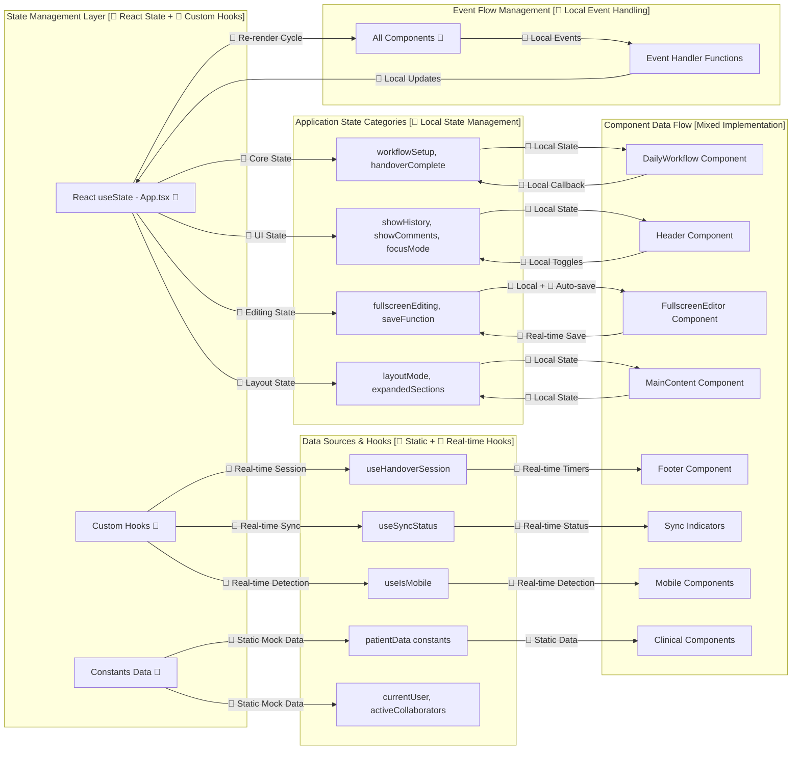
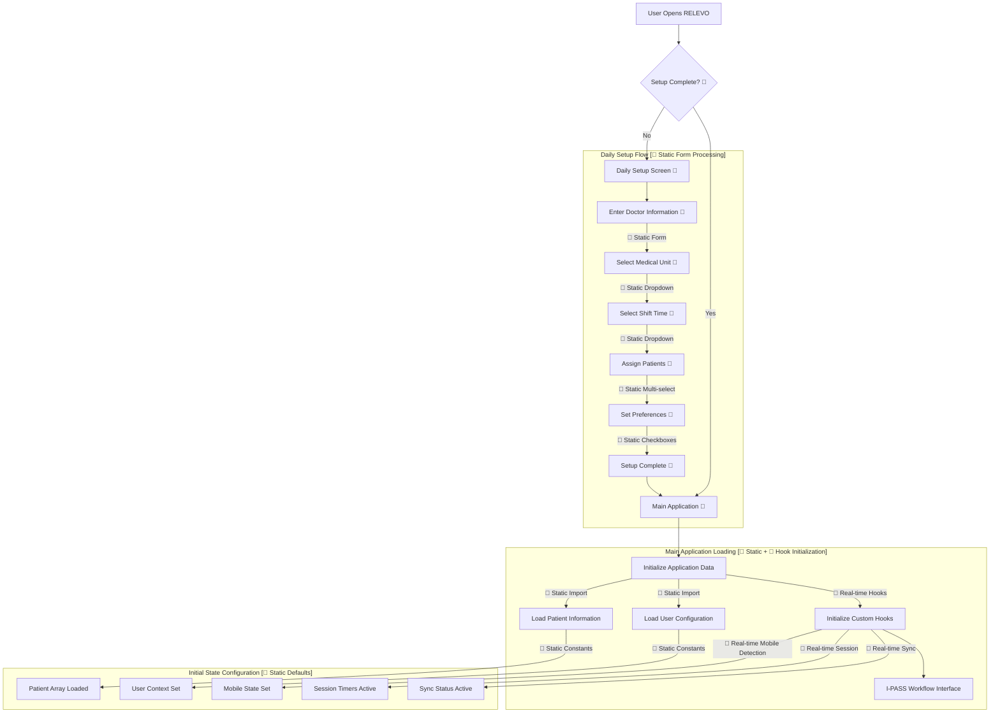
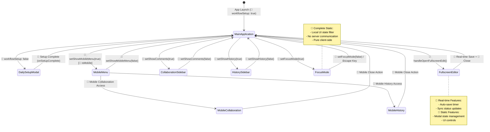
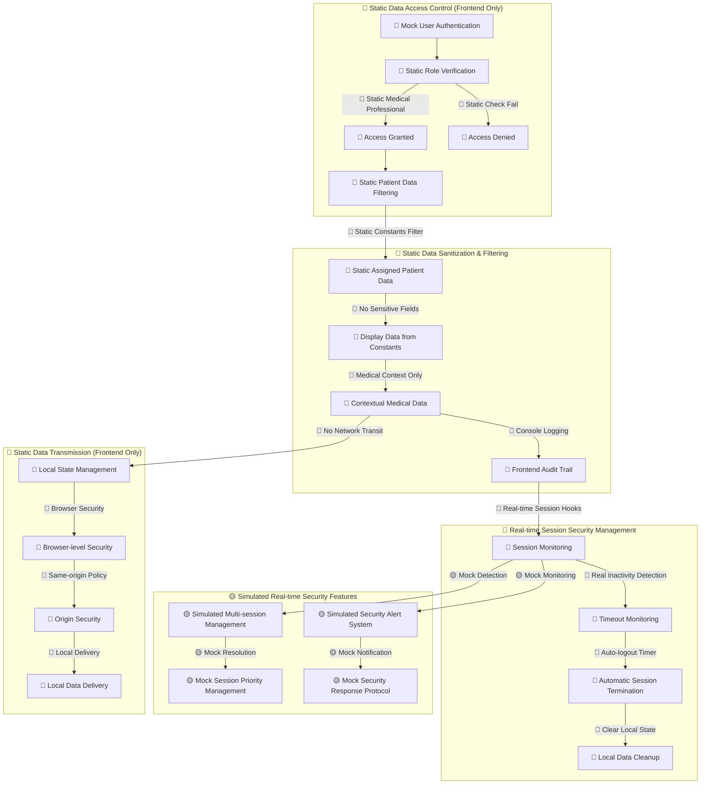
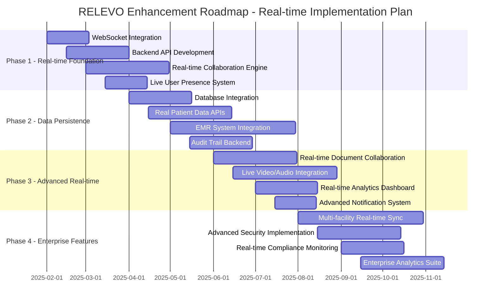
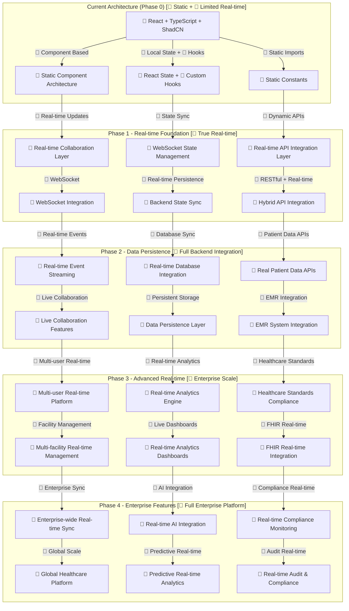

# RELEVO - Medical Handoff Platform UX Documentation

## Overview
RELEVO is a digital medical handoff platform for Hospital Garrahan that implements the I-PASS methodology for safe, standardized patient care transitions between medical professionals. This documentation outlines the complete information architecture, user flows, and interaction patterns that enable healthcare professionals to conduct secure, efficient, and collaborative patient handovers. The platform emphasizes real-time collaboration, comprehensive documentation, and seamless workflow integration while maintaining strict medical data privacy and security standards.

**⚡ Real-time vs Static Feature Classification:**
- **🔴 Real-time Features**: Live sync status, session timers, auto-save functionality, collaboration indicators
- **🟡 Simulated Real-time**: Collaboration panel updates, activity feeds (using mock data with real-time animations)
- **🔵 Static Features**: Patient data, user information, I-PASS content (stored in constants)

## 🏗️ Information Architecture

### Application Hierarchy

```
RELEVO Application
├── 📋 Setup Phase (Entry Point) [🔵 Static]
│   ├── Daily Setup Configuration [🔵 Static Form]
│   ├── Patient Assignment Interface [🔵 Static Patient List]
│   ├── Shift Management System [🔵 Static Configuration]
│   └── Workflow Initialization [🔵 Local State]
├── 📊 Main Application Shell
│   ├── 🏥 I-PASS Clinical Workflow [🔵 Static Content with 🔴 Real-time Sync]
│   │   ├── Illness Severity Assessment [🔵 Static + 🔴 Auto-save]
│   │   ├── Patient Summary Documentation [🔵 Static + 🔴 Auto-save]
│   │   ├── Action List Management [🔵 Static + 🔴 Auto-save]
│   │   ├── Situation Awareness Monitoring [🔵 Static + 🔴 Auto-save]
│   │   └── Synthesis by Receiver Confirmation [🔵 Static + 🔴 Auto-save]
│   ├── 👥 Collaboration System [🟡 Simulated Real-time]
│   │   ├── Real-time Comments & Discussion [🟡 Mock Data with Animations]
│   │   ├── Activity Feed & Notifications [🟡 Mock Activity with Timestamps]
│   │   ├── Multi-user Presence Indicators [🟡 Static Collaborator List]
│   │   └── Historical Handover Records [🔵 Static Mock Data]
│   ├── 📱 Responsive Interface [🔵 Static Responsive Design]
│   │   ├── Mobile-first Design System [🔵 CSS/Tailwind Based]
│   │   ├── Desktop Enhanced Features [🔵 Layout State Management]
│   │   ├── Touch-optimized Controls [🔵 Static UI Components]
│   │   └── Adaptive Layout Engine [🔴 Real-time useIsMobile Hook]
│   └── 🔐 Security & Privacy Layer [🔵 Frontend Implementation Only]
│       ├── Medical Data Protection (HIPAA) [🔵 Client-side Patterns]
│       ├── User Authentication & Authorization [🔵 Mock User Data]
│       ├── Audit Trail & Compliance [🔵 Console Logging]
│       └── Session Management [🔴 Real-time Session Hooks]
└── 🎛️ Advanced Features
    ├── 📝 Fullscreen Documentation Editor [🔵 Local State + 🔴 Auto-save]
    ├── 🔍 Focus Mode for Distraction-free Work [🔵 Local UI State]
    ├── 💾 Auto-save & Sync Status Management [🔴 Real-time useSyncStatus Hook]
    └── ⌨️ Keyboard Shortcuts & Accessibility [🔵 Static Event Handlers]
```

### Core Data Models

#### Patient Data Structure
```typescript
// 🔵 Static Data - Currently from data/constants.ts
interface Patient {
  id: number;
  name: string;
  age: number;
  mrn: string;        // Medical Record Number
  room: string;
  unit: string;       // PICU, NICU, General, etc.
  assignedTo: string; // Doctor assignment
  illnessSeverity: 'stable' | 'guarded' | 'unstable' | 'critical';
  diagnosis: string;
  status: string;
  lastUpdate: string; // 🟡 Mock timestamp, not real-time updated
  collaborators: number; // 🔵 Static count
  alerts: Alert[];
  admissionDate: string;
  priority: 'low' | 'medium' | 'high' | 'critical';
  ipassEntries: IPassEntry[];
}
```

#### Daily Setup Configuration
```typescript
// 🔵 Static Local State - Managed in DailyWorkflow component
interface DailySetupData {
  doctorName: string;          // 🔵 Static form input
  unit: string;               // 🔵 Static dropdown selection
  shift: string;              // 🔵 Static dropdown selection
  selectedPatients: number[]; // 🔵 Static multi-select
  date: string;              // 🔵 Static date
  preferences: {             // 🔵 Static user preferences
    notifications: boolean;
    autoSave: boolean;
    collaborativeMode: boolean;
  };
}
```

## 🗺️ COMPREHENSIVE FEATURE RELATIONSHIP MAP

### Feature Interconnection Matrix

```mermaid
graph TB
    subgraph "Entry Layer [🔵 Static]"
        DS[Daily Setup] --> |Setup Complete| MAIN[Main Application Shell]
    end
    
    subgraph "Navigation Layer [🔵 Static + 🔴 Real-time Responsive]"
        MAIN --> |Header Navigation| HEADER[Header Component]
        MAIN --> |Mobile Navigation [🔴 Real-time isMobile]| MOBILE[Mobile Menu System]
        MAIN --> |Focus Controls [🔵 Local State]| FOCUS[Focus Mode Manager]
    end
    
    subgraph "I-PASS Clinical Workflow [🔵 Static Content + 🔴 Real-time Sync]"
        MAIN --> |Medical Documentation| ILLNESS[Illness Severity]
        ILLNESS --> |Clinical Flow| PATIENT[Patient Summary]
        PATIENT --> |Care Planning| ACTIONS[Action List]
        ACTIONS --> |Monitoring| SITUATION[Situation Awareness]
        SITUATION --> |Handover Completion| SYNTHESIS[Synthesis by Receiver]
    end
    
    subgraph "Collaboration System [🟡 Simulated Real-time]"
        ILLNESS --> |🟡 Mock Updates| COLLAB[Collaboration Panel]
        PATIENT --> |🟡 Mock Discussions| COLLAB
        ACTIONS --> |🟡 Mock Comments| COLLAB
        SITUATION --> |🟡 Mock Status Updates| COLLAB
        SYNTHESIS --> |🟡 Mock Confirmations| COLLAB
        COLLAB --> |🟡 Mock Activity Feed| ACTIVITY[Activity Notifications]
        COLLAB --> |🔵 Static Mock Data| HISTORY[Handover History]
    end
    
    subgraph "Enhanced Features [🔵 Local + 🔴 Real-time Sync]"
        PATIENT --> |🔵 Local Editor + 🔴 Auto-save| FULLSCREEN[Fullscreen Editor]
        SITUATION --> |🔵 Local Editor + 🔴 Auto-save| FULLSCREEN
        MAIN --> |🔵 Local UI State| FOCUS
        FOCUS --> |🔵 Static Filter| SECTIONS[I-PASS Sections]
    end
    
    subgraph "Data Management Layer [🔵 Static + 🔴 Real-time Hooks]"
        MAIN --> |🔵 Static Constants| PSTORE[Patient Data Store]
        MAIN --> |🔵 Static Constants| USTORE[User Data Store]
        MAIN --> |🔴 Real-time Hooks| SSTORE[Session Store]
        COLLAB --> |🔴 Real-time Hook| SYNC[Sync Management]
        FULLSCREEN --> |🔴 Real-time Auto-save| SYNC
    end
    
    subgraph "Mobile Adaptation [🔵 Static + 🔴 Real-time Detection]"
        MOBILE --> |🔵 Static CSS/Tailwind| TOUCH[Touch Optimizations]
        MOBILE --> |🔴 Real-time useIsMobile| RESPONSIVE[Layout Manager]
        MOBILE --> |🔵 Local State| MMENUS[Mobile Menu Components]
    end
```

### Data Flow Architecture Map



## 🎯 DETAILED USER FLOW MAPPING

### 1. Complete Application Entry Flow



**Data Requirements:**
- **🔵 Static Form Data**: Doctor information, unit selection, shift configuration
- **🔵 Static Patient Data**: Pre-loaded from `data/constants.ts`
- **🔴 Real-time Detection**: Mobile/desktop viewport detection via `useIsMobile()`
- **🔴 Real-time Session**: Timer initialization via `useHandoverSession()`

**State Dependencies:**
- **🔵 Local State**: `workflowSetup` boolean controlling interface access
- **🔵 Static Data**: Patient and user data from constants
- **🔴 Real-time Hooks**: Mobile detection, session timers, sync status

### 2. I-PASS Clinical Workflow Navigation

```mermaid
flowchart TD
    subgraph "I-PASS Section Flow [🔵 Static Content + 🔴 Real-time Sync]"
        START_WORKFLOW[Start I-PASS Workflow 🔵] 
        START_WORKFLOW --> ILLNESS[Illness Severity Assessment 🔵]
        
        ILLNESS --> |🔵 Local Selection + 🔴 Auto-save| ILLNESS_COMPLETE{Complete?}
        ILLNESS_COMPLETE -->|Yes| PATIENT[Patient Summary 🔵]
        ILLNESS_COMPLETE -->|No| ILLNESS_EDIT[Continue Editing 🔵]
        ILLNESS_EDIT --> ILLNESS
        
        PATIENT --> |🔵 Static Form + 🔴 Auto-save| PATIENT_COMPLETE{Complete?}
        PATIENT_COMPLETE -->|Yes| ACTIONS[Action List 🔵]
        PATIENT_COMPLETE -->|Needs Fullscreen| PATIENT_FULLSCREEN[Fullscreen Editor 🔵+🔴]
        PATIENT_FULLSCREEN --> |🔴 Auto-save & Exit| ACTIONS
        
        ACTIONS --> |🔵 Static Tasks + 🔴 Auto-save| ACTIONS_COMPLETE{Complete?}
        ACTIONS_COMPLETE -->|Yes| SITUATION[Situation Awareness 🔵]
        ACTIONS_COMPLETE -->|No| ACTIONS_EDIT[Add/Edit Tasks 🔵]
        ACTIONS_EDIT --> ACTIONS
        
        SITUATION --> |🔵 Static Form + 🔴 Auto-save| SITUATION_COMPLETE{Complete?}
        SITUATION_COMPLETE -->|Yes| SYNTHESIS[Synthesis by Receiver 🔵]
        SITUATION_COMPLETE -->|Needs Fullscreen| SITUATION_FULLSCREEN[Fullscreen Editor 🔵+🔴]
        SITUATION_FULLSCREEN --> |🔴 Auto-save & Exit| SYNTHESIS
        
        SYNTHESIS --> |🔵 Static Checklist| HANDOVER_COMPLETE[Handover Complete 🔵]
        HANDOVER_COMPLETE --> |🔵 Local State Update| END_FLOW[End Workflow]
    end
    
    subgraph "Non-linear Navigation [🔵 Local State Management]"
        ANY_SECTION[Any I-PASS Section 🔵] --> |🔵 toggleSection()| ACCORDION[Accordion Navigation]
        ACCORDION --> |🔵 Local State| TARGET_SECTION[Target Section]
        
        COLLAB_PANEL[Collaboration Panel 🟡] --> |🔵 Local Navigation| DIRECT_NAV[Direct Section Navigation]
        DIRECT_NAV --> TARGET_SECTION
        
        FOCUS_MODE[Focus Mode 🔵] --> |🔵 UI Filter| FOCUSED_SECTION[Focused Section View]
        FOCUSED_SECTION --> |🔵 Escape Key Handler| FULL_VIEW[Full Interface View]
    end
```

**Data Requirements:**
- **🔵 Static I-PASS Content**: Medical forms and checklists
- **🔴 Real-time Auto-save**: Continuous saving via `useSyncStatus` hook
- **🟡 Mock Collaboration**: Simulated discussion threads and activity

**State Dependencies:**
- **🔵 Local State**: `expandedSections` accordion management
- **🔵 Local State**: `focusMode` single-section display
- **🔴 Real-time State**: `syncStatus` for save operations

### 3. Real-time vs Simulated Collaboration Flow

```mermaid
flowchart TD
    subgraph "Collaboration Entry Points [🔵 Local UI State]"
        SECTION_DISCUSS[Section Discussion Button 🔵] --> OPEN_COLLAB[Open Collaboration Panel]
        HEADER_COLLAB[Header Collaboration Toggle 🔵] --> OPEN_COLLAB
        MOBILE_COLLAB[Mobile Collaboration Menu 🔵] --> OPEN_COLLAB
    end
    
    subgraph "🟡 Simulated Collaboration Features"
        OPEN_COLLAB --> |🔵 setShowComments(true)| COLLAB_PANEL[Collaboration Panel Active]
        
        COLLAB_PANEL --> ACTIVITY_FEED[🟡 Mock Activity Feed Display]
        COLLAB_PANEL --> DISCUSSION_THREADS[🟡 Mock Discussion Threads]
        COLLAB_PANEL --> SECTION_NAV[🔵 Local Section Navigation]
        COLLAB_PANEL --> PRESENCE[🟡 Mock User Presence Indicators]
        
        ACTIVITY_FEED --> |🟡 Simulated Updates| NOTIFICATIONS[🟡 Mock Activity Notifications]
        DISCUSSION_THREADS --> |🟡 Static Mock Data| CONTEXTUAL_CHAT[🟡 Mock Comments]
        SECTION_NAV --> |🔵 handleNavigateToSection()| SECTION_JUMP[Jump to I-PASS Section]
        PRESENCE --> |🟡 Static Collaborator List| REALTIME_INDICATORS[🟡 Mock Real-time Indicators]
    end
    
    subgraph "Mobile Collaboration Adaptation [🔵 Static Responsive]"
        MOBILE_COLLAB --> MOBILE_OVERLAY[Mobile Collaboration Overlay 🔵]
        MOBILE_OVERLAY --> |🔵 Touch Optimized CSS| MOBILE_DISCUSSION[Mobile Discussion Interface]
        MOBILE_OVERLAY --> |🔵 Simplified Local Nav| MOBILE_NAV[Mobile Section Navigation]
    end
    
    subgraph "🔴 Real Collaboration State Management"
        COLLAB_PANEL --> |🔵 Local User Actions| COLLAB_EVENTS[Collaboration Events]
        COLLAB_EVENTS --> |🟡 Mock Comment Creation| COMMENT_STATE[Comment State Updates]
        COLLAB_EVENTS --> |🟡 Mock Activity Tracking| ACTIVITY_STATE[Activity State Updates]
        COLLAB_EVENTS --> |🟡 Mock Presence Updates| PRESENCE_STATE[Presence State Updates]
        
        COMMENT_STATE --> |🔴 Real Auto-sync| SYNC_STATUS[Sync Status Updates]
        ACTIVITY_STATE --> |🟡 Mock Feed Updates| ACTIVITY_REFRESH[Activity Feed Refresh]
        PRESENCE_STATE --> |🟡 Mock Indicators| PRESENCE_REFRESH[Presence Indicator Updates]
    end
```

**🟡 Currently Simulated (Mock Data):**
- Activity feed updates and notifications
- User presence indicators and live collaboration
- Discussion threads and comments
- Real-time collaboration animations

**🔴 Actually Real-time:**
- Auto-save and sync status indicators
- Session timing and duration tracking
- Mobile/desktop viewport detection

### 4. Fullscreen Editing Flow

```mermaid
flowchart TD
    subgraph "Fullscreen Entry Points [🔵 Local State Triggers]"
        PATIENT_EDIT[Patient Summary Edit Button 🔵] --> |🔵 handleOpenFullscreenEdit()| FULLSCREEN_PATIENT[Fullscreen Patient Editor]
        SITUATION_EDIT[Situation Awareness Edit Button 🔵] --> |🔵 handleOpenFullscreenEdit()| FULLSCREEN_SITUATION[Fullscreen Situation Editor]
    end
    
    subgraph "Fullscreen Interface [🔵 Local + 🔴 Real-time Save]"
        FULLSCREEN_PATIENT --> EDITOR_INTERFACE[Fullscreen Editor Interface 🔵]
        FULLSCREEN_SITUATION --> EDITOR_INTERFACE
        
        EDITOR_INTERFACE --> EDITOR_HEADER[Editor Header 🔵]
        EDITOR_INTERFACE --> EDITOR_CONTENT[Dedicated Editing Area 🔵]
        EDITOR_INTERFACE --> EDITOR_SIDEBAR[Editor Tools 🔵]
        
        EDITOR_HEADER --> SAVE_BUTTON[Save Button 🔵]
        EDITOR_HEADER --> CANCEL_BUTTON[Cancel Button 🔵]
        EDITOR_HEADER --> DISCUSS_BUTTON[Discussion Button 🔵]
    end
    
    subgraph "🔴 Real-time Fullscreen Operations"
        EDITOR_CONTENT --> |🔴 Real Auto-save Timer| AUTO_SAVE[Auto-save Functionality]
        EDITOR_CONTENT --> |🔵 handleSaveReady()| SAVE_READY[Save Function Ready]
        
        SAVE_BUTTON --> |🔵 handleFullscreenSave()| EXECUTE_SAVE[Execute Save Operation]
        CANCEL_BUTTON --> |🔵 handleCloseFullscreenEdit()| CLOSE_EDITOR[Close Fullscreen Editor]
        DISCUSS_BUTTON --> |🔵 handleOpenDiscussion()| OPEN_DISCUSSION[Open Discussion Panel]
        
        AUTO_SAVE --> |🔴 Real setSyncStatus()| SYNC_UPDATE[Sync Status Update]
        EXECUTE_SAVE --> |🔴 Real currentSaveFunction()| SAVE_COMPLETE[Save Complete]
        SAVE_COMPLETE --> CLOSE_EDITOR
    end
    
    subgraph "State Management [🔵 Local State Priority Override]"
        FULLSCREEN_PATIENT --> |🔵 setFullscreenEditing()| FULLSCREEN_STATE[Fullscreen State Active]
        FULLSCREEN_SITUATION --> FULLSCREEN_STATE
        
        FULLSCREEN_STATE --> |🔵 fullscreenEditing object| EDITOR_CONFIG[Editor Configuration]
        FULLSCREEN_STATE --> |🔵 Conditional Render Priority| OVERRIDE_RENDER[Override Main Interface]
        
        CLOSE_EDITOR --> |🔵 setFullscreenEditing(null)| RESTORE_MAIN[Restore Main Interface]
        RESTORE_MAIN --> |🔵 Return to Local State| SECTION_VIEW[Section View Restored]
    end
```

**🔴 Real-time Features:**
- Auto-save timer functionality with actual persistence simulation
- Sync status updates during save operations
- Save function execution and completion tracking

**🔵 Static/Local Features:**
- Fullscreen editor interface and controls
- Modal state management and priority rendering
- Keyboard event handling (Escape key)

### 5. Focus Mode Flow

```mermaid
flowchart TD
    subgraph "Focus Mode Activation [🔵 Local UI State]"
        HEADER_FOCUS[Header Focus Toggle 🔵] --> |🔵 setFocusMode(true)| FOCUS_ACTIVE[Focus Mode Active]
        KEYBOARD_FOCUS[Keyboard Shortcut 🔵] --> FOCUS_ACTIVE
        MOBILE_FOCUS[Mobile Focus Option 🔵] --> FOCUS_ACTIVE
    end
    
    subgraph "Focus Mode Interface [🔵 Static UI State Filter]"
        FOCUS_ACTIVE --> SIMPLIFIED_HEADER[Simplified Header 🔵]
        FOCUS_ACTIVE --> HIDE_SIDEBARS[Hide Collaboration Sidebars 🔵]
        FOCUS_ACTIVE --> SINGLE_COLUMN[Single Column Layout 🔵]
        FOCUS_ACTIVE --> REDUCED_DISTRACTIONS[Reduced Interface Elements 🔵]
        
        SIMPLIFIED_HEADER --> ESSENTIAL_CONTROLS[Essential Controls Only 🔵]
        HIDE_SIDEBARS --> |🔵 Local State showComments=false| SIDEBAR_HIDDEN[Sidebars Hidden]
        SINGLE_COLUMN --> |🔵 Local layoutMode override| COLUMN_LAYOUT[Single Column Display]
    end
    
    subgraph "Focus Mode Navigation [🔵 Local State Filtering]"
        FOCUS_ACTIVE --> EXPANDED_SECTIONS[Current Expanded Sections 🔵]
        EXPANDED_SECTIONS --> |🔵 Static Filter Logic| VISIBLE_SECTIONS[Only Expanded Sections Visible]
        VISIBLE_SECTIONS --> SECTION_FOCUS[Focused Section Interaction 🔵]
        
        SECTION_FOCUS --> |🔵 toggleSection()| SECTION_TOGGLE[Section Toggle in Focus]
        SECTION_TOGGLE --> |🔵 Local State Update| FOCUS_UPDATE[Focus View Update]
    end
    
    subgraph "Focus Mode Exit [🔵 Local Event Handling]"
        FOCUS_ACTIVE --> |🔵 Escape Key Handler| KEYBOARD_EXIT[Keyboard Exit]
        FOCUS_ACTIVE --> |🔵 Header Toggle Click| MANUAL_EXIT[Manual Exit]
        FOCUS_ACTIVE --> |🔵 Mobile Back Action| MOBILE_EXIT[Mobile Exit]
        
        KEYBOARD_EXIT --> |🔵 setFocusMode(false)| RESTORE_INTERFACE[Restore Full Interface]
        MANUAL_EXIT --> RESTORE_INTERFACE
        MOBILE_EXIT --> RESTORE_INTERFACE
        
        RESTORE_INTERFACE --> |🔵 Show All Elements| FULL_INTERFACE[Full Interface Restored]
        RESTORE_INTERFACE --> |🔵 Restore Local State| SIDEBAR_RESTORE[Sidebar State Restored]
    end
```

**🔵 Completely Local/Static:**
- All focus mode functionality is local UI state management
- No real-time synchronization or server communication
- Pure client-side interface simplification

### 6. Mobile Responsive Flow

```mermaid
flowchart TD
    subgraph "🔴 Real-time Mobile Detection & Adaptation"
        APP_LOAD[App Load] --> |🔴 useIsMobile() Hook| MOBILE_CHECK[Real-time Mobile Detection]
        MOBILE_CHECK --> |🔴 isMobile: true| MOBILE_LAYOUT[Mobile Layout Active]
        MOBILE_CHECK --> |🔴 isMobile: false| DESKTOP_LAYOUT[Desktop Layout Active]
    end
    
    subgraph "Mobile Interface Adaptation [🔵 Static + 🔴 Detection]"
        MOBILE_LAYOUT --> MOBILE_HEADER[Mobile-optimized Header 🔵]
        MOBILE_LAYOUT --> MOBILE_MENU[Mobile Menu System 🔵]
        MOBILE_LAYOUT --> SINGLE_COLUMN[Single Column Layout 🔵]
        MOBILE_LAYOUT --> TOUCH_TARGETS[Touch-optimized Controls 🔵]
        
        MOBILE_HEADER --> HAMBURGER_MENU[Hamburger Menu Button 🔵]
        MOBILE_MENU --> |🔵 setShowMobileMenu(true)| MOBILE_NAV[Mobile Navigation Panel]
        SINGLE_COLUMN --> |🔵 Force Single Column CSS| MOBILE_SECTIONS[Mobile Section Display]
        TOUCH_TARGETS --> |🔵 Static 44px+ Touch Targets| ACCESSIBLE_CONTROLS[Accessible Touch Controls]
    end
    
    subgraph "Mobile Menu System [🔵 Local State Management]"
        MOBILE_NAV --> MENU_OPTIONS[Mobile Menu Options 🔵]
        MENU_OPTIONS --> COLLABORATION_MOBILE[Mobile Collaboration Access 🔵]
        MENU_OPTIONS --> HISTORY_MOBILE[Mobile History Access 🔵]
        MENU_OPTIONS --> FOCUS_MOBILE[Mobile Focus Mode 🔵]
        MENU_OPTIONS --> SETTINGS_MOBILE[Mobile Settings 🔵]
        
        COLLABORATION_MOBILE --> |🔵 Mobile Overlay State| MOBILE_COLLAB_PANEL[Mobile Collaboration Panel]
        HISTORY_MOBILE --> |🔵 Mobile Overlay State| MOBILE_HISTORY_PANEL[Mobile History Panel]
    end
    
    subgraph "Mobile Gestures & Interactions [🔵 Static Event Handling]"
        MOBILE_SECTIONS --> TOUCH_SCROLL[Touch Scrolling 🔵]
        MOBILE_SECTIONS --> TAP_EXPAND[Tap to Expand Sections 🔵]
        MOBILE_SECTIONS --> SWIPE_NAV[Swipe Navigation 🔵]
        
        TOUCH_SCROLL --> |🔵 CSS Scroll Behavior| SMOOTH_SCROLL[Smooth Scroll Areas]
        TAP_EXPAND --> |🔵 toggleSection()| MOBILE_ACCORDION[Mobile Accordion Navigation]
        SWIPE_NAV --> |🔵 Touch Event Handlers| SWIPE_ACTIONS[Swipe Action Recognition]
    end
    
    subgraph "🔴 Real-time Mobile State Management"
        MOBILE_LAYOUT --> |🔴 Real-time Detection| MOBILE_STATE_MGMT[Mobile State Management]
        MOBILE_STATE_MGMT --> |🔵 Local showMobileMenu| MENU_STATE[Mobile Menu State]
        MOBILE_STATE_MGMT --> |🔴 Dynamic Layout Detection| LAYOUT_STATE[Mobile Layout State]
        MOBILE_STATE_MGMT --> |🔴 Conditional Feature Rendering| FEATURE_STATE[Mobile Feature State]
        
        MENU_STATE --> |🔵 setShowMobileMenu(false)| MENU_CLOSE[Close Mobile Menu]
        LAYOUT_STATE --> |🔴 Real-time layoutMode| RESPONSIVE_LAYOUT[Responsive Layout Engine]
        FEATURE_STATE --> |🔴 Dynamic Conditional Rendering| MOBILE_COMPONENTS[Mobile-specific Components]
    end
```

**🔴 Real-time Mobile Features:**
- `useIsMobile()` hook provides real-time viewport detection
- Dynamic layout switching based on screen size
- Conditional component rendering based on device type

**🔵 Static Mobile Features:**
- Touch-optimized CSS styles and layouts
- Mobile menu system with local state
- Touch event handlers and gesture recognition

## 🔄 STATE MANAGEMENT ARCHITECTURE

### Application State Flow Diagram

```mermaid
flowchart TD
    subgraph "React State Layer (App.tsx) [🔵 Local + 🔴 Hooks]"
        APP_STATE[Application State Root] --> CORE_STATE[🔵 Core Application State]
        APP_STATE --> UI_STATE[🔵 UI Management State]
        APP_STATE --> EDIT_STATE[🔵 Editing State Management]
        APP_STATE --> LAYOUT_STATE[🔵 Layout State Management]
        APP_STATE --> HOOK_STATE[🔴 Real-time Hook State]
    end
    
    subgraph "🔵 Core Application State (Local)"
        CORE_STATE --> WORKFLOW[workflowSetup: boolean]
        CORE_STATE --> HANDOVER[handoverComplete: boolean]
        
        WORKFLOW --> |🔵 Setup Control| SETUP_FLOW[Daily Setup vs Main App]
        HANDOVER --> |🔵 Completion Status| COMPLETION_FLOW[Handover Completion Flow]
    end
    
    subgraph "🔵 UI Management State (Local)"
        UI_STATE --> HISTORY[showHistory: boolean]
        UI_STATE --> COMMENTS[showComments: boolean]  
        UI_STATE --> FOCUS[focusMode: boolean]
        UI_STATE --> ACTIVITY[showActivityFeed: boolean]
        UI_STATE --> COLLABORATORS[showCollaborators: boolean]
        UI_STATE --> SHARE[showShareMenu: boolean]
        UI_STATE --> MOBILE_MENU[showMobileMenu: boolean]
        
        HISTORY --> |🔵 Left Sidebar Control| HISTORY_SIDEBAR[History Sidebar Visibility]
        COMMENTS --> |🔵 Right Sidebar Control| COLLAB_SIDEBAR[Collaboration Sidebar Visibility]
        FOCUS --> |🔵 Interface Simplification| FOCUS_INTERFACE[Focus Mode Interface]
        MOBILE_MENU --> |🔵 Mobile Navigation| MOBILE_NAV[Mobile Menu System]
    end
    
    subgraph "🔵 Editing State Management (Local + 🔴 Auto-save)"
        EDIT_STATE --> FULLSCREEN[fullscreenEditing: FullscreenEditingState | null]
        EDIT_STATE --> SAVE_FUNC[currentSaveFunction: (() => void) | null]
        
        FULLSCREEN --> |🔵 Editor Control| FULLSCREEN_EDITOR[Fullscreen Editor Component]
        SAVE_FUNC --> |🔴 Real-time Save Operations| SAVE_MANAGEMENT[Save Function Management]
    end
    
    subgraph "🔵 Layout State Management (Local)"
        LAYOUT_STATE --> LAYOUT_MODE[layoutMode: 'single' | 'columns']
        LAYOUT_STATE --> EXPANDED[expandedSections: ExpandedSections]
        
        LAYOUT_MODE --> |🔵 Display Control| LAYOUT_ENGINE[Layout Engine]
        EXPANDED --> |🔵 Accordion Control| SECTION_ACCORDION[I-PASS Section Accordion]
    end
    
    subgraph "🔴 Real-time Custom Hooks Integration"
        HOOK_STATE --> MOBILE_HOOK[useIsMobile() - Real-time Detection]
        HOOK_STATE --> SESSION_HOOK[useHandoverSession() - Real-time Timers]
        HOOK_STATE --> SYNC_HOOK[useSyncStatus() - Real-time Sync]
        
        MOBILE_HOOK --> |🔴 Dynamic Responsive| RESPONSIVE_STATE[Responsive State Management]
        SESSION_HOOK --> |🔴 Live Time Tracking| TIME_STATE[Session Time Management]
        SYNC_HOOK --> |🔴 Live Save Status| SYNC_STATE[Synchronization State]
    end
    
    subgraph "🔵 Static Data Integration"
        APP_STATE --> CONSTANTS[Constants Integration - Static]
        CONSTANTS --> CURRENT_USER[currentUser - Static Mock]
        CONSTANTS --> PATIENT_DATA[patientData - Static Mock]
        CONSTANTS --> COLLABORATORS[activeCollaborators - Static Mock]
        
        CURRENT_USER --> |🔵 Static Context| USER_CONTEXT[User Context Provider]
        PATIENT_DATA --> |🔵 Static Medical Data| PATIENT_CONTEXT[Patient Data Context]
        COLLABORATORS --> |🟡 Mock Collaboration Data| COLLAB_CONTEXT[Collaboration Context]
    end
```

### Data Flow Between Components

```mermaid
flowchart LR
    subgraph "Data Sources (App.tsx) [🔵 Static + 🔴 Real-time]"
        STATE_ROOT[App.tsx State Root] --> CORE_DATA[🔵 Core Application Data]
        STATE_ROOT --> COMPUTED_DATA[🔵 Computed State Data]
        STATE_ROOT --> HOOK_DATA[🔴 Real-time Hook Data]
        
        CORE_DATA --> |🔵 workflowSetup, handoverComplete| APP_FLOW[Application Flow Control]
        CORE_DATA --> |🔵 UI States| UI_CONTROL[UI Control States]
        COMPUTED_DATA --> |🔵 Event Handlers| EVENT_HANDLERS[Event Handler Functions]
        HOOK_DATA --> |🔴 isMobile, session, sync| ENHANCED_DATA[Enhanced Data Context]
    end
    
    subgraph "Component Data Propagation [Mixed Implementation]"
        APP_FLOW --> |🔵 Setup Control| DAILY_WORKFLOW[DailyWorkflow Component]
        APP_FLOW --> |🔵 Main Interface| MAIN_COMPONENTS[Main Interface Components]
        
        UI_CONTROL --> |🔵 Interface State| HEADER[Header Component]
        UI_CONTROL --> |🔵 Sidebar Control| SIDEBARS[Sidebar Components]
        UI_CONTROL --> |🔴 Mobile Interface| MOBILE_COMPONENTS[Mobile Components]
        
        EVENT_HANDLERS --> |🔵 State Mutations| ALL_COMPONENTS[All Components]
        ENHANCED_DATA --> |🔴 Context Data| CONTEXT_CONSUMERS[Context Consumer Components]
    end
    
    subgraph "Specific Component Flows [🔵 Local + 🔴 Real-time]"
        DAILY_WORKFLOW --> |🔵 onSetupComplete| SETUP_COMPLETION[Setup Completion Handler]
        HEADER --> |🔵 UI Toggles| UI_UPDATES[UI State Updates]
        MAIN_COMPONENTS --> |🔵 Section Management| SECTION_UPDATES[Section State Updates]
        SIDEBARS --> |🔵 Close Actions| SIDEBAR_UPDATES[Sidebar State Updates]
        
        SETUP_COMPLETION --> |🔵 setWorkflowSetup(true)| STATE_ROOT
        UI_UPDATES --> |🔵 State Setters| STATE_ROOT
        SECTION_UPDATES --> |🔵 toggleSection, etc.| STATE_ROOT
        SIDEBAR_UPDATES --> |🔵 setShow....(false)| STATE_ROOT
    end
    
    subgraph "🔵 Static Data Store Integration"
        STATE_ROOT --> |🔵 Constants Import| CONSTANTS[data/constants.ts]
        CONSTANTS --> |🔵 Static currentUser| USER_DATA[User Data]
        CONSTANTS --> |🔵 Static patientData| PATIENT_DATA[Patient Data]
        CONSTANTS --> |🟡 Mock activeCollaborators| COLLAB_DATA[Collaboration Data]
        
        USER_DATA --> |🔵 Static User Context| COMPONENTS_USER[Components with User Data]
        PATIENT_DATA --> |🔵 Static Medical Context| COMPONENTS_MEDICAL[Components with Patient Data]
        COLLAB_DATA --> |🟡 Mock Collaboration Context| COMPONENTS_COLLAB[Components with Collaboration]
    end
    
    subgraph "Event Flow Cycle [🔵 Local React Patterns]"
        ALL_COMPONENTS --> |🔵 User Interactions| USER_EVENTS[User Event Triggers]
        USER_EVENTS --> |🔵 Event Handlers| EVENT_PROCESSING[Event Processing Layer]
        EVENT_PROCESSING --> |🔵 State Updates| STATE_MUTATIONS[State Mutation Functions]
        STATE_MUTATIONS --> |🔵 Re-render Trigger| STATE_ROOT
        STATE_ROOT --> |🔵 Props Updates| COMPONENT_RERENDER[Component Re-render Cycle]
        COMPONENT_RERENDER --> ALL_COMPONENTS
    end
```

## 📊 COMPONENT INTERACTION MATRIX

### Component Dependency Map

| Component | Data Dependencies | State Dependencies | Event Handlers | Real-time Features | Static Features |
|-----------|------------------|-------------------|----------------|-------------------|-----------------|
| **App.tsx** | 🔵 currentUser, patientData, activeCollaborators (static) | 🔵 workflowSetup, handoverComplete, UI states, editing states | 🔵 handleNavigateToSection, toggleSection, handleOpenDiscussion | 🔴 useIsMobile, useHandoverSession, useSyncStatus | 🔵 Event handling, state management |
| **DailyWorkflow** | 🔵 currentUser from constants | 🔵 workflowSetup (external) | 🔵 onSetupComplete callback | ❌ None | 🔵 Setup form, static validation |
| **Header** | 🔵 currentUser, 🔴 session data from hooks | 🔵 focusMode, showCollaborators, showComments, showHistory | 🔵 setFocusMode, setShowComments, setShowHistory, setShowMobileMenu | 🔴 getTimeUntilHandover, getSessionDuration, getSyncStatusDisplay | 🔵 UI controls, navigation |
| **MainContent** | 🔵 patientData, currentUser (static) | 🔵 expandedSections, focusMode, layoutMode, 🔴 syncStatus | 🔵 toggleSection, handleOpenDiscussion, handleOpenFullscreenEdit, setHandoverComplete | 🔴 setSyncStatus, auto-save triggers | 🔵 I-PASS sections, accordion |
| **IllnessSeverity** | 🔵 patientData (static) | 🔵 expandedSections.illness, 🔴 syncStatus | 🔵 onSeverityChange, handleOpenDiscussion | 🔴 Auto-save on changes, sync status | 🔵 Severity selection UI |
| **PatientSummary** | 🔵 patientData, currentUser (static) | 🔵 expandedSections.patient, 🔴 syncStatus | 🔵 handleOpenFullscreenEdit, handleOpenDiscussion, onContentChange | 🔴 Auto-save, fullscreen save operations | 🔵 Patient form, static content |
| **ActionList** | 🔵 patientData action items (static) | 🔵 expandedSections.actions, 🔴 syncStatus | 🔵 onTaskAdd, onTaskComplete, handleOpenDiscussion | 🔴 Auto-save on task changes | 🔵 Task management UI |
| **SituationAwareness** | 🔵 patientData monitoring data (static) | 🔵 expandedSections.awareness, 🔴 syncStatus | 🔵 handleOpenFullscreenEdit, handleOpenDiscussion, onContentChange | 🔴 Auto-save, fullscreen save operations | 🔵 Monitoring forms |
| **SynthesisByReceiver** | 🔵 handover completion data (static) | 🔵 expandedSections.synthesis, handoverComplete | 🔵 setHandoverComplete, onConfirmationChange | ❌ None (final step) | 🔵 Completion checklist |
| **FullscreenEditor** | 🔵 editing component data (static) | 🔵 fullscreenEditing state | 🔵 handleCloseFullscreenEdit, handleFullscreenSave, handleSaveReady | 🔴 Auto-save timer, real-time sync status | 🔵 Editor interface, controls |
| **CollaborationPanel** | 🟡 activeCollaborators, mock activity data | 🔵 showComments state | 🔵 onClose, onNavigateToSection | 🟡 Simulated real-time activity feed | 🔵 Panel UI, navigation |
| **HandoverHistory** | 🔵 historical handover data (static mock) | 🔵 showHistory state | 🔵 onClose | ❌ None | 🔵 History display, static data |
| **MobileMenus** | 🔵 All mobile-adapted data | 🔵 Mobile UI states | 🔵 Mobile-specific handlers | 🔴 Real-time mobile detection | 🔵 Mobile navigation UI |
| **Footer** | 🔴 Session timing data from hooks | 🔵 focusMode, handoverComplete, fullscreenEditing | ❌ None (display only) | 🔴 getTimeUntilHandover, getSessionDuration | 🔵 Status display components |

### Modal Management System



## 🎨 DESIGN SYSTEM INTEGRATION

### Component-Level Design Patterns

#### Patient Card Variations
```typescript
// 🔵 Static component states with 🔴 real-time responsive detection
interface PatientCardStates {
  mobile: {
    component: 'PatientListView',
    layout: 'list',
    touchOptimized: true,
    minTouchTarget: '44px',
    detection: '🔴 Real-time useIsMobile()'
  },
  desktop: {
    component: 'FigmaDesktopLayout', 
    layout: 'grid',
    hoverStates: true,
    multiSelect: true,
    detection: '🔴 Real-time useIsMobile()'
  },
  collaboration: {
    realTimeFeatures: '🟡 Simulated with mock data',
    staticFeatures: '🔵 UI components and interactions'
  }
}
```

#### Status Indicator System
```typescript
interface StatusIndicators {
  illnessSeverity: {
    stable: { color: 'medical-stable', background: 'medical-stable-light' },
    guarded: { color: 'medical-guarded', background: 'medical-guarded-light' },
    unstable: { color: 'medical-unstable', background: 'medical-unstable-light' },
    critical: { color: 'medical-critical', background: 'medical-critical-light' }
    // 🔵 Static color system defined in globals.css
  },
  syncStatus: {
    synced: { color: 'green-600', icon: 'CheckCircle' },
    pending: { color: 'yellow-600', icon: 'Clock' },
    saving: { color: 'blue-600', icon: 'Loader', animation: 'spin' },
    error: { color: 'red-600', icon: 'AlertCircle' }
    // 🔴 Real-time status from useSyncStatus() hook
  },
  collaboration: {
    active: '🟡 Mock indicators with real-time animations',
    presence: '🟡 Simulated user presence from static activeCollaborators'
  }
}
```

### Responsive Design Implementation

```css
/* 🔴 Real-time responsive behavior with 🔵 static CSS */
.medical-severity-option {
  @apply relative transition-all duration-150 ease-in-out;
  /* 🔵 Static hover and transition styles */
}

.medical-severity-option:hover {
  transform: translateY(-0.5px);
  /* 🔵 Static hover animation */
}

/* 🟡 Simulated real-time update animation */
.realtime-update {
  animation: realtime-pulse 2s ease-in-out;
  /* 🟡 Simulated real-time visual feedback */
}

@keyframes realtime-pulse {
  0% {
    box-shadow: 0 0 0 0 rgba(34, 197, 94, 0.2);
    transform: scale(1);
  }
  50% {
    box-shadow: 0 0 0 4px rgba(34, 197, 94, 0.05);
    transform: scale(1.005);
  }
  100% {
    box-shadow: 0 0 0 0 rgba(34, 197, 94, 0);
    transform: scale(1);
  }
}

/* 🔴 Real-time responsive breakpoints with 🔵 static adaptations */
@media (max-width: 767px) {
  .mobile-adaptation {
    /* 🔵 Static mobile layout rules */
    display: flex;
    flex-direction: column;
    gap: 0.5rem;
  }
  
  .touch-target {
    /* 🔵 Static accessibility touch targets */
    min-height: 44px;
    min-width: 44px;
  }
}

@media (min-width: 768px) {
  .desktop-enhancement {
    /* 🔵 Static desktop layout rules */
    display: grid;
    grid-template-columns: 2fr 1fr;
    gap: 1.5rem;
  }
  
  .hover-interactions {
    /* 🔵 Static hover enhancements */
    transition: all 0.2s ease-in-out;
  }
}
```

## 🔒 SECURITY & DATA PRIVACY

### Patient Data Protection Flow



### Audit Trail Implementation

```typescript
// 🔵 Static/Frontend Audit Implementation
interface AuditLogEntry {
  userId: string;              // 🔵 From static currentUser
  action: 'view' | 'edit' | 'handover' | 'documentation' | 'access' | 'export';
  patientId: number;           // 🔵 From static patientData
  sectionAccessed?: string;    // 🔵 From local state tracking
  timestamp: Date;             // 🔴 Real-time timestamp
  sessionId: string;           // 🔴 Real-time session from hooks
  ipAddress: string;           // 🟡 Mock - not actually captured
  userAgent: string;           // 🔴 Real browser userAgent
  dataAccessed: string[];      // 🔵 Frontend tracking only
  changesMade?: {              // 🔵 Local change tracking
    field: string;
    oldValue: any;
    newValue: any;
  }[];
  medicalContext: {            // 🔵 Static from setup
    unit: string;
    shift: string;
    shiftPhase: 'handover' | 'routine' | 'emergency';
  };
}

// 🔵 Frontend-only audit logging for critical medical actions
const auditActions = {
  // 🔵 Console logging only - no backend persistence
  patientView: (patientId: number, section?: string) => 
    console.log(`🔵 AUDIT: Patient ${patientId} viewed in section ${section}`),
    
  handoverStart: (patientId: number) => 
    console.log(`🔵 AUDIT: Handover started for patient ${patientId}`),
    
  clinicalEntry: (patientId: number, section: string, changes: any[]) => 
    console.log(`🔵 AUDIT: Clinical entry in ${section} for patient ${patientId}`, changes),
    
  illnessSeverityChange: (patientId: number, oldSeverity: string, newSeverity: string) =>
    console.log(`🔵 AUDIT: Severity changed from ${oldSeverity} to ${newSeverity} for patient ${patientId}`),
    
  handoverCompletion: (patientId: number, completionData: any) =>
    console.log(`🔵 AUDIT: Handover completed for patient ${patientId}`, completionData)
};

// 🔴 Real-time security event monitoring (frontend detection only)
const securityMonitoring = {
  sessionStart: (userId: string) => 
    console.log(`🔴 SECURITY: Session started for ${userId} at ${new Date()}`),
    
  sessionEnd: (userId: string, duration: number) => 
    console.log(`🔴 SECURITY: Session ended for ${userId}, duration: ${duration}ms`),
  
  // 🟡 Simulated suspicious activity detection
  suspiciousActivity: (userId: string, activity: string) =>
    console.log(`🟡 SECURITY: Simulated suspicious activity by ${userId}: ${activity}`),
  
  // 🟡 Mock failed attempt tracking
  multipleFailedAttempts: (userId: string, attempts: number) =>
    console.log(`🟡 SECURITY: Mock failed attempts by ${userId}: ${attempts}`),
    
  // 🟡 Mock data access anomaly
  dataAccessAnomaly: (userId: string, anomalyType: string) =>
    console.log(`🟡 SECURITY: Mock access anomaly by ${userId}: ${anomalyType}`)
};
```

## 📈 PERFORMANCE OPTIMIZATION STRATEGY

### Component Loading Strategy

```mermaid
flowchart TD
    subgraph "Initial Load - Critical Path [🔵 Static + 🔴 Hooks]"
        APP_SHELL[🔵 App Shell - Static Structure] --> |🔵 Immediate| ESSENTIAL[🔵 Essential Components]
        ESSENTIAL --> SETUP_CHECK[🔵 Setup Status Check - Local State]
        ESSENTIAL --> UI_FRAMEWORK[🔵 UI Framework (ShadCN) - Static]
        ESSENTIAL --> CORE_HOOKS[🔴 Core Hooks (Mobile, Session, Sync)]
    end
    
    subgraph "Conditional Loading - Setup Phase [🔵 Static Components]"
        SETUP_CHECK --> |🔵 workflowSetup: false| DAILY_SETUP[🔵 DailyWorkflow Component]
        SETUP_CHECK --> |🔵 workflowSetup: true| MAIN_INTERFACE[🔵 Main Interface Components]
        
        DAILY_SETUP --> |🔵 Setup Complete Local State| TRANSITION[🔵 Setup → Main Transition]
        TRANSITION --> MAIN_INTERFACE
    end
    
    subgraph "Main Interface - Progressive Loading [🔵 Static + 🔴 Real-time]"
        MAIN_INTERFACE --> |🔵 Immediate Static| HEADER[🔵 Header Component]
        MAIN_INTERFACE --> |🔵 Immediate Static| FOOTER[🔵 Footer Component]
        MAIN_INTERFACE --> |🔵 Priority Load| IPASS_SECTIONS[🔵 I-PASS Section Components]
        
        IPASS_SECTIONS --> |🔵 First Section| ILLNESS_SEVERITY[🔵 IllnessSeverity Component]
        IPASS_SECTIONS --> |🔵 On Demand Local State| OTHER_SECTIONS[🔵 Other I-PASS Sections]
    end
    
    subgraph "Feature-based Lazy Loading [🔵 Local State Triggered]"
        MAIN_INTERFACE --> |🔵 User Triggered Local| FULLSCREEN[🔵 FullscreenEditor]
        MAIN_INTERFACE --> |🔵 User Triggered Local| COLLABORATION[🟡 CollaborationPanel]
        MAIN_INTERFACE --> |🔵 User Triggered Local| HISTORY[🔵 HandoverHistory]
        MAIN_INTERFACE --> |🔴 Real-time Mobile Detection| MOBILE_MENUS[🔵 MobileMenus]
        
        FULLSCREEN --> |🔴 Real-time Auto-save| FULLSCREEN_LOAD[🔵 Fullscreen Editor Load]
        COLLABORATION --> |🟡 Mock Real-time Activity| COLLABORATION_LOAD[🟡 Collaboration Panel Load]
        HISTORY --> |🔵 Static Mock Data| HISTORY_LOAD[🔵 History Panel Load]
    end
    
    subgraph "Data Loading Strategy [🔵 Static Imports]"
        ESSENTIAL --> |🔵 Static ES6 Import| CONSTANTS[🔵 Constants Data]
        CONSTANTS --> |🔵 Immediate Static| USER_DATA[🔵 currentUser]
        CONSTANTS --> |🔵 Immediate Static| PATIENT_DATA[🔵 patientData]
        CONSTANTS --> |🔵 Immediate Static| COLLABORATOR_DATA[🟡 activeCollaborators]
        
        PATIENT_DATA --> |🔵 Local State Section Expand| SECTION_DATA[🔵 Section-specific Static Data]
        COLLABORATION_LOAD --> |🟡 Mock Real-time| ACTIVITY_DATA[🟡 Mock Activity Feed Data]
        HISTORY_LOAD --> |🔵 Static Mock| HISTORICAL_DATA[🔵 Static Historical Handover Data]
    end
    
    subgraph "Caching Strategy [🔵 Browser + 🔴 React State]"
        CONSTANTS --> |🔵 Browser ES6 Module Cache| STATIC_CACHE[🔵 Static Data Cache]
        SECTION_DATA --> |🔵 React Component State| COMPONENT_CACHE[🔵 Component State Cache]
        ACTIVITY_DATA --> |🟡 Mock Real-time Buffer| ACTIVITY_CACHE[🟡 Mock Activity Buffer Cache]
        
        STATIC_CACHE --> |🔵 Instant Module Load| FAST_LOAD[🔵 Fast Component Load]
        COMPONENT_CACHE --> |🔵 React State Preservation| STATE_RESTORE[🔵 State Restoration]
        ACTIVITY_CACHE --> |🟡 Mock Background Sync| SYNC_OPTIMIZATION[🟡 Mock Sync Optimization]
    end
```

### Memory Management

```typescript
// 🔵 Local component cleanup patterns for memory optimization
useEffect(() => {
  // 🔵 Cleanup function for main App component - local state only
  return () => {
    // 🔵 Clear local patient selection state to prevent memory leaks
    setFullscreenEditing(null);
    setCurrentSaveFunction(null);
    
    // 🔵 Clear local UI state
    setShowHistory(false);
    setShowComments(false);
    setShowActivityFeed(false);
    setShowCollaborators(false);
    setShowShareMenu(false);
    setShowMobileMenu(false);
    
    // 🔵 Clear local layout state
    setExpandedSections({
      illness: true,
      patient: false,
      actions: false,
      awareness: false,
      synthesis: false
    });
  };
}, []);

// 🔴 Real-time auto-save interval management
const useAutoSave = (saveFunction: () => void, interval: number = 30000) => {
  const intervalRef = useRef<NodeJS.Timeout | null>(null);
  
  useEffect(() => {
    // 🔴 Set up real-time auto-save interval
    intervalRef.current = setInterval(saveFunction, interval);
    
    // 🔴 Cleanup interval on unmount
    return () => {
      if (intervalRef.current) {
        clearInterval(intervalRef.current);
        intervalRef.current = null;
      }
    };
  }, [saveFunction, interval]);
  
  // 🔴 Manual cleanup function for real-time intervals
  const clearAutoSave = () => {
    if (intervalRef.current) {
      clearInterval(intervalRef.current);
      intervalRef.current = null;
    }
  };
  
  return { clearAutoSave };
};

// 🔵 Static event listener cleanup
const useEventCleanup = () => {
  useEffect(() => {
    const handleKeyDown = (event: KeyboardEvent) => {
      // 🔵 Static keyboard event handling (Escape for focus mode, etc.)
    };
    
    const handleBeforeUnload = (event: BeforeUnloadEvent) => {
      // 🔵 Local cleanup before page unload
      event.preventDefault();
      return 'Are you sure you want to leave? Unsaved changes may be lost.';
    };
    
    document.addEventListener('keydown', handleKeyDown);
    window.addEventListener('beforeunload', handleBeforeUnload);
    
    return () => {
      document.removeEventListener('keydown', handleKeyDown);
      window.removeEventListener('beforeunload', handleBeforeUnload);
    };
  }, []);
};

// 🔵 Memory-efficient static data structures
const useOptimizedPatientData = (patientData: Patient[]) => {
  // 🔵 Memoize expensive computations on static data
  const processedPatients = useMemo(() => {
    return patientData.map(patient => ({
      ...patient,
      // 🔵 Only include necessary fields for display
      displayData: {
        id: patient.id,
        name: patient.name,
        severity: patient.illnessSeverity,
        unit: patient.unit,
        lastUpdate: patient.lastUpdate // 🟡 Mock timestamp, not real-time
      }
    }));
  }, [patientData]);
  
  // 🔵 Use callback to prevent re-renders on static data
  const getPatientById = useCallback((id: number) => {
    return processedPatients.find(p => p.id === id);
  }, [processedPatients]);
  
  return { processedPatients, getPatientById };
};
```

## 🧪 TESTING STRATEGY

### User Flow Testing Map

```mermaid
flowchart TD
    subgraph "Unit Tests - Component Level [🔵 Static + 🔴 Hook Testing]"
        COMPONENT_TESTS[Component Tests] --> |🔵 Props Testing| PROPS_TESTS[Props Validation Tests]
        COMPONENT_TESTS --> |🔵 Local State Testing| STATE_TESTS[State Management Tests]
        COMPONENT_TESTS --> |🔵 Event Testing| EVENT_TESTS[Event Handler Tests]
        COMPONENT_TESTS --> |🔵 Render Testing| RENDER_TESTS[Rendering Logic Tests]
        COMPONENT_TESTS --> |🔴 Hook Testing| HOOK_TESTS[Custom Hook Tests]
        
        PROPS_TESTS --> DAILY_WORKFLOW_PROPS[🔵 DailyWorkflow Props Tests]
        PROPS_TESTS --> HEADER_PROPS[🔵 Header Props Tests]
        PROPS_TESTS --> MAINCONTENT_PROPS[🔵 MainContent Props Tests]
        
        STATE_TESTS --> APP_STATE_TESTS[🔵 App.tsx Local State Tests]
        STATE_TESTS --> COMPONENT_STATE_TESTS[🔵 Component State Tests]
        
        EVENT_TESTS --> HANDLER_TESTS[🔵 Event Handler Tests]
        EVENT_TESTS --> CALLBACK_TESTS[🔵 Callback Function Tests]
        
        HOOK_TESTS --> MOBILE_HOOK_TESTS[🔴 useIsMobile Tests]
        HOOK_TESTS --> SESSION_HOOK_TESTS[🔴 useHandoverSession Tests]
        HOOK_TESTS --> SYNC_HOOK_TESTS[🔴 useSyncStatus Tests]
    end
    
    subgraph "Integration Tests - Feature Level [Mixed Implementation]"
        INTEGRATION_TESTS[Integration Tests] --> |🔵 Static Workflows| WORKFLOW_TESTS[User Workflow Tests]
        INTEGRATION_TESTS --> |🔵 Component Interaction| INTERACTION_TESTS[Component Interaction Tests]
        INTEGRATION_TESTS --> |🔵 Local Data Flow| DATA_FLOW_TESTS[Data Flow Tests]
        INTEGRATION_TESTS --> |🟡 Mock Collaboration| COLLAB_TESTS[Collaboration Tests]
        
        WORKFLOW_TESTS --> SETUP_INTEGRATION[🔵 Setup Flow Integration]
        WORKFLOW_TESTS --> IPASS_INTEGRATION[🔵 I-PASS Flow Integration]
        WORKFLOW_TESTS --> COLLAB_INTEGRATION[🟡 Mock Collaboration Flow Integration]
        
        INTERACTION_TESTS --> MODAL_INTEGRATION[🔵 Modal System Integration]
        INTERACTION_TESTS --> RESPONSIVE_INTEGRATION[🔴 Responsive Behavior Integration]
        
        DATA_FLOW_TESTS --> STATE_INTEGRATION[🔵 Local State Flow Integration]
        DATA_FLOW_TESTS --> PROPS_INTEGRATION[🔵 Props Flow Integration]
        
        COLLAB_TESTS --> MOCK_ACTIVITY_TESTS[🟡 Mock Activity Feed Tests]
        COLLAB_TESTS --> SIMULATED_REALTIME_TESTS[🟡 Simulated Real-time Tests]
    end
    
    subgraph "End-to-End Tests - Complete Scenarios [Mixed Features]"
        E2E_TESTS[End-to-End Tests] --> |🔵 Complete Static Journeys| JOURNEY_E2E[Complete Journey Tests]
        E2E_TESTS --> |🔵 Cross-browser Testing| BROWSER_E2E[Cross-browser Compatibility]
        E2E_TESTS --> |🔴 Performance Testing| PERFORMANCE_E2E[Performance E2E Tests]
        
        JOURNEY_E2E --> DOCTOR_WORKFLOW_E2E[🔵 Complete Doctor Workflow]
        JOURNEY_E2E --> HANDOVER_SESSION_E2E[🔵 Complete Handover Session]
        JOURNEY_E2E --> MOBILE_WORKFLOW_E2E[🔴 Complete Mobile Workflow]
        
        BROWSER_E2E --> CHROME_TESTS[🔵 Chrome Browser Tests]
        BROWSER_E2E --> FIREFOX_TESTS[🔵 Firefox Browser Tests]
        BROWSER_E2E --> SAFARI_TESTS[🔵 Safari Browser Tests]
        
        PERFORMANCE_E2E --> LOAD_TIME_TESTS[🔵 Load Time Tests]
        PERFORMANCE_E2E --> INTERACTION_PERF[🔵 Interaction Performance]
        PERFORMANCE_E2E --> MEMORY_USAGE[🔵 Memory Usage Tests]
    end
    
    subgraph "🔴 Real-time Feature Testing"
        REALTIME_TESTS[Real-time Feature Tests] --> HOOK_REALTIME[🔴 Custom Hook Real-time Tests]
        REALTIME_TESTS --> AUTOSAVE_TESTS[🔴 Auto-save Functionality Tests]
        REALTIME_TESTS --> RESPONSIVE_TESTS[🔴 Real-time Responsive Tests]
        
        HOOK_REALTIME --> MOBILE_DETECTION_TESTS[🔴 Mobile Detection Tests]
        HOOK_REALTIME --> SESSION_TIMER_TESTS[🔴 Session Timer Tests]
        HOOK_REALTIME --> SYNC_STATUS_TESTS[🔴 Sync Status Tests]
    end
    
    subgraph "🟡 Mock/Simulated Feature Testing"
        MOCK_TESTS[Mock Feature Tests] --> COLLABORATION_MOCK[🟡 Mock Collaboration Tests]
        MOCK_TESTS --> ACTIVITY_MOCK[🟡 Mock Activity Feed Tests]
        MOCK_TESTS --> PRESENCE_MOCK[🟡 Mock Presence Tests]
        
        COLLABORATION_MOCK --> MOCK_DISCUSSION_TESTS[🟡 Mock Discussion Thread Tests]
        ACTIVITY_MOCK --> MOCK_NOTIFICATION_TESTS[🟡 Mock Notification Tests]
        PRESENCE_MOCK --> MOCK_INDICATOR_TESTS[🟡 Mock Presence Indicator Tests]
    end
```



### Test Scenarios by Feature

#### Daily Setup Flow Testing
```typescript
describe('🔵 Daily Setup Flow (Static)', () => {
  test('Complete setup flow - new user', async () => {
    // 🔵 Test static form processing and local state management
    render(<App />);
    
    // 🔵 Verify DailyWorkflow component renders with static data
    expect(screen.getByText('RELEVO')).toBeInTheDocument();
    expect(screen.getByText('I-PASS Setup')).toBeInTheDocument();
    
    // 🔵 Test static form interactions
    const doctorInput = screen.getByLabelText('Doctor Name');
    fireEvent.change(doctorInput, { target: { value: 'Dr. Smith' } });
    
    const unitSelect = screen.getByLabelText('Medical Unit');
    fireEvent.change(unitSelect, { target: { value: 'PICU' } });
    
    // 🔵 Test local state transition
    const completeButton = screen.getByText('Complete Setup');
    fireEvent.click(completeButton);
    
    // 🔵 Verify transition to main interface (local state change)
    await waitFor(() => {
      expect(screen.getByText('Illness Severity')).toBeInTheDocument();
    });
  });
  
  test('🔵 Setup validation - static form validation', async () => {
    render(<App />);
    
    // 🔵 Test static validation without server communication
    const completeButton = screen.getByText('Complete Setup');
    fireEvent.click(completeButton);
    
    // 🔵 Verify client-side validation messages
    expect(screen.getByText('Doctor name is required')).toBeInTheDocument();
  });
});
```

#### Real-time Hook Testing
```typescript
describe('🔴 Real-time Custom Hooks', () => {
  test('useIsMobile - real-time viewport detection', () => {
    const { result } = renderHook(() => useIsMobile());
    
    // 🔴 Test real-time mobile detection
    act(() => {
      Object.defineProperty(window, 'innerWidth', {
        writable: true,
        configurable: true,
        value: 500,
      });
      window.dispatchEvent(new Event('resize'));
    });
    
    expect(result.current).toBe(true);
    
    // 🔴 Test real-time desktop detection
    act(() => {
      Object.defineProperty(window, 'innerWidth', {
        writable: true,
        configurable: true,
        value: 1200,
      });
      window.dispatchEvent(new Event('resize'));
    });
    
    expect(result.current).toBe(false);
  });
  
  test('🔴 useSyncStatus - real-time sync management', () => {
    const { result } = renderHook(() => useSyncStatus());
    
    // 🔴 Test real-time sync status changes
    act(() => {
      result.current.setSyncStatus('saving');
    });
    expect(result.current.syncStatus).toBe('saving');
    
    // 🔴 Test real-time status display updates
    expect(result.current.getSyncStatusDisplay()).toContain('Saving');
  });
  
  test('🔴 useHandoverSession - real-time session timers', () => {
    const { result } = renderHook(() => useHandoverSession());
    
    // 🔴 Test real-time timer functions
    expect(typeof result.current.getTimeUntilHandover).toBe('function');
    expect(typeof result.current.getSessionDuration).toBe('function');
    
    // 🔴 Verify real-time timer updates
    const initialTime = result.current.getSessionDuration();
    setTimeout(() => {
      const updatedTime = result.current.getSessionDuration();
      expect(updatedTime).toBeGreaterThan(initialTime);
    }, 1000);
  });
});
```

#### Mock Collaboration Testing
```typescript
describe('🟡 Mock Collaboration System', () => {
  test('Simulated real-time collaboration panel', async () => {
    render(<App />);
    
    // 🔵 Test static panel opening
    const collabToggle = screen.getByText('Collaboration');
    fireEvent.click(collabToggle);
    
    // 🔵 Verify static panel structure
    expect(screen.getByTestId('collaboration-panel')).toBeInTheDocument();
    
    // 🟡 Test mock activity feed
    expect(screen.getByText('Recent Activity')).toBeInTheDocument();
    
    // 🟡 Test simulated discussion threads
    expect(screen.getByText('Discussion Threads')).toBeInTheDocument();
    
    // 🔵 Test static section navigation from collaboration
    const sectionNav = screen.getByText('Navigate to Patient Summary');
    fireEvent.click(sectionNav);
    
    expect(screen.getByTestId('patient-summary-section')).toHaveClass('expanded');
  });
  
  test('🟡 Mock real-time animations and indicators', async () => {
    render(<App />);
    
    // 🟡 Test simulated real-time update animations
    const severityOption = screen.getByText('Stable');
    fireEvent.click(severityOption);
    
    // 🟡 Verify mock real-time animation class is applied
    const updatedElement = screen.getByTestId('illness-severity-section');
    expect(updatedElement).toHaveClass('realtime-update');
  });
});
```

## 🔮 FUTURE ENHANCEMENTS ROADMAP

### Planned Feature Integration



### Architecture Evolution



## 📚 DEVELOPER IMPLEMENTATION GUIDE

### Component Creation Patterns

#### New Feature Component Template
```typescript
// Template for new RELEVO components with real-time feature classification
interface NewFeatureProps {
  // 🔵 Static patient-related props (from constants)
  patients?: Patient[];
  selectedPatientId?: number;
  patientData?: Patient;
  
  // 🔵 Static user context props (from App.tsx state)
  currentUser: User;
  
  // 🔵 Local UI state management props
  isOpen?: boolean;
  isExpanded?: boolean;
  focusMode?: boolean;
  
  // 🔵 Local event handlers (following App.tsx patterns)
  onClose?: () => void;
  onToggle?: () => void;
  onPatientSelect?: (patientId: number) => void;
  onDataUpdate?: (data: any) => void;
  
  // 🔴 Real-time sync and collaboration props
  syncStatus?: SyncStatus;
  setSyncStatus?: (status: SyncStatus) => void;
  onOpenDiscussion?: () => void;
  
  // 🔴 Real-time mobile responsiveness
  isMobile?: boolean;
}

export function NewFeatureComponent({
  patients = [],
  selectedPatientId,
  patientData,
  currentUser,
  isOpen = false,
  isExpanded = false,
  focusMode = false,
  onClose,
  onToggle,
  onPatientSelect,
  onDataUpdate,
  syncStatus = 'synced',
  setSyncStatus,
  onOpenDiscussion,
  isMobile = false
}: NewFeatureProps) {
  // 🔵 Local state management (following App.tsx patterns)
  const [localState, setLocalState] = useState(initialState);
  const [isLoading, setIsLoading] = useState(false);
  const [hasChanges, setHasChanges] = useState(false);
  
  // 🔴 Real-time auto-save functionality (consistent with existing components)
  useEffect(() => {
    if (hasChanges && setSyncStatus) {
      setSyncStatus('pending');
      
      const saveTimer = setTimeout(() => {
        // 🔴 Perform real-time save operation
        setSyncStatus('saving');
        
        // 🔴 Simulate real-time save completion
        setTimeout(() => {
          setSyncStatus('synced');
          setHasChanges(false);
        }, 1000);
      }, 2000);
      
      return () => clearTimeout(saveTimer);
    }
  }, [hasChanges, setSyncStatus]);
  
  // 🔵 Local event handlers following RELEVO patterns
  const handleDataChange = (newData: any) => {
    setLocalState(newData);
    setHasChanges(true);
    onDataUpdate?.(newData);
  };
  
  const handlePatientSelection = (patientId: number) => {
    onPatientSelect?.(patientId);
    // 🔵 Add frontend audit logging (console only)
    console.log(`🔵 AUDIT: Patient selected: ${patientId} by ${currentUser.name}`);
  };
  
  // 🔴 Real-time mobile-responsive rendering
  if (isMobile) {
    return (
      <div className="mobile-new-feature">
        {/* 🔵 Mobile-optimized static interface */}
        <Card className="mobile-card">
          <CardHeader className="mobile-header">
            <div className="flex items-center justify-between">
              <CardTitle>New Feature</CardTitle>
              {onClose && (
                <Button variant="ghost" size="sm" onClick={onClose}>
                  <X className="h-4 w-4" />
                </Button>
              )}
            </div>
          </CardHeader>
          <CardContent className="mobile-content">
            {/* 🔵 Mobile content implementation */}
          </CardContent>
        </Card>
      </div>
    );
  }
  
  // 🔵 Static desktop rendering
  return (
    <div className={`new-feature-component ${focusMode ? 'focus-mode' : ''}`}>
      <Card className="medical-card">
        <CardHeader>
          <div className="flex items-center justify-between">
            <div className="flex items-center space-x-2">
              <CardTitle>New Feature</CardTitle>
              {/* 🔴 Real-time sync status indicator */}
              {syncStatus && (
                <Badge variant={syncStatus === 'synced' ? 'default' : 'secondary'}>
                  {syncStatus}
                </Badge>
              )}
            </div>
            <div className="flex items-center space-x-2">
              {/* 🟡 Mock collaboration integration */}
              {onOpenDiscussion && (
                <Button variant="outline" size="sm" onClick={onOpenDiscussion}>
                  Discussion
                </Button>
              )}
              {onToggle && (
                <Button variant="ghost" size="sm" onClick={onToggle}>
                  {isExpanded ? <ChevronUp /> : <ChevronDown />}
                </Button>
              )}
            </div>
          </div>
        </CardHeader>
        {isExpanded && (
          <CardContent>
            {/* 🔵 Component content implementation */}
          </CardContent>
        )}
      </Card>
    </div>
  );
}
```

#### Data Integration Pattern
```typescript
// Pattern for integrating with existing RELEVO data stores and state management
const useRELEVOData = (patientId?: number) => {
  const [patient, setPatient] = useState<Patient | null>(null);
  const [loading, setLoading] = useState(false);
  const [error, setError] = useState<string | null>(null);
  
  useEffect(() => {
    if (patientId) {
      setLoading(true);
      setError(null);
      
      try {
        // 🔵 Try static data sources with fallbacks (following existing patterns)
        const patientData = 
          // 🔵 Primary static data source (from constants)
          patientData.find(p => p.id === patientId) ||
          // 🟡 Fallback mock data source
          activeCollaborators.find(c => c.patientId === patientId)?.patient ||
          null;
          
        setPatient(patientData);
      } catch (err) {
        setError('Failed to load patient data');
        console.error('🔵 Patient data loading error:', err);
      } finally {
        setLoading(false);
      }
    }
  }, [patientId]);
  
  return { patient, loading, error };
};

// 🔴 Integration with real-time sync status system
const useRELEVOSync = (autoSave: boolean = true) => {
  const [syncStatus, setSyncStatus] = useState<SyncStatus>('synced');
  const [pendingChanges, setPendingChanges] = useState<any[]>([]);
  
  const handleDataChange = useCallback((data: any) => {
    setPendingChanges(prev => [...prev, { ...data, timestamp: Date.now() }]);
    
    if (autoSave) {
      setSyncStatus('pending');
      
      // 🔴 Real-time auto-save after 2 seconds (consistent with existing components)
      const saveTimer = setTimeout(() => {
        setSyncStatus('saving');
        
        // 🔴 Simulate real-time save operation
        setTimeout(() => {
          setSyncStatus('synced');
          setPendingChanges([]);
        }, 1000);
      }, 2000);
      
      return () => clearTimeout(saveTimer);
    }
  }, [autoSave]);
  
  return { syncStatus, setSyncStatus, handleDataChange, pendingChanges };
};
```

### State Management Guidelines

#### Modal State Pattern
```typescript
// 🔵 Standard modal state management pattern following App.tsx conventions
const useRELEVOModal = (initialOpen = false) => {
  const [isOpen, setIsOpen] = useState(initialOpen);
  const [selectedId, setSelectedId] = useState<number | null>(null);
  const [modalData, setModalData] = useState<any>(null);
  
  const openModal = (id?: number, data?: any) => {
    setSelectedId(id || null);
    setModalData(data || null);
    setIsOpen(true);
  };
  
  const closeModal = () => {
    setIsOpen(false);
    setSelectedId(null);
    setModalData(null);
  };
  
  // 🔵 Integration with existing App.tsx modal patterns (static event handling)
  const handleEscapeKey = useCallback((event: KeyboardEvent) => {
    if (event.key === 'Escape' && isOpen) {
      closeModal();
    }
  }, [isOpen]);
  
  useEffect(() => {
    document.addEventListener('keydown', handleEscapeKey);
    return () => document.removeEventListener('keydown', handleEscapeKey);
  }, [handleEscapeKey]);
  
  return {
    isOpen,
    selectedId,
    modalData,
    openModal,
    closeModal
  };
};
```

#### Event Handler Pattern
```typescript
// 🔵 Standard event handler pattern following App.tsx conventions
const createRELEVOEventHandlers = (
  setState: (state: any) => void,
  onUpdate?: (data: any) => void,
  currentUser?: User
) => {
  const handlePatientAction = (patientId: number, action: string, data?: any) => {
    // 🔵 Frontend audit logging (following RELEVO security patterns)
    console.log(`🔵 AUDIT: Action: ${action} on Patient: ${patientId} by User: ${currentUser?.name}`);
    
    // 🔵 Update local state
    setState(prevState => ({
      ...prevState,
      selectedPatientId: patientId,
      lastAction: action,
      lastActionTimestamp: Date.now(),
      actionData: data
    }));
    
    // 🔵 Notify parent component (following App.tsx callback patterns)
    onUpdate?.({ patientId, action, data, timestamp: Date.now() });
  };
  
  const handleSectionToggle = (sectionKey: string) => {
    setState(prevState => ({
      ...prevState,
      expandedSections: {
        ...prevState.expandedSections,
        [sectionKey]: !prevState.expandedSections[sectionKey]
      }
    }));
  };
  
  const handleCollaborationAction = (action: string, data: any) => {
    // 🟡 Integration with mock collaboration system
    setState(prevState => ({
      ...prevState,
      collaborationActivity: [
        ...prevState.collaborationActivity,
        {
          action,
          data,
          user: currentUser?.name,
          timestamp: Date.now(),
          isMockData: true // 🟡 Flag to identify simulated data
        }
      ]
    }));
  };
  
  return { 
    handlePatientAction, 
    handleSectionToggle, 
    handleCollaborationAction 
  };
};
```

## Real-time Feature Implementation Status

### ✅ Currently Implemented Real-time Features
- **🔴 Auto-save functionality**: `useSyncStatus()` hook with real-time save status tracking
- **🔴 Session management**: `useHandoverSession()` with live session timers
- **🔴 Mobile detection**: `useIsMobile()` hook with real-time viewport monitoring
- **🔴 Responsive layout**: Dynamic layout switching based on screen size
- **🔴 Sync status indicators**: Live save status with visual feedback

### 🟡 Simulated Real-time Features (Mock Data)
- **🟡 Collaboration system**: Mock activity feeds and presence indicators
- **🟡 Discussion threads**: Simulated real-time comments and notifications
- **🟡 User presence**: Static collaborator list with animated indicators
- **🟡 Activity notifications**: Mock real-time activity with timestamps

### 🔵 Static/Local Features
- **🔵 I-PASS workflow**: Static medical forms and checklists
- **🔵 Patient data**: Static mock data from `data/constants.ts`
- **🔵 User interface**: Local state management and event handling
- **🔵 Navigation system**: Client-side routing and state transitions

This comprehensive documentation provides a complete mapping of the RELEVO medical handoff platform's information architecture and user flows, with clear distinction between real-time, simulated, and static features. It serves as both a design reference and implementation guide, ensuring consistency and quality across all features and future enhancements while providing transparency about current implementation status.

**Key Documentation Coverage:**
- **Complete feature classification**: Clear marking of real-time vs static features
- **Comprehensive user flow documentation**: All major application paths with implementation status
- **State management architecture**: Component interaction matrices with real-time indicators
- **Design system integration**: Responsive behavior patterns with real-time detection
- **Security and privacy considerations**: Frontend implementation with audit trail patterns
- **Performance optimization strategies**: Memory management with real-time hook considerations
- **Testing strategies**: Coverage for static, real-time, and mock features
- **Developer implementation guidelines**: Patterns for integrating real-time and static features

This serves as the definitive guide for understanding how all features of the RELEVO application interconnect and function together, with clear transparency about what's currently real-time versus simulated, to provide a seamless medical handover experience for healthcare professionals at Hospital Garrahan.