# RELEVO - Medical Handover Platform UX Documentation

## Overview
RELEVO is a digital medical handover platform for Hospital Garrahan that implements the I-PASS methodology. This documentation outlines the complete information architecture, user flows, and interaction patterns.

---

## 🏗️ Information Architecture

### Application Hierarchy

```
RELEVO Application
├── 📋 Daily Setup (Entry Point)
├── 📊 Main Application Shell
│   ├── 🔄 Schedule/Dashboard View
│   ├── 👥 Patients Management
│   ├── 👤 Profile & Settings
│   └── 🔍 Global Search (Command Palette)
├── 🏥 Clinical Workflows
│   ├── 📝 Handover Sessions
│   ├── 📄 Clinical Documentation
│   └── 👁️ Patient Detail Views
└── 🎛️ Navigation System
    ├── 📱 Right-Side Sidebar
    ├── 🔍 Command Palette (⌘K)
    └── 📋 Quick Actions
```

### Core Data Models

#### Patient Data Structure
```typescript
interface Patient {
  id: number;
  name: string;
  age: number;
  mrn: string;        // Medical Record Number
  room: string;
  unit: string;       // PICU, NICU, General, etc.
  assignedTo: string; // Doctor assignment
  illnessSeverity: 'stable' | 'watcher' | 'unstable';
  diagnosis: string;
  status: string;
  lastUpdate: string;
  collaborators: number;
  alerts: Alert[];
  admissionDate: string;
  priority: 'low' | 'medium' | 'high' | 'critical';
  ipassEntries: IPassEntry[];
}
```

#### Daily Setup Configuration
```typescript
interface DailySetupData {
  doctorName: string;
  unit: string;          // Selected medical unit
  shift: string;         // Morning, Evening, Night
  selectedPatients: number[]; // Assigned patient IDs
  date: string;
  preferences: {
    notifications: boolean;
    autoSave: boolean;
    collaborativeMode: boolean;
  };
}
```

---

## 🗺️ COMPREHENSIVE FEATURE RELATIONSHIP MAP

### Feature Interconnection Matrix

```mermaid
graph TB
    subgraph "Entry Layer"
        DS[Daily Setup]
        DS --> |Setup Complete| MAIN[Main Application Shell]
    end
    
    subgraph "Navigation Layer"
        MAIN --> |Navigation System| SIDEBAR[Right-Side Sidebar]
        MAIN --> |Quick Access| CMD[Command Palette ⌘K]
        MAIN --> |Header Context| HEADER[Header Component]
    end
    
    subgraph "Primary Views"
        MAIN --> |Tab: Schedule| DASH[HandoverDashboard]
        MAIN --> |Tab: Patients| PAT[Patient Management]
        MAIN --> |Tab: Profile| PROF[Profile View]
    end
    
    subgraph "Patient Management Flows"
        PAT --> |Mobile Layout| PATLIST[PatientListView]
        PAT --> |Desktop Layout| FIGMA[FigmaDesktopLayout]
        PATLIST --> |Patient Selection| DETAIL[PatientDetailView]
        FIGMA --> |Patient Selection| DETAIL
        CMD --> |Search Results| DETAIL
    end
    
    subgraph "Clinical Workflows"
        DETAIL --> |Start Handover| HANDOVER[HandoverSession]
        DETAIL --> |Clinical Entry| CLINICAL[ClinicalDocumentation]
        DASH --> |Quick Handover| HANDOVER
        SIDEBAR --> |I-PASS Docs| CLINICAL
    end
    
    subgraph "Data Layer"
        MAIN --> |Patient Data| PSTORE[patients.store]
        MAIN --> |Setup Data| MSTORE[mockData.store]
        MAIN --> |Clinical Data| CSTORE[clinical.store]
        HANDOVER --> |I-PASS Data| CSTORE
        CLINICAL --> |Documentation| CSTORE
    end
    
    subgraph "Modal System"
        MAIN --> |Setup Change| DSMODAL[Daily Setup Modal]
        MAIN --> |Search Interface| CMDMODAL[Command Palette Modal]
        HANDOVER --> |I-PASS Session| HMODAL[Handover Modal]
        CLINICAL --> |Documentation| CMODAL[Clinical Modal]
    end
```



### Data Flow Architecture Map

```mermaid
flowchart LR
    subgraph "State Management Layer"
        RS[React useState]
        PS[patients.store]
        MS[mockData.store]
        CS[clinical.store]
        US[user.store]
    end
    
    subgraph "Application State"
        RS --> |activeTab| TAB_STATE[Tab State Management]
        RS --> |selectedPatient| PAT_STATE[Patient Selection State]
        RS --> |modalStates| MODAL_STATE[Modal State Management]
        RS --> |setupData| SETUP_STATE[Setup Configuration State]
    end
    
    subgraph "Data Sources"
        PS --> |Patient Lists| PAT_VIEWS[Patient Views]
        PS --> |Desktop Patients| DESKTOP_PAT[getDesktopPatients()]
        PS --> |Clinical Patients| CLINICAL_PAT[getClinicalPatients()]
        MS --> |Hospital Data| HOSPITAL_PAT[hospitalPatients]
        MS --> |Units & Shifts| CONFIG_DATA[Configuration Data]
    end
    
    subgraph "Component Data Flow"
        PAT_VIEWS --> |Mobile| PATLIST[PatientListView]
        PAT_VIEWS --> |Desktop| FIGMA[FigmaDesktopLayout]
        DESKTOP_PAT --> FIGMA
        CLINICAL_PAT --> CLINICAL[ClinicalDocumentation]
        HOSPITAL_PAT --> DETAIL[PatientDetailView]
        CONFIG_DATA --> DS[DailySetup]
    end
```

---

## 🎯 DETAILED USER FLOW MAPPING

### 1. Complete Application Entry Flow

```mermaid
flowchart TD
    START[User Opens RELEVO] --> CHECK{Setup Complete?}
    
    CHECK -->|No| SETUP_START[Daily Setup Screen]
    CHECK -->|Yes| MAIN_APP[Main Application]
    
    subgraph "Daily Setup Flow"
        SETUP_START --> DOCTOR[Enter Doctor Information]
        DOCTOR --> |Name & Credentials| UNIT[Select Medical Unit]
        UNIT --> |PICU/NICU/General/Cardiology/Surgery| SHIFT[Select Shift Time]
        SHIFT --> |Morning/Evening/Night| PATIENTS[Assign Patients]
        PATIENTS --> |Select from Available| PREFS[Set Preferences]
        PREFS --> |Notifications/AutoSave/Collaboration| SETUP_COMPLETE[Setup Complete]
        SETUP_COMPLETE --> MAIN_APP
    end
    
    subgraph "Main Application Loading"
        MAIN_APP --> INIT_DATA[Initialize Application Data]
        INIT_DATA --> |Load Patient Data| LOAD_PATIENTS[patients.store]
        INIT_DATA --> |Load Configuration| LOAD_CONFIG[mockData.store]
        INIT_DATA --> |Set Default Tab| SCHEDULE_VIEW[Schedule Dashboard]
    end
    
    subgraph "Data Dependencies"
        LOAD_PATIENTS --> |Import patients| PAT_DATA[Patient Array]
        LOAD_PATIENTS --> |getDesktopPatients()| DESK_PAT[Desktop Patient Data]
        LOAD_PATIENTS --> |getClinicalPatients()| CLIN_PAT[Clinical Patient Data]
        LOAD_CONFIG --> |hospitalPatients| HOSP_PAT[Hospital Patient Details]
        LOAD_CONFIG --> |units, shifts| CONFIG[Unit & Shift Configuration]
    end
```

**Data Requirements at Each Step:**
- **Doctor Information**: Name, credentials, medical license
- **Unit Selection**: Available units from `units` configuration
- **Shift Selection**: Available shifts from `shifts` configuration  
- **Patient Assignment**: Filtered patients by unit and availability
- **Preferences**: Notification settings, auto-save intervals, collaboration modes

### 2. Navigation System Flow Map

```mermaid
flowchart TD
    subgraph "Navigation Entry Points"
        SIDEBAR[Right-Side Sidebar] --> NAV_MENU[Navigation Menu]
        HEADER[Header Component] --> MOBILE_TRIGGER[Mobile Hamburger Menu]
        KEYBOARD[⌘K Shortcut] --> CMD_PALETTE[Command Palette]
    end
    
    subgraph "Navigation Actions"
        NAV_MENU --> SCH[Schedule/Dashboard]
        NAV_MENU --> PAT[Patients Management]
        NAV_MENU --> SEARCH[Search Action]
        NAV_MENU --> DOCS[I-PASS Documentation]
        NAV_MENU --> SETTINGS[Settings/Profile]
        
        SEARCH --> CMD_PALETTE
        MOBILE_TRIGGER --> NAV_MENU
    end
    
    subgraph "Navigation State Management"
        SCH --> |setActiveTab('schedule')| SCH_STATE[Schedule State Active]
        PAT --> |setActiveTab('patients')| PAT_STATE[Patients State Active]
        SETTINGS --> |setActiveTab('profile')| PROF_STATE[Profile State Active]
        
        DOCS --> |handleFastClinicalEntry()| FAST_CLINICAL[Quick Clinical Documentation]
        CMD_PALETTE --> |openCommandPalette()| SEARCH_STATE[Search Modal Open]
    end
    
    subgraph "Context Updates"
        SCH_STATE --> |Update Header| HEADER_SCH[Header: "Schedule"]
        PAT_STATE --> |Update Header| HEADER_PAT["Patients • Count Badge"]
        PROF_STATE --> |Update Header| HEADER_PROF["Profile & Settings"]
        
        SCH_STATE --> |Update Content| DASH_COMPONENT[HandoverDashboard Component]
        PAT_STATE --> |Update Content| PAT_COMPONENT[Patient Management Component]
        PROF_STATE --> |Update Content| PROF_COMPONENT[ProfileView Component]
    end
```

**Navigation State Dependencies:**
- **Active Tab State**: `activeTab` React state controlling current view
- **Sidebar State**: ShadCN sidebar provider managing collapse/expand
- **Mobile Detection**: `isMobile` state for responsive behavior
- **Command Palette State**: `commandPaletteOpen` controlling search modal

### 3. Patient Management Comprehensive Flow

```mermaid
flowchart TD
    subgraph "Patient Management Entry"
        PAT_TAB[Patients Tab Selected] --> DEVICE_CHECK{Device Type Detection}
        
        DEVICE_CHECK -->|Mobile < 768px| MOBILE_LAYOUT[PatientListView]
        DEVICE_CHECK -->|Desktop ≥ 768px| DESKTOP_LAYOUT[FigmaDesktopLayout]
    end
    
    subgraph "Mobile Patient Flow"
        MOBILE_LAYOUT --> |patients.store data| MOBILE_LIST[Patient List Cards]
        MOBILE_LIST --> |Touch Patient Card| PAT_SELECT_M[handlePatientSelect()]
        PAT_SELECT_M --> |setSelectedPatientDetail(id)| DETAIL_VIEW[PatientDetailView]
    end
    
    subgraph "Desktop Patient Flow"
        DESKTOP_LAYOUT --> |getDesktopPatients() data| DESKTOP_GRID[Patient Grid Layout]
        DESKTOP_GRID --> |Click Patient| PAT_SELECT_D[Patient Selection]
        PAT_SELECT_D --> |Multiple Selection Modes| DETAIL_VIEW
        
        DESKTOP_LAYOUT --> |⌘K Integration| CMD_TRIGGER[Command Palette Trigger]
        CMD_TRIGGER --> |Search Results| SEARCH_SELECT[Search-based Selection]
        SEARCH_SELECT --> DETAIL_VIEW
    end
    
    subgraph "Patient Detail Actions"
        DETAIL_VIEW --> |hospitalPatients.find(id)| PAT_DETAIL_DATA[Patient Detail Data]
        PAT_DETAIL_DATA --> ACT1[Start Handover]
        PAT_DETAIL_DATA --> ACT2[Clinical Documentation]
        PAT_DETAIL_DATA --> ACT3[View History]
        PAT_DETAIL_DATA --> ACT4[Back to List]
        
        ACT1 --> |handleStartHandover(id)| HANDOVER_FLOW[Handover Session Flow]
        ACT2 --> |handleClinicalEntry(id, type)| CLINICAL_FLOW[Clinical Documentation Flow]
        ACT4 --> |handlePatientDetailBack()| RETURN_LIST[Return to Patient List]
    end
    
    subgraph "Data Source Mapping"
        MOBILE_LIST --> |Source| PAT_STORE_M[patients array from patients.store]
        DESKTOP_GRID --> |Source| PAT_STORE_D[getDesktopPatients() function]
        PAT_DETAIL_DATA --> |Source| HOSP_PAT[hospitalPatients from mockData]
        
        HANDOVER_FLOW --> |Uses| HOSP_PAT
        CLINICAL_FLOW --> |Uses| CLIN_PAT[getClinicalPatients()]
    end
```

**Patient Management Data Flow:**
- **Patient List Source**: `patients` array from `patients.store`
- **Desktop Enhanced Data**: `getDesktopPatients()` with additional formatting
- **Detail View Data**: `hospitalPatients` array for comprehensive patient info
- **Clinical Integration**: `getClinicalPatients()` for documentation workflows

### 4. Clinical Workflow Integration Map

```mermaid
flowchart TD
    subgraph "Clinical Workflow Entry Points"
        SIDEBAR_DOCS[Sidebar: I-PASS docs] --> FAST_ENTRY[handleFastClinicalEntry()]
        PATIENT_DETAIL[Patient Detail View] --> CLINICAL_BUTTON[Clinical Documentation Button]
        DASHBOARD[HandoverDashboard] --> START_HANDOVER[Start Handover Button]
        CMD_PALETTE[Command Palette] --> QUICK_ACTIONS[Quick Clinical Actions]
    end
    
    subgraph "Handover Session Flow"
        START_HANDOVER --> |setHandoverSessionActive(true)| HANDOVER_MODAL[HandoverSession Modal]
        HANDOVER_MODAL --> |I-PASS Methodology| IPASS_FLOW[I-PASS Step Flow]
        
        IPASS_FLOW --> STEP1[Identity & Verification]
        STEP1 --> STEP2[Illness Severity Assessment]
        STEP2 --> STEP3[Patient Summary Generation]
        STEP3 --> STEP4[Action List Creation]
        STEP4 --> STEP5[Situation Awareness]
        STEP5 --> STEP6[Synthesis & Confirmation]
        
        STEP6 --> |Complete| HANDOVER_COMPLETE[Handover Complete]
        HANDOVER_COMPLETE --> |Save Data| CLINICAL_STORE[clinical.store]
        HANDOVER_COMPLETE --> |Close Modal| RETURN_DASHBOARD[Return to Dashboard]
    end
    
    subgraph "Clinical Documentation Flow"
        CLINICAL_BUTTON --> |setClinicalDocOpen(true)| CLINICAL_MODAL[ClinicalDocumentation Modal]
        FAST_ENTRY --> |Default Patient Selection| CLINICAL_MODAL
        
        CLINICAL_MODAL --> |getClinicalPatients() data| DOC_TYPES[Document Type Selection]
        DOC_TYPES --> ACTION_LIST[Action Lists]
        DOC_TYPES --> PROGRESS_NOTES[Progress Notes]
        DOC_TYPES --> MED_ORDERS[Medication Orders]
        DOC_TYPES --> LAB_RESULTS[Lab Results]
        
        ACTION_LIST --> |defaultType: 'action_list'| DOC_EDITOR[Document Editor]
        PROGRESS_NOTES --> DOC_EDITOR
        MED_ORDERS --> DOC_EDITOR
        LAB_RESULTS --> DOC_EDITOR
        
        DOC_EDITOR --> |Auto-save every 30s| AUTO_SAVE[Auto-save System]
        DOC_EDITOR --> |Manual Save| MANUAL_SAVE[Manual Save]
        AUTO_SAVE --> CLINICAL_STORE
        MANUAL_SAVE --> CLINICAL_STORE
    end
    
    subgraph "State Management Integration"
        HANDOVER_MODAL --> |selectedPatientForHandover| HANDOVER_STATE[Handover Patient State]
        CLINICAL_MODAL --> |selectedPatientForDoc| CLINICAL_STATE[Clinical Patient State]
        CLINICAL_MODAL --> |lastDocumentedPatient| LAST_PAT_STATE[Last Patient Memory]
        
        FAST_ENTRY --> |Uses lastDocumentedPatient| SMART_SELECTION[Smart Patient Selection]
        SMART_SELECTION --> |Fallback Logic| PAT_FALLBACK[Patient Fallback Logic]
        PAT_FALLBACK --> |1. Last documented| LAST_DOC[lastDocumentedPatient]
        PAT_FALLBACK --> |2. Watcher severity| WATCHER_PAT[illnessSeverity: 'watcher']
        PAT_FALLBACK --> |3. In-progress status| INPROG_PAT[status: 'in-progress']
        PAT_FALLBACK --> |4. First available| FIRST_PAT[patients[0]]
    end
```

**Clinical Workflow Data Dependencies:**
- **Handover Sessions**: Uses `hospitalPatients` for complete patient data
- **Clinical Documentation**: Uses `getClinicalPatients()` for formatted clinical data
- **Smart Selection**: Implements fallback logic for quick clinical entry
- **Auto-save**: Continuous persistence to `clinical.store`

### 5. Command Palette System Flow

```mermaid
flowchart TD
    subgraph "Command Palette Activation"
        KEYBOARD[⌘K / Ctrl+K] --> OPEN_CMD[openCommandPalette()]
        SIDEBAR_SEARCH[Sidebar: Search] --> OPEN_CMD
        QUICK_ACTIONS[Quick Action Buttons] --> OPEN_CMD
        
        OPEN_CMD --> |setCommandPaletteOpen(true)| CMD_MODAL[Command Palette Modal]
    end
    
    subgraph "Search Functionality"
        CMD_MODAL --> |Input Field| SEARCH_INPUT[Search Input Component]
        SEARCH_INPUT --> |Real-time Filter| SEARCH_LOGIC[Search Logic]
        
        SEARCH_LOGIC --> |Filter patients by:| FILTER_CRITERIA[Filter Criteria]
        FILTER_CRITERIA --> NAME_SEARCH[Name Match]
        FILTER_CRITERIA --> ROOM_SEARCH[Room Match]  
        FILTER_CRITERIA --> MRN_SEARCH[MRN Match]
        
        NAME_SEARCH --> |toLowerCase() contains| RESULTS[Search Results]
        ROOM_SEARCH --> |toLowerCase() contains| RESULTS
        MRN_SEARCH --> |Exact or partial match| RESULTS
        
        RESULTS --> |Limit to 5 results| DISPLAY_RESULTS[Display Results]
    end
    
    subgraph "Command Actions"
        DISPLAY_RESULTS --> |Click Patient| PAT_ACTION[Patient Selection Action]
        DISPLAY_RESULTS --> |Quick Actions| QUICK_ACTION[Quick Action Menu]
        
        PAT_ACTION --> |handlePatientSelect(id)| PAT_DETAIL[Patient Detail View]
        PAT_ACTION --> |Close Command Palette| CLOSE_CMD[Close Modal]
        
        QUICK_ACTION --> |Start Handover| HANDOVER_ACTION[Handover Quick Start]
        QUICK_ACTION --> |Clinical Note| CLINICAL_ACTION[Quick Clinical Entry]
        QUICK_ACTION --> |Navigation| NAV_ACTION[Navigation Shortcuts]
    end
    
    subgraph "Keyboard Navigation"
        SEARCH_INPUT --> |Arrow Keys| RESULT_NAV[Result Navigation]
        RESULT_NAV --> |Up/Down| HIGHLIGHT[Highlight Selection]
        HIGHLIGHT --> |Enter| SELECT_ACTION[Select Highlighted]
        HIGHLIGHT --> |Escape| CLOSE_CMD
        
        SELECT_ACTION --> PAT_ACTION
        SELECT_ACTION --> QUICK_ACTION
        SELECT_ACTION --> NAV_ACTION
    end
    
    subgraph "Data Integration"
        SEARCH_LOGIC --> |Source Data| PAT_DATA[patients array]
        PAT_DATA --> |Safe Filtering| SAFE_PAT[safePatients with null checks]
        SAFE_PAT --> |Filter Logic| FILTERED[Filtered Results]
        
        FILTERED --> |Result Display| RESULT_CARD[Patient Result Cards]
        RESULT_CARD --> |Patient Info| INFO_DISPLAY[Name, Room, Diagnosis]
        INFO_DISPLAY --> |Click Handler| PAT_ACTION
    end
```

**Command Palette Features:**
- **Global Access**: Available from any view via keyboard shortcut
- **Fuzzy Search**: Intelligent matching across patient data fields
- **Quick Actions**: Direct access to common workflows
- **Keyboard Navigation**: Full keyboard accessibility
- **Recent Items**: Memory of frequently accessed patients

### 6. Responsive Layout Flow Map

```mermaid
flowchart TD
    subgraph "Device Detection System"
        WINDOW_SIZE[Window Size Detection] --> |useEffect + resize listener| SIZE_STATE[isMobile State]
        SIZE_STATE --> |< 768px| MOBILE_TRUE[isMobile: true]
        SIZE_STATE --> |≥ 768px| MOBILE_FALSE[isMobile: false]
    end
    
    subgraph "Layout Adaptations"
        MOBILE_TRUE --> |SidebarProvider| MOBILE_SIDEBAR[defaultOpen: false]
        MOBILE_FALSE --> |SidebarProvider| DESKTOP_SIDEBAR[defaultOpen: true]
        
        MOBILE_TRUE --> |Patient View| MOBILE_PAT_VIEW[PatientListView]
        MOBILE_FALSE --> |Patient View| DESKTOP_PAT_VIEW[FigmaDesktopLayout]
        
        MOBILE_TRUE --> |Navigation| MOBILE_NAV[Hamburger Menu in Header]
        MOBILE_FALSE --> |Navigation| DESKTOP_NAV[Sidebar Trigger in Footer]
    end
    
    subgraph "Component Behavior Changes"
        MOBILE_PAT_VIEW --> |Touch Optimized| TOUCH_CARDS[Touch-friendly Patient Cards]
        DESKTOP_PAT_VIEW --> |Mouse Optimized| HOVER_STATES[Hover States & Tooltips]
        
        MOBILE_NAV --> |EnhancedSidebarTrigger| MOBILE_TRIGGER[Menu Icon + Mobile Indicator]
        DESKTOP_NAV --> |EnhancedSidebarTrigger| DESKTOP_TRIGGER[Chevron Icons]
        
        TOUCH_CARDS --> |44px min touch target| ACCESSIBILITY[Touch Accessibility]
        HOVER_STATES --> |Hover effects| DESKTOP_UX[Desktop User Experience]
    end
    
    subgraph "Sidebar Responsive Behavior"
        MOBILE_SIDEBAR --> |Collapsed by default| ICON_MODE_M[Icon Mode Mobile]
        DESKTOP_SIDEBAR --> |Expanded by default| FULL_MODE_D[Full Mode Desktop]
        
        ICON_MODE_M --> |4rem width (64px)| MOBILE_SIDEBAR_WIDTH[Mobile Sidebar Width]
        FULL_MODE_D --> |4.5rem collapsed (72px)| DESKTOP_SIDEBAR_WIDTH[Desktop Sidebar Width]
        
        MOBILE_TRIGGER --> |Hamburger always visible| MOBILE_ACCESS[Mobile Sidebar Access]
        DESKTOP_TRIGGER --> |Chevron in sidebar footer| DESKTOP_ACCESS[Desktop Sidebar Access]
    end
```

**Responsive Design Features:**
- **Breakpoint System**: 768px threshold for mobile/desktop detection
- **Component Switching**: Different components for mobile vs desktop layouts
- **Touch Optimization**: 44px minimum touch targets for accessibility
- **Sidebar Adaptation**: Different collapse behaviors and trigger positions

---

## 🔄 STATE MANAGEMENT ARCHITECTURE

### Application State Flow Diagram

```mermaid
flowchart TD
    subgraph "React State Layer (App.tsx)"
        APP_STATE[Application State] --> TAB_STATE[activeTab: TabType]
        APP_STATE --> MOBILE_STATE[isMobile: boolean]
        APP_STATE --> SETUP_STATE[dailySetup: DailySetupData | null]
        APP_STATE --> MODAL_STATES[Modal States]
        APP_STATE --> PATIENT_STATES[Patient Selection States]
    end
    
    subgraph "Modal State Management"
        MODAL_STATES --> SETUP_MODAL[showSetupChange: boolean]
        MODAL_STATES --> HANDOVER_MODAL[handoverSessionActive: boolean]
        MODAL_STATES --> CLINICAL_MODAL[clinicalDocOpen: boolean]
        MODAL_STATES --> CMD_MODAL[commandPaletteOpen: boolean]
    end
    
    subgraph "Patient State Management"
        PATIENT_STATES --> SELECTED_DETAIL[selectedPatientDetail: number | null]
        PATIENT_STATES --> SELECTED_DOC[selectedPatientForDoc: number | null]
        PATIENT_STATES --> SELECTED_HANDOVER[selectedPatientForHandover: number | null]
        PATIENT_STATES --> LAST_DOCUMENTED[lastDocumentedPatient: number | null]
        PATIENT_STATES --> DEFAULT_DOC_TYPE[defaultDocType: string]
    end
    
    subgraph "Data Store Integration"
        SETUP_STATE --> |Configuration Data| MOCK_DATA[mockData.store]
        PATIENT_STATES --> |Patient Lists| PATIENTS_STORE[patients.store]
        CLINICAL_MODAL --> |Clinical Data| CLINICAL_STORE[clinical.store]
        HANDOVER_MODAL --> |I-PASS Data| CLINICAL_STORE
    end
    
    subgraph "Event Handler Layer"
        TAB_STATE --> |handleNavigate()| NAV_HANDLER[Navigation Handler]
        PATIENT_STATES --> |handlePatientSelect()| PAT_HANDLER[Patient Selection Handler]
        MODAL_STATES --> |Modal Open/Close Handlers| MODAL_HANDLER[Modal Management Handler]
        SETUP_STATE --> |handleSetupComplete()| SETUP_HANDLER[Setup Management Handler]
    end
```

### Data Flow Between Components

```mermaid
flowchart LR
    subgraph "Data Sources"
        PS[patients.store] --> |patients array| APP[App.tsx]
        PS --> |getDesktopPatients()| DESKTOP[FigmaDesktopLayout]
        PS --> |getClinicalPatients()| CLINICAL[ClinicalDocumentation]
        
        MS[mockData.store] --> |hospitalPatients| DETAIL[PatientDetailView]
        MS --> |units, shifts| SETUP[DailySetup]
        MS --> |DailySetupData type| CONFIG[Configuration]
    end
    
    subgraph "State Propagation"
        APP --> |activeTab prop| COMPONENTS[View Components]
        APP --> |dailySetup data| SIDEBAR[app-sidebar]
        APP --> |patient counts| BADGE[Patient Count Badges]
        APP --> |current doctor| PROFILE[Profile Information]
    end
    
    subgraph "Event Flow"
        COMPONENTS --> |User Actions| HANDLERS[Event Handlers]
        HANDLERS --> |State Updates| APP
        APP --> |Re-render| COMPONENTS
        
        HANDLERS --> |Data Persistence| STORES[Data Stores]
        STORES --> |State Sync| APP
    end
```

---

## 📊 COMPONENT INTERACTION MATRIX

### Component Dependency Map

| Component | Data Dependencies | State Dependencies | Event Handlers | Child Components |
|-----------|------------------|-------------------|----------------|-----------------|
| **App.tsx** | patients.store, mockData.store | activeTab, modalStates, patientStates | handleNavigate, handlePatientSelect, handleSetupComplete | Header, All Views, Modals |
| **DailySetup** | units, shifts from mockData | setupData, isEditing | onSetupComplete | Form Components |
| **HandoverDashboard** | patients array, dailySetup | currentDoctor, selectedPatients | onStartHandover, onChangeSetup | QuickActions, Timeline |
| **PatientListView** | patients array | - | onPatientSelect | PatientCard components |
| **FigmaDesktopLayout** | getDesktopPatients() | currentDoctor, unit, shift | onCommandPalette, onStartHandover | Desktop Patient Components |
| **PatientDetailView** | hospitalPatients.find(id) | selectedPatientDetail | onBack, onStartHandover, onOpenDocumentation | DetailComponents |
| **HandoverSession** | hospitalPatients, selectedPatientId | handoverSessionActive | onClose | I-PASS Components |
| **ClinicalDocumentation** | getClinicalPatients() | selectedPatientForDoc, defaultType | onClose | Documentation Forms |
| **CommandPalette** | patients array | commandPaletteOpen | onClose, onPatientSelect, onNavigate | Search Components |
| **app-sidebar** | - | currentDoctor, unit, shift, activeTab | onNavigate, onOpenCommandPalette | SidebarComponents |
| **ProfileView** | - | doctorName, unit, shift, isMobile | - | Profile Components |

### Modal Management System

```mermaid
stateDiagram-v2
    [*] --> MainApp : App Launch
    
    MainApp --> DailySetupModal : showSetupChange = true
    DailySetupModal --> MainApp : Setup Complete / Cancel
    
    MainApp --> CommandPaletteModal : ⌘K / Search Action
    CommandPaletteModal --> MainApp : Selection Made / Escape
    CommandPaletteModal --> PatientDetailView : Patient Selected
    
    MainApp --> HandoverModal : Start Handover Action
    HandoverModal --> MainApp : Handover Complete / Cancel
    
    MainApp --> ClinicalModal : Clinical Documentation Action
    ClinicalModal --> MainApp : Documentation Complete / Cancel
    
    MainApp --> PatientDetailView : Patient Selection
    PatientDetailView --> MainApp : Back Action
    PatientDetailView --> HandoverModal : Start Handover
    PatientDetailView --> ClinicalModal : Clinical Entry
```



---

## 🎨 DESIGN SYSTEM INTEGRATION

### Component-Level Design Patterns

#### Patient Card Variations
```typescript
// PatientCard component states and their usage contexts
interface PatientCardStates {
  mobile: {
    component: 'PatientListView',
    layout: 'list',
    touchOptimized: true,
    minTouchTarget: '44px'
  },
  desktop: {
    component: 'FigmaDesktopLayout', 
    layout: 'grid',
    hoverStates: true,
    multiSelect: true
  },
  detail: {
    component: 'PatientDetailView',
    layout: 'full',
    actions: ['handover', 'clinical', 'history']
  }
}
```

#### Status Indicator System
```typescript
interface StatusIndicators {
  illnessSeverity: {
    stable: { color: 'green-800', background: 'green-50' },
    watcher: { color: 'yellow-800', background: 'yellow-50' },
    unstable: { color: 'red-700', background: 'red-50' }
  },
  priority: {
    low: 'neutral-600',
    medium: 'yellow-600', 
    high: 'orange-600',
    critical: 'red-700'
  }
}
```

### Responsive Design Implementation

```css
/* Component-specific responsive behavior */
.patient-management-view {
  /* Mobile: List layout */
  @media (max-width: 767px) {
    display: flex;
    flex-direction: column;
    gap: 0.5rem;
  }
  
  /* Desktop: Grid layout */
  @media (min-width: 768px) {
    display: grid;
    grid-template-columns: repeat(auto-fill, minmax(300px, 1fr));
    gap: 1rem;
  }
}

.sidebar-responsive {
  /* Mobile: Icon mode by default */
  @media (max-width: 767px) {
    width: var(--sidebar-width-icon-mobile);
  }
  
  /* Desktop: Full width available */
  @media (min-width: 768px) {
    width: var(--sidebar-width-desktop);
  }
}
```

---

## 🔒 SECURITY & DATA PRIVACY

### Patient Data Protection Flow


### Audit Trail Implementation

```typescript
interface AuditLogEntry {
  userId: string;
  action: 'view' | 'edit' | 'handover' | 'documentation';
  patientId: number;
  timestamp: Date;
  sessionId: string;
  ipAddress: string;
  userAgent: string;
  dataAccessed: string[];
}

// Audit logging for critical actions
const auditActions = {
  patientView: (patientId: number) => logAudit('view', patientId),
  handoverStart: (patientId: number) => logAudit('handover', patientId),
  clinicalEntry: (patientId: number) => logAudit('documentation', patientId),
  dataExport: (patientIds: number[]) => logBulkAudit('export', patientIds)
};
```

---

## 📈 PERFORMANCE OPTIMIZATION STRATEGY

### Component Loading Strategy


### Memory Management

```typescript
// Component cleanup patterns
useEffect(() => {
  // Cleanup function for modal components
  return () => {
    // Clear patient selection state
    setSelectedPatientDetail(null);
    setSelectedPatientForDoc(null);
    setSelectedPatientForHandover(null);
    
    // Clear modal states
    setHandoverSessionActive(false);
    setClinicalDocOpen(false);
    setCommandPaletteOpen(false);
  };
}, []);

// Data store cleanup
const cleanupStores = () => {
  // Clear cached patient data older than 1 hour
  clearExpiredCache();
  
  // Reset auto-save intervals
  clearInterval(autoSaveInterval);
  
  // Cleanup event listeners
  removeEventListeners();
};
```

---

## 🧪 TESTING STRATEGY

### User Flow Testing Map


### Test Scenarios by Feature

#### Daily Setup Flow Testing
```typescript
describe('Daily Setup Flow', () => {
  test('Complete setup flow - new user', async () => {
    // 1. Render DailySetup component
    // 2. Enter doctor information
    // 3. Select medical unit
    // 4. Choose shift time
    // 5. Assign patients
    // 6. Set preferences
    // 7. Verify setup completion
    // 8. Check transition to main app
  });
  
  test('Edit existing setup', async () => {
    // 1. Load with existing setup
    // 2. Open setup change modal
    // 3. Modify configuration
    // 4. Save changes
    // 5. Verify state updates
  });
});
```

#### Patient Management Testing
```typescript
describe('Patient Management', () => {
  test('Mobile patient list interaction', async () => {
    // 1. Load PatientListView on mobile
    // 2. Verify touch-optimized layout
    // 3. Test patient card selection
    // 4. Navigate to patient detail
    // 5. Test back navigation
  });
  
  test('Desktop patient grid interaction', async () => {
    // 1. Load FigmaDesktopLayout on desktop
    // 2. Test hover states
    // 3. Test multi-selection
    // 4. Test command palette integration
    // 5. Verify handover initiation
  });
});
```

---

## 🔮 FUTURE ENHANCEMENTS ROADMAP

### Planned Feature Integration


### Architecture Evolution


---

## 📚 DEVELOPER IMPLEMENTATION GUIDE

### Component Creation Patterns

#### New Feature Component Template
```typescript
// Template for new RELEVO components
interface NewFeatureProps {
  // Patient-related props
  patients?: Patient[];
  selectedPatientId?: number;
  
  // User context props
  currentDoctor: string;
  unit: string;
  shift: string;
  
  // State management props
  isOpen?: boolean;
  onClose?: () => void;
  
  // Event handlers
  onPatientSelect?: (patientId: number) => void;
  onDataUpdate?: (data: any) => void;
}

export function NewFeature({
  patients = [],
  selectedPatientId,
  currentDoctor,
  unit,
  shift,
  isOpen = false,
  onClose,
  onPatientSelect,
  onDataUpdate
}: NewFeatureProps) {
  // Component implementation following RELEVO patterns
  return (
    <div className="medical-card">
      {/* Component content */}
    </div>
  );
}
```

#### Data Integration Pattern
```typescript
// Pattern for integrating with existing data stores
const usePatientData = (patientId?: number) => {
  const [patient, setPatient] = useState<Patient | null>(null);
  const [loading, setLoading] = useState(false);
  
  useEffect(() => {
    if (patientId) {
      setLoading(true);
      
      // Try multiple data sources with fallbacks
      const patientData = 
        hospitalPatients.find(p => p.id === patientId) ||
        patients.find(p => p.id === patientId) ||
        null;
        
      setPatient(patientData);
      setLoading(false);
    }
  }, [patientId]);
  
  return { patient, loading };
};
```

### State Management Guidelines

#### Modal State Pattern
```typescript
// Standard modal state management pattern
const useModalState = (initialOpen = false) => {
  const [isOpen, setIsOpen] = useState(initialOpen);
  const [selectedId, setSelectedId] = useState<number | null>(null);
  
  const openModal = (id?: number) => {
    setSelectedId(id || null);
    setIsOpen(true);
  };
  
  const closeModal = () => {
    setIsOpen(false);
    setSelectedId(null);
  };
  
  return {
    isOpen,
    selectedId,
    openModal,
    closeModal
  };
};
```

#### Event Handler Pattern
```typescript
// Standard event handler pattern for RELEVO
const createEventHandlers = (
  setState: (state: any) => void,
  onUpdate?: (data: any) => void
) => {
  const handlePatientAction = (patientId: number, action: string) => {
    // Log audit trail
    auditActions.patientView(patientId);
    
    // Update state
    setState(prevState => ({
      ...prevState,
      selectedPatientId: patientId,
      lastAction: action
    }));
    
    // Notify parent component
    onUpdate?.({ patientId, action });
  };
  
  return { handlePatientAction };
};
```

---

This comprehensive documentation provides a complete mapping of the RELEVO medical handover platform's information architecture and user flows. It serves as both a design reference and implementation guide, ensuring consistency and quality across all features and future enhancements.

The documentation covers:
- **Complete feature relationship mapping**
- **Detailed user flow documentation**
- **State management architecture**
- **Component interaction matrices**
- **Performance optimization strategies**
- **Security and privacy considerations**
- **Testing strategies**
- **Future enhancement roadmaps**
- **Developer implementation guidelines**

This serves as the definitive guide for understanding how all features of the RELEVO application interconnect and function together to provide a seamless medical handover experience for healthcare professionals at Hospital Garrahan.