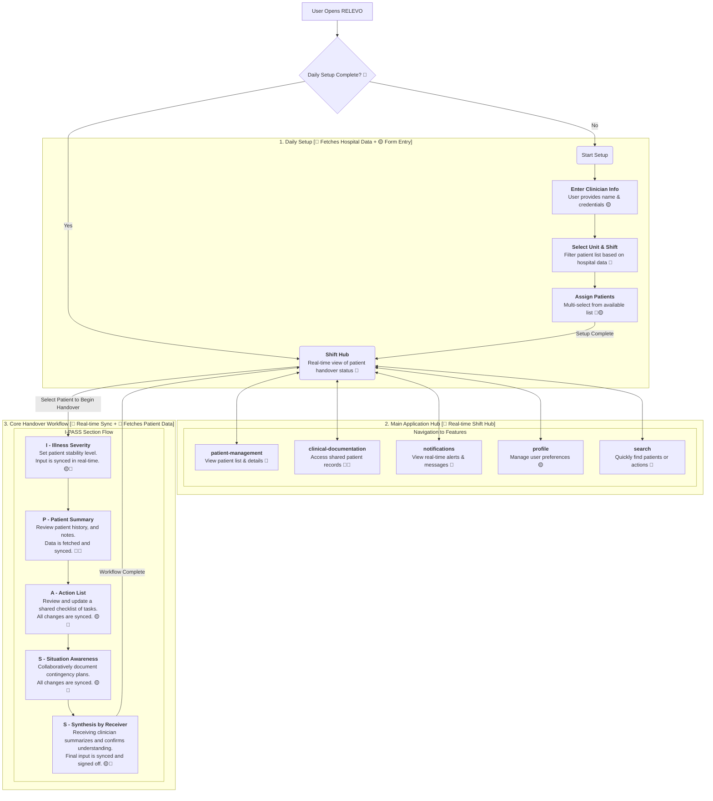

### **Feature Classification Key**

  - **🔴 Real-time Features**: Utilizes technologies like WebSockets for live sync status, session timers, auto-save functionality, and multi-user collaboration indicators.
  - **🟡 NO Real-time Features**: Standard client-side actions like form submissions or patient selections that trigger a one-time data transaction.
  - **🔵 External Data Sources**: Involves API calls to fetch data from federated hospital services, such as EMR/EHR for doctor/patient information, unit lists, and clinical records.

## 🎯 Application Flow with Feature Classification

This diagram illustrates the complete user journey through the RELEVO application, detailing the technical interactions at each step.

### Detailed Flow Description

#### 1\. Daily Setup (`daily-setup`)

This initial phase is a blend of fetching foundational data from hospital services and capturing direct user input. It's a mandatory prerequisite to starting a shift.

  - **Fetching Data (🔵)**: The application initiates API calls to retrieve foundational data required for the session. This includes lists of medical units (e.g., PICU, NICU), shift times, and a roster of available patients within those units. Clinician credentials may also be validated against a central hospital directory.
  - **User Input (🟡)**: The clinician actively enters their information (name, credentials) and uses a multi-select interface to choose their patients for the shift. These are discrete, form-based actions that configure the user's session state.

#### 2\. Main Application Hub (`dashboard`)

The Shift Hub is a dynamic, real-time feature that serves as the central navigation and status hub for the clinician's entire shift.

  - **Real-time Status (🔴)**: The Shift Hub displays a grid or list of the user's assigned patients. The handover status for each patient (e.g., Not Started, In Progress, Complete) is a live indicator, updated in real-time via a WebSocket connection as team members interact with the system.
  - **Navigation to Core Features**:
      - **`patient-management` (🔵)**: A dedicated view to manage and review the assigned patient list. It fetches detailed, read-only summaries for each patient.
      - **`clinical-documentation` (🔵🔴)**: Provides access to the patient's full medical record. It fetches historical data from the EMR (🔵) and enables real-time collaborative editing of notes (🔴), where multiple users can see each other's changes live.
      - **`notifications` (🔴)**: An inbox where real-time alerts (e.g., new lab results, urgent messages from colleagues) are pushed to the user.
      - **`profile` (🟡)**: A standard settings page for managing user information and application preferences (e.g., theme, notification settings).
      - **`search` (🔵)**: A command palette (`⌘K`) that allows for rapid, full-text search across all assigned patients and their core data.

#### 3\. Core Handover Workflow (`handover`)

The I-PASS workflow is the application's cornerstone feature, orchestrating a safe and structured transfer of patient care. It is a stateful process, heavily reliant on both real-time synchronization and fetching external patient data.

  - **`I` - Illness Severity (🟡🔴)**: The giving clinician makes a subjective assessment of the patient's stability. This selection is a user-driven event (🟡) that is immediately broadcast to all collaborators in real-time (🔴).
  - **`P` - Patient Summary (🔵🔴)**: This view presents a concise summary of the patient's case, pulling the most recent data from the hospital's EMR (labs, notes) (🔵). The content itself can be collaboratively discussed and edited in real-time (🔴).
  - **`A` - Action List (🟡🔴)**: A dynamic, shared checklist of pending tasks and follow-ups. Any team member can add, edit, or check off items (🟡), with all changes instantly synced for everyone else (🔴).
  - **`S` - Situation Awareness & Contingency Planning (🟡🔴)**: A collaborative text-editing field where clinicians can jointly document potential risks and "what-if" scenarios. All contributions are synced live (🔴).
  - **`S` - Synthesis by Receiver (🟡🔴)**: The final step. The receiving clinician must summarize the handover in their own words (🟡). This action is synced and serves as the digital signature, completing the handover and updating the patient's status on the main Shift Hub in real-time (🔴).