### **Feature Classification Key**

  - **🔴 Real-time Features**: Utilizes technologies like WebSockets for live sync status, session timers, auto-save functionality, and multi-user collaboration indicators.
  - **🟡 User-Driven Actions**: Standard, discrete client-side actions like form submissions or selections that trigger a one-time data transaction with the backend.
  - **🔵 External/Backend Data**: Involves API calls to fetch or persist data. This includes fetching initial data from hospital systems (EMR/EHR) and all standard interactions with the RELEVO C\# backend.

## 🎯 Application Flow with Feature Classification

This diagram illustrates the complete user journey through the RELEVO application, detailing the technical interactions at each step based on the provided architecture.

```mermaid
graph TD
    A[User Opens RELEVO & Authenticates via Clerk] --> B{Daily Setup Complete? 🔵}
    
    B -- No --> C
    B -- Yes --> D

    subgraph "1. Daily Setup [🔵 Fetches Hospital Data + 🟡 Form Entry]"
        C(Start Setup) --> C1["<b>1. Select Unit & Shift</b><br/>User selects from lists fetched from the hospital system via the backend. 🔵🟡"]
        C1 --> C2["<b>2. Assign Patients</b><br/>User assigns patients to themself from a roster fetched for the selected unit. 🔵🟡"]
        C2 -- Setup Complete --> D
    end
    
    subgraph "2. Main Application Hub [🔴 Real-time Dashboard]"
        D("<b>Dashboard / Main Hub</b><br/>Real-time view of assigned patients and handover status. 🔴")
        subgraph "Navigation to Features"
          D --> E["<b>Patient Management</b><br/>View patient list & details. 🔵"]
          D -- Select Patient --> F["<b>Core Handover Workflow</b><br/>Initiate or continue a handover."]
          D --> G["<b>Notifications</b><br/>View real-time alerts. 🔴"]
          D --> H["<b>Profile & Settings</b><br/>Manage user preferences. 🟡"]
          D --> I["<b>Search (CommandPalette)</b><br/>Find patients or action items. 🔵"]
        end
    end
    
    subgraph "3. Core Handover Workflow [🔴 Real-time Sync + 🔵 Fetches Patient Data + 🟡 User Actions]"
        
      subgraph "I-PASS Section Flow"
        F --> J["<b>I - Illness Severity</b><br/>Set patient stability level. 🟡🔴"]
        J --> K["<b>P - Patient Summary</b><br/>Review patient history from EMR. 🔵"]
        K --> L["<b>A - Action List</b><br/>Review and update a shared checklist of tasks. 🟡🔴"]
        L --> M["<b>S - Situation Awareness</b><br/>Collaboratively edit contingency plans in a text editor. 🔴"]
        M --> N["<b>S - Synthesis by Receiver</b><br/>Receiving clinician summarizes and confirms understanding to complete the handover. 🟡🔴"]
      end

      subgraph "Auxiliary Panels"
        F <--> P1["<b>Collaboration Panel</b><br/>Real-time chat and activity feed for the patient. 🔴🔵"]
        F <--> P2["<b>Patient Timeline</b><br/>View history of past handovers. 🔵"]
      end

      N -- "Workflow Complete" --> D
    end
```

### Detailed Flow Description

#### 1\. Daily Setup (`daily-setup`)

This initial phase is a mandatory prerequisite for starting a shift and is a blend of fetching foundational data and capturing direct user input.

  - **Fetching Data (🔵)**: The application initiates API calls to the C\# backend to retrieve foundational data required for the session. This includes lists of medical units and shift times, which may be cached by the backend to improve response times.
  - **User Input & Data Fetching (🔵🟡)**: The clinician selects their unit and shift (🟡). Based on this, the application fetches a roster of available patients (🔵). The clinician then uses a multi-select interface to assign patients to their shift (🟡), which creates the session configuration. The clinician's identity is confirmed automatically via the JWT from the Clerk authentication service.

#### 2\. Main Application Hub (`dashboard`)

The dashboard is a dynamic, real-time feature that serves as the central navigation and status hub for the clinician's entire shift.

  - **Real-time Status (🔴)**: The dashboard displays a grid of the user's assigned patients. The handover status for each patient (e.g., Not Started, In Progress, Completed) is a live indicator, updated in real-time via a WebSocket connection as team members work. This is managed by the NestJS service.
  - **Navigation to Core Features**:
      - **`patient-management` (🔵)**: A view to manage the assigned patient list, which fetches detailed, read-only summaries for each patient from the C\# backend.
      - **`notifications` (🔴)**: An inbox where real-time alerts (e.g., new lab results, urgent messages) are pushed to the user via the NestJS real-time service.
      - **`profile` (🟡)**: A standard settings page for managing user preferences (e.g., theme), which are saved via API calls.
      - **`search` (🔵)**: A command palette that allows for rapid, server-side search across all patients and action items, powered by Oracle Text through the C\# API.

#### 3\. Core Handover Workflow (`handover`)

The I-PASS workflow is the application's cornerstone feature for orchestrating a safe and structured transfer of patient care. It is a stateful, collaborative process reliant on real-time synchronization, user actions, and fetching patient data.

  - **`I` - Illness Severity (🟡🔴)**: The clinician selects the patient's stability level. This user-driven event (🟡) is sent to the C\# backend, which then triggers a real-time broadcast (🔴) to all collaborators via the NestJS service.
  - **`P` - Patient Summary (🔵)**: This view presents a concise summary of the patient's case, pulling the most recent data from the C\# backend, which holds the patient's clinical information.
  - **`A` - Action List (🟡🔴)**: A dynamic, shared checklist of tasks. Any team member can add, edit, or check off items (🟡), with changes saved to the database and instantly synced via WebSockets to everyone else (🔴).
  - **`S` - Situation Awareness (🔴)**: A collaborative text-editing field powered by Hocuspocus where clinicians can jointly document contingency plans. All contributions are synced live between clients (🔴) and persisted periodically to the database.
  - **`S` - Synthesis by Receiver (🟡🔴)**: The final step. The receiving clinician submits their summary of the handover (🟡). This action is saved to the C\# backend and serves as the digital sign-off, which triggers a real-time event (🔴) that completes the handover and updates the patient's status on the main dashboard.