### **Feature Classification Key**

  - **🔴 Real-time Features**: Utilizes technologies like WebSockets for live synchronization of data, such as status indicators, collaborative text editing, and chat messages.
  - **🟡 User-Driven Actions**: Standard, discrete client-side actions like form submissions or selections that trigger a one-time data transaction with the backend.
  - **🔵 Backend Data Interaction**: Involves API calls to the C\# backend to fetch or persist data. The backend may in turn interact with external hospital systems like an EMR/EHR.

## 🎯 I-PASS Workflow & Patient Navigation

This document details two core user journeys: the step-by-step clinical handover process and the responsive patient management interface.

### 1\. I-PASS Clinical Workflow Navigation (`handover`)

This flow maps the structured, yet flexible, navigation within the core I-PASS handover feature. It is a rich, collaborative environment designed for both linear progression and non-linear, conversational-style handovers.

```mermaid
graph TD
    subgraph "A. Core I-PASS Sequence"
        direction TB
        START_WORKFLOW["Start Handover for a Patient 🟡"]
        START_WORKFLOW -- "POST /handovers" --> I["<b>I - Illness Severity</b><br/>User sets patient stability level.<br/>Selection is synced live. 🟡🔴"]
        I --> P["<b>P - Patient Summary</b><br/>Review patient chart, history.<br/>EMR data is fetched; notes are saved explicitly. 🔵🟡"]
        P --> A["<b>A - Action List</b><br/>Collaboratively manage a shared checklist.<br/>All updates are synced live. 🟡🔴"]
        A --> S1["<b>S - Situation Awareness</b><br/>Jointly document contingency plans.<br/>Live collaborative text editing. 🔴"]
        S1 --> S2["<b>S - Synthesis by Receiver</b><br/>Receiver summarizes to confirm understanding.<br/>Final sign-off is synced live. 🟡🔴"]
        S2 --> END_WORKFLOW["Handover Complete ✅<br/>Status updates on Dashboard. 🔴"]
    end

    subgraph "B. Auxiliary & Non-Linear Features"
        P --> FULLSCREEN1["<b>FullscreenEditor (Static Mode)</b><br/>Expand Patient Summary for focused writing. 🔵🟡"]
        S1 --> FULLSCREEN2["<b>FullscreenEditor (Collaborative Mode)</b><br/>Expand Situation Awareness for live co-editing. 🔴"]
        
        COLLAB["<b>CollaborationPanel</b><br/>Real-time chat, presence, and activity feed for the patient. 🔴🔵"]
        
        TIMELINE["<b>PatientTimeline</b><br/>Navigate patient's handover history. 🔵"]

        %% Connections for Auxiliary Features
        subgraph Handover Session
            direction LR
            I; P; A; S1; S2;
        end
        
        Handover Session <--> COLLAB
        Handover Session <--> TIMELINE
    end
```

#### **Workflow Description**

  - **A. Core I-PASS Sequence**: While the workflow has a logical start and end, it is designed for flexibility, allowing clinicians to move freely between I-PASS sections using a collapsible accordion interface.

      - **Data Integration (🔵)**: The `Patient Summary` section is populated with data fetched from the backend (`GET /handovers/{handoverId}`), ensuring the handover is based on the latest clinical information. Updates to this section are saved via an explicit user action.
      - **Real-time Collaboration (🔴)**: Every field is designed for collaboration.
          - Changes to `Illness Severity` and the `Action List` trigger server-to-server webhooks from the C\# API to the NestJS service, which then broadcasts the updates to all connected clients.
          - The `Situation Awareness` section uses a Hocuspocus server for true real-time collaborative text editing, including cursor tracking and presence.
          - The `CollaborationPanel` provides at-a-glance awareness of team members through presence indicators and offers a patient-specific chat and a live activity feed.
      - **User-Driven Actions (🟡)**: Each step requires active participation, such as setting a value in `Illness Severity`, checking off items in the `Action List`, or submitting the final summary in `Synthesis by Receiver`. These actions trigger the real-time syncs and are persisted via API calls to the C\# backend.

  - **B. Auxiliary Features**: The workflow is enhanced with powerful tools to support a natural, conversational handover.

      - **Fullscreen Editor**: For sections requiring extensive text entry, the user can enter a dedicated `FullscreenEditor`. This editor operates in a static mode for `Patient Summary` (explicit save) and a live collaborative mode for `Situation Awareness`.
      - **Patient Timeline**: Users can access the `PatientTimeline` to view a chronological history of all past handovers for the patient, populated by the `GET /patients/{patientId}/handovers` endpoint. Selecting a past handover loads its full, read-only state.

-----

### 2\. Patient Management Comprehensive Flow (`patient-management`)

This flow details how clinicians view and select patients, showcasing the application's responsive design for mobile and desktop devices.

```mermaid
graph TD
    subgraph "Entry & Device Detection"
        A["Navigate to 'Patients' Tab 🟡"] --> B{"Detect Device Type"}
        B -- "Mobile" --> C[Mobile Layout: `PatientListView`]
        B -- "Desktop" --> D[Desktop Layout: `FigmaDesktopLayout`]
    end

    subgraph "Mobile Flow [Touch-Optimized]"
        C -- "Fetches patient list 🔵" --> C1["Render List of `PatientSelectionCard`s"]
        C1 -- "Tap a patient 🟡" --> C2["Show `PatientDetailView`<br/>Full-screen view with all patient info 🔵"]
    end

    subgraph "Desktop Flow [Feature-Rich]"
        D -- "Fetches patient list 🔵" --> D1["Render two-panel view with patient list and details"]
        D1 -- "Click a patient 🟡" --> D2["Display patient details in main panel 🔵"]
        D -- "Press ⌘K 🟡" --> D3["Open `CommandPalette` (search)"]
        D3 -- "Search and select 🟡" --> D2
    end

    subgraph "Actions from Detail View"
        C2 & D2 -- "User action 🟡" --> E{"Select Action"}
        E --> E1["Start/Continue Handover<br/>Initiates `handover` workflow 🔴"]
        E --> E2["View Handover History<br/>Opens `PatientTimeline` view 🔵"]
    end
```



#### **Patient Management Description**

  - **Responsive Layouts**: The application provides distinct experiences optimized for different screen sizes.

      - **Mobile (`PatientListView`)**: A streamlined, single-column list of patient cards designed for touch interaction. Tapping a card opens a full-screen `PatientDetailView` to display comprehensive patient information.
      - **Desktop (`FigmaDesktopLayout`)**: An expansive multi-column layout with a patient list on the left and a detailed content area on the right, allowing for rapid context switching.

  - **Data Flow**: The list of patients assigned to the clinician is fetched from the backend using the `GET /me/patients` endpoint. When a user selects a patient, their comprehensive details are retrieved via `GET /patients/{patientId}` to populate the detail view.

  - **Actions**: From the detailed view on any device, the user can initiate key workflows:

      - **Start Handover (🔴)**: Navigates the user to the real-time `HandoverSession` workflow for the selected patient. This is initiated by calling `POST /handovers`.
      - **View History (🔵)**: Allows the user to access the `PatientTimeline`, which provides a historical log of all previous handovers for that patient. This data is fetched from the `GET /patients/{patientId}/handovers` and `GET /handovers/{handoverId}/history` endpoints.
      - **Search Integration (🔵)**: On desktop, the `CommandPalette` (`⌘K`) provides a powerful way to quickly find and jump to a specific patient using the `GET /search` endpoint, which is powered by Oracle Text for performance.