### **Feature Classification Key**

  - [cite\_start]**🔴 Real-time Features**: Utilizes technologies like WebSockets for live sync status [cite: 1894, 1895][cite\_start], session timers [cite: 329, 931][cite\_start], auto-save functionality [cite: 786][cite\_start], and multi-user collaboration indicators[cite: 334, 673].
  - [cite\_start]**🟡 NO Real-time Features**: Standard client-side actions like form submissions [cite: 993][cite\_start], patient selection[cite: 131], or navigation that trigger a one-time data transaction.
  - [cite\_start]**🔵 External Data Sources**: Involves API calls to fetch or filter data from hospital services, such as EMR/EHR for doctor/patient information [cite: 2, 1907][cite\_start], unit lists [cite: 1899][cite\_start], and shift data[cite: 1900].

## 🎯 I-PASS Workflow & Patient Navigation

This document details two core user journeys: the step-by-step clinical handover process and the responsive patient management interface.

### 1\. I-PASS Clinical Workflow Navigation (`handover`)

This flow maps the structured, yet flexible, navigation within the core I-PASS handover feature. It is a rich, collaborative environment designed for both linear progression and non-linear, conversational-style handovers.

```mermaid
graph TD
    subgraph "A. Core I-PASS Sequence [🔵 Fetches EMR Data + 🔴 Real-time Sync]"
        direction TB
        START_WORKFLOW["Start Handover for a Patient 🟡"]
        START_WORKFLOW --> I["<b>I - Illness Severity</b><br/>User sets patient stability level.<br/>Selection is synced live. 🟡🔴"]
        I --> P["<b>P - Patient Summary</b><br/>Review patient chart, history, and vitals.<br/>EMR data is fetched; notes are synced. 🔵🔴"]
        P --> A["<b>A - Action List</b><br/>Collaboratively manage a shared checklist.<br/>All updates are synced live. 🟡🔴"]
        A --> S1["<b>S - Situation Awareness</b><br/>Jointly document contingency plans.<br/>All text edits are synced live. 🟡🔴"]
        S1 --> S2["<b>S - Synthesis by Receiver</b><br/>Receiver summarizes to confirm understanding.<br/>Final sign-off is synced live. 🟡🔴"]
        S2 --> END_WORKFLOW["Handover Complete ✅<br/>Status updates on Shift Hub. 🔴"]
    end

    subgraph "B. Auxiliary & Non-Linear Navigation"
        P --> FULLSCREEN1["<b>FullscreenEditor</b><br/>Expand Patient Summary for focused editing. 🔴"]
        S1 --> FULLSCREEN2["<b>FullscreenEditor</b><br/>Expand Situation Awareness for focused editing. 🔴"]
        FULLSCREEN1 & FULLSCREEN2 --> |"Exit Fullscreen"| A

        COLLAB["<b>CollaborationPanel</b><br/>Shows who is active in each section. 🔴"]
        COLLAB -- "Click to navigate" --> I & P & A & S1 & S2

        ACCORDION["<b>Collapsible Accordion Interface</b><br/>Collapse or expand any I-PASS section."]
        ACCORDION -- "Jump to any section" --> I & P & A & S1 & S2
    end
```

#### **Workflow Description**

  - **A. Core I-PASS Sequence**: While the workflow has a logical start and end, it is designed for flexibility, allowing clinicians to move freely between sections.

      - [cite\_start]**Data Integration (🔵)**: The `Patient Summary` section is enriched with read-only data fetched directly from the hospital's EMR, ensuring the handover is based on the latest clinical information[cite: 27, 57, 58].
      - **Real-time Collaboration (🔴)**: Every field, selection, and checklist item is a collaborative object. [cite\_start]The `IllnessSeverity` component simulates a real-time update when a user makes a selection[cite: 689]. [cite\_start]The `SituationAwareness` component features auto-saving to simulate live text editing[cite: 786]. [cite\_start]The `CollaborationPanel` provides at-a-glance awareness of where team members are currently active by showing a live feed of updates[cite: 641, 658].
      - [cite\_start]**User-Driven Actions (🟡)**: Each step requires active participation—making assessments in `IllnessSeverity` [cite: 689][cite\_start], checking off items in the `SynthesisByReceiver` checklist [cite: 707, 718][cite\_start], and writing notes in `SituationAwareness` [cite: 798] [cite\_start]or `PatientSummary`[cite: 556]. These actions trigger the real-time sync.

  - **B. Auxiliary & Non-Linear Navigation**: The workflow is not rigidly linear, supporting a natural, conversational handover.

      - [cite\_start]**Fullscreen Editor**: For sections requiring extensive text entry, like `PatientSummary` or `SituationAwareness`, the user can enter a dedicated `FullscreenEditor` for a focused writing experience, which is then synced back to the main session[cite: 331, 535, 774, 776].
      - **Free Navigation**: Users can jump between any I-PASS section at any time. [cite\_start]The main interface is built with `Collapsible` components, allowing each section to be expanded or collapsed independently[cite: 418, 444, 457]. [cite\_start]The `CollaborationPanel` also allows users to click on an activity update to navigate directly to that section[cite: 663, 664].

-----

### 2\. Patient Management Comprehensive Flow (`patient-management`)

This flow details how clinicians view and select patients, showcasing the application's responsive design for mobile and desktop devices. The system dynamically renders different layouts based on screen size.

```mermaid
graph TD
    subgraph "Entry & Device Detection"
        A["Navigate to 'Patients' Tab 🟡"] --> B{"Detect Device Type"}
        B -- "Mobile" --> C[Mobile Layout: `PatientListView`]
        B -- "Desktop" --> D[Desktop Layout: `FigmaDesktopLayout` or `SimpleDesktopLayout`]
    end

    subgraph "Mobile Flow [Touch-Optimized]"
        C -- "Fetches patient list 🔵" --> C1["Render List of `SimplePatientCard`s"]
        C1 -- "Tap a patient 🟡" --> C2["Show `PatientDetailView`<br/>Full-screen view with all patient info 🔵"]
    end

    subgraph "Desktop Flow [Feature-Rich]"
        D -- "Fetches patient list 🔵" --> D1["Render two-panel view with patient list and details"]
        D1 -- "Click a patient 🟡" --> D2["Display patient details in main panel 🔵"]
        D -- "Press ⌘K 🟡" --> D3["Open `CommandPalette` (search feature)"]
        D3 -- "Search and select 🟡" --> D2
    end

    subgraph "Actions from Detail View"
        C2 & D2 -- "User action 🟡" --> E{"Select Action"}
        E --> E1["Start Handover<br/>Initiates `handover` workflow 🔴"]
        E --> E2["View/Edit Documentation<br/>Opens `ClinicalDocumentation` modal 🔵🔴"]
        E --> E3["View History<br/>Fetches historical data 🔵"]
    end
```

#### **Patient Management Description**

  - [cite\_start]**Responsive Layouts**: The application provides distinct experiences optimized for different screen sizes, detected via a `useIsMobile` hook[cite: 991].

      - [cite\_start]**Mobile (`PatientListView`)**: A streamlined, single-column list of `SimplePatientCard` components designed for touch interaction[cite: 218, 247]. [cite\_start]Tapping a card triggers the `onPatientSelect` handler [cite: 247][cite\_start], which opens a full-screen `PatientDetailView` to display comprehensive patient information, ensuring an uncluttered and focused experience[cite: 17].
      - [cite\_start]**Desktop (`FigmaDesktopLayout` / `SimpleDesktopLayout`)**: A more expansive multi-column layout is used, such as a two-panel view with a patient list on the left and a detailed content area on the right[cite: 18, 1618]. This allows for rapid context switching without losing sight of the overall patient list.

  - [cite\_start]**Data Flow**: The patient list is initially fetched from a centralized data store that simulates an API call to hospital services (🔵)[cite: 1907, 123, 1164]. [cite\_start]When a user selects a patient, their comprehensive details are retrieved to populate either the `PatientDetailView` (mobile) or the main content panel (desktop)[cite: 16, 131, 143].

  - **Actions**: From the detailed view on any device, the user can initiate key workflows:

      - [cite\_start]**Start Handover (🔴)**: Navigates the user to the real-time `HandoverSession` workflow for the selected patient[cite: 41, 15, 17].
      - [cite\_start]**Clinical Documentation (🔵🔴)**: Opens the `ClinicalDocumentation` modal, which fetches existing records and allows for real-time collaborative editing of I-PASS sections[cite: 24, 40, 56, 1222].
      - [cite\_start]**Search Integration (🔵)**: On desktop, the `CommandPalette` (`⌘K`) provides a powerful way to quickly find and jump to a specific patient across different hospital units, bypassing manual scrolling[cite: 24, 1537, 1853].