### **Feature Classification Key**

  - **🔴 Real-time Features**: Utilizes technologies like WebSockets for live synchronization of data, such as chat, presence indicators, and collaborative text editing.
  - **🟡 User-Driven Actions**: Standard, discrete client-side actions like form submissions or selections that trigger a one-time data transaction with the backend.
  - **🔵 Backend Data Interaction**: Involves API calls to the C\# backend to fetch or persist data, such as loading historical information or saving new entries.

## 🎯 Collaboration & Workflow Integration

This document outlines the application's real-time collaboration capabilities and maps the various entry points into its core clinical workflow.

### 1\. Real-time Collaboration Flow (`CollaborationPanel`)

This flow details user interactions within the `CollaborationPanel`, the central hub for team communication and activity tracking during a live handover session.

#### **Collaboration Feature Breakdown**

The `CollaborationPanel` is a dynamic sidebar that consolidates team interactions into two distinct tabs: "Discussion" and "Updates" (Activity Feed).

  - **Live Chat & Discussion (🔴🟡🔵)**: The "Discussion" tab provides a patient-specific chat thread. When a user sends a message (🟡), it is transmitted via a WebSocket to the NestJS service, which then broadcasts a `chat:message` event (🔴) to all participants in the dedicated Socket.IO room. The NestJS service then makes a `POST /patients/{patientId}/messages` call to the C\# API to persist the message to the database (🔵). Initial chat history is loaded via `GET /patients/{patientId}/messages` when the panel opens (🔵).

  - **Presence & Activity Indicators (🔴)**: The panel displays avatars of all clinicians in the session and the "Updates" tab shows a live feed of significant actions. When a user updates an I-PASS section, the C\# API triggers a webhook to the NestJS service (e.g., `ILLNESS_SEVERITY_UPDATED`). The NestJS service then broadcasts a `handover:activity` event to clients, providing at-a-glance awareness of team members' actions.

  - **Typing Indicators (🔴)**: To improve the flow of conversation, a `chat:typing` event is broadcast when a user is actively typing a message, allowing a "user is typing..." indicator to be displayed in the UI.

  - **Contextual Navigation (🟡)**: The `CollaborationPanel` also serves as a navigation tool. Clicking on an item in the "Updates" feed instantly scrolls the main view to that specific I-PASS section, supporting a more natural, conversational handover.

-----

### 2\. Handover Workflow Integration Map

This diagram illustrates the various pathways a user can take to enter the single, primary clinical workflow: the **`HandoverSession`**. The application provides multiple, context-aware entry points to streamline user access.

```mermaid
graph TD
    subgraph "A. Workflow Entry Points (User Actions 🟡)"
        A1["Dashboard View: Click 'Start Handover' on patient card"]
        A2["Patient Detail View: Click 'Initiate Handover'"]
        A3["Search (⌘K): Find patient, select 'Handover' action"]
    end

    subgraph "B. Handover Session Initiation"
        A1 & A2 & A3 --> B1["<b>Initiate HandoverSession Workflow</b>"]
        B1 -- "Calls POST /handovers with patientId 🔵" --> B2["C# API creates new handover record"]
        B2 -- "Returns new handover object" --> B3["Client navigates to HandoverSession view"]
    end

    subgraph "C. The Handover Session"
        B3 -- "Establishes WebSocket connection 🔴" --> C1["Real-time collaborative environment"]
        C1 -- "Fetches full handover state via GET /handovers/{id} 🔵" --> C2["User completes all I-PASS steps"]
        C2 -- "Final sign-off by receiver via PUT /handovers/{id}/synthesis 🟡" --> C3["Handover is logged & status updated"]
        C3 -- "Triggers HANDOVER_STATUS_CHANGED webhook 🔴" --> C4["Dashboard status updates in real-time"]
    end
```

#### **Workflow Integration Details**

  - **Unified Workflow Entry (🟡)**: The application is designed to be context-aware, offering users several convenient ways to access the core `HandoverSession` workflow. A handover can be initiated from:

      * The main `ContextAwareDashboard`.
      * The dedicated `PatientDetailView`.
      * The `CommandPalette` search results.

  - **A Single, Focused Workflow**: Unlike a general-purpose documentation tool, the application funnels users into one primary clinical workflow: the **`HandoverSession`**. This is a formal, stateful session focused on the synchronous transfer of care for a single patient. All clinical documentation (Patient Summary, Situation Awareness, etc.) occurs within the context of this session.

  - **Technical Initiation Flow (🔵🔴)**: Regardless of the entry point, the process is the same:

    1.  The client sends a `POST /handovers` request containing the `patientId` to the C\# API.
    2.  The API creates a new `HANDOVERS` record in the database, along with its associated collaborative document, and returns the new handover object.
    3.  The client application uses this data to navigate to the `HandoverSession` component, which then establishes a WebSocket connection to the NestJS service for real-time collaboration.