### **Feature Classification Key**

  - **🔴 Real-time Features**: Live sync status, session timers, auto-save functionality, collaboration indicators.
  - **🟡 NO Real-time Features**: Standard client-side actions like form submissions, patient selection, or navigation that trigger a one-time data transaction.
  - **🔵 External Data Sources**: Involves API calls to fetch data from hospital services, such as EMR/EHR for doctor/patient information, unit lists, and shift data.

## 🎯 Collaboration & Workflow Integration

This document outlines the application's real-time collaboration capabilities and maps the various entry points into its core clinical workflows.

### 1\. Real-time Collaboration Flow (`CollaborationPanel`)

This flow details the user interactions within the `CollaborationPanel`, the central hub for team communication and activity tracking during a live handover session. It provides both a persistent chat and a real-time activity feed.

```mermaid
graph TD
    subgraph "User Actions (Client-Side 🟡)"
        A["User opens `CollaborationPanel` 🟡"] --> B["Types a message in the 'Discussion' tab 🟡"]
        A --> C["Clicks on an activity in the 'Updates' tab 🟡"]
    end

    subgraph "Real-time System Events (Server-Side 🔴)"
        B -- "Sends message" --> D["Message broadcast to all session participants 🔴"]
        D --> E["UI updates with new message for all users 🔴"]

        F["Another user starts typing 🟡"] --> G["'User is typing...' indicator is broadcast 🔴"]
        G --> H["UI shows typing indicator to all users 🔴"]

        I["User joins/leaves or updates an I-PASS section 🟡"] --> J["Presence & activity update is broadcast 🔴"]
        J --> K["`CollaborationPanel` 'Updates' feed is populated 🔴"]
    end

    subgraph "Data Integration (🔵)"
        L["Panel loads initial comment history & activity 🔵"]
        E -- "Message persisted" --> M["New message saved to database 🔵"]
    end
```

#### **Collaboration Feature Breakdown**

[cite\_start]The `CollaborationPanel` is a dynamic sidebar that consolidates team interactions into two distinct tabs: "Discussion" and "Updates"[cite: 646, 647].

  - **Live Chat & Discussion (🔴🟡🔵)**: The "Discussion" tab provides a dedicated chat thread for the handover. [cite\_start]When a user sends a message (a 🟡 client-side action), it is broadcast in real-time (🔴) to all participants and then persisted in the database (🔵)[cite: 642, 656]. Initial message history is loaded when the panel opens (🔵).

  - **Presence & Activity Indicators (🔴)**: The panel displays the avatars of all clinicians currently in the handover session. [cite\_start]More importantly, the "Updates" tab shows a live feed of significant actions, such as a user updating the `Illness Severity` or adding a new task to the `Action List`[cite: 641]. This provides crucial, at-a-glance situational awareness of where team members are currently active.

  - **Typing Indicators (🔴)**: To prevent users from talking over each other in the chat, a "user is typing..." indicator appears in real-time before a message is sent. [cite\_start]This feature is crucial for smooth, synchronous text communication, as seen in components like `SituationAwareness` which track collaborator actions[cite: 780].

  - **Contextual Navigation (🟡)**: The `CollaborationPanel` also serves as a navigation tool. [cite\_start]Clicking on an item in the "Updates" feed (e.g., "Dr. Johnson updated Illness Severity") instantly scrolls the main view to that specific I-PASS section, allowing for a more natural, conversational flow where clinicians can revisit points as needed[cite: 663, 664].

-----

### 2\. Clinical Workflow Integration Map

This diagram illustrates the various pathways a user can take to enter the two primary clinical workflows: the structured `handover` session and the general-purpose `clinical-documentation` editor.

```mermaid
graph TD
    subgraph "A. Workflow Entry Points (User Actions 🟡)"
        A1["Patient Detail View: Click 'Start Handover'"] --> B1
        A2["Desktop Patient View: Select patient, click 'Start Handover'"] --> B1
        A3["Search (⌘K): Find patient, select 'Handover'"] --> B1

        B1["<b>Initiate `handover` Workflow</b>"]

        C1["Patient Detail View: Click 'I-PASS' for docs"] --> D1
        C2["App Sidebar: Click 'Documentation'"] --> D1
        C3["Desktop Patient View: Click 'Clinical Entry'"] --> D1

        D1["<b>Open `clinical-documentation` Editor</b>"]
    end

    subgraph "B. Structured Handover Workflow (`handover`)"
        B1 -- "Loads patient data 🔵" --> B2["I-PASS session begins"]
        B2 -- "Real-time collaboration environment 🔴" --> B3["User completes all I-PASS steps"]
        B3 -- "Final sign-off by receiver 🟡" --> B4["Handover is logged & status updated 🔵🔴"]
    end

    subgraph "C. General Clinical Documentation (`clinical-documentation`)"
        D1 -- "Requires a patient context" --> D2{"Patient Selected?"}
        D2 -- Yes --> D3["Load patient's documents 🔵"]
        D2 -- No --> D4["Show 'Smart Patient' Selector"]
        D4 -- "Uses fallback logic 🟡" --> D3
        D3 -- "Real-time collaborative editor 🔴" --> D5["User edits forms, notes, etc."]
        D5 -- "Auto-save 🔴" --> D6["Changes persisted to database 🔵"]
    end

    subgraph "D. 'Smart Patient' Selection Logic"
       D4 --> LOGIC["Find best patient match:"]
       LOGIC --> |"1. Last patient documented by user"| P1["Local State 🟡"]
       LOGIC --> |"2. First patient with 'Watcher' severity"| P2["EMR Data 🔵"]
       LOGIC --> |"3. First patient with 'in-progress' status"| P3["App State 🔴"]
       LOGIC --> |"4. First patient in the list"| P4["Local State 🟡"]
    end
```



#### **Workflow Integration Details**

  - [cite\_start]**Multiple Entry Points (🟡)**: The application is designed to be context-aware, offering users several convenient ways to access core workflows. A handover can be initiated directly from the `PatientDetailView` [cite: 41, 26][cite\_start], the `FigmaDesktopLayout` [cite: 18][cite\_start], or after finding a patient via the `CommandPalette`[cite: 24]. [cite\_start]Similarly, clinical documentation can be accessed from a patient's detail view [cite: 40] [cite\_start]or globally from the `AppSidebar`[cite: 15, 22].

  - **Distinct Workflows**:

      - [cite\_start]**`handover`**: This is a formal, stateful session focused on the synchronous transfer of care for a single patient[cite: 16]. [cite\_start]It is heavily reliant on real-time (🔴) features like live collaboration, sync status, and presence indicators to facilitate a safe and structured I-PASS process[cite: 531, 542].
      - [cite\_start]**`clinical-documentation`**: This is a more general-purpose tool, often for asynchronous work[cite: 24, 25]. [cite\_start]It opens a modal editor allowing a user to access and edit various I-PASS forms for any of their assigned patients[cite: 1219, 1222]. [cite\_start]While it features real-time co-editing (🔴) capabilities like auto-saving, its primary purpose is documentation rather than live communication[cite: 786].

  - **Smart Patient Selection (🟡🔵🔴)**: To streamline documentation, the system uses a fallback mechanism to pre-select the most likely patient if the user initiates documentation globally without first selecting one. [cite\_start]This is handled by the `handleFastClinicalEntry` function[cite: 15], which uses the following logic:

    1.  The most recently documented patient (local state 🟡).
    2.  If none, the first assigned patient with an illness severity of "watcher" (reads from fetched list 🔵).
    3.  If none, the first patient with a status of "in-progress" (live application state 🔴).
    4.  As a final fallback, the first patient in the user's list (local state 🟡).