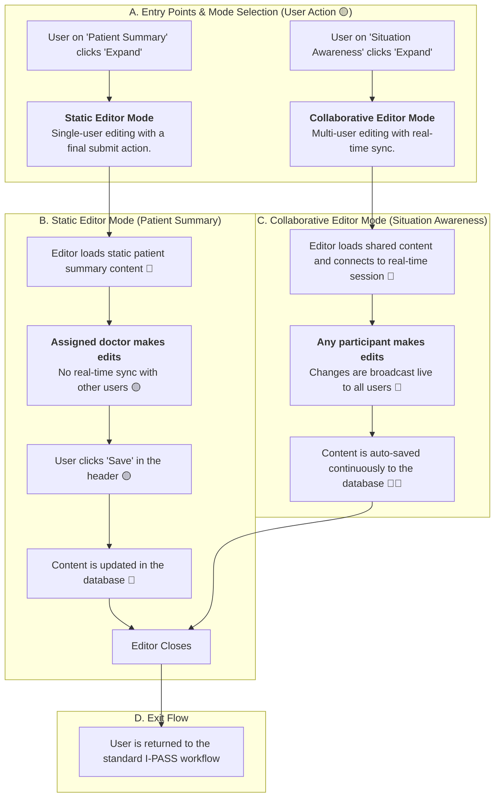

### **Feature Classification Key**

  - **🔴 Real-time Features**: Live sync status, session timers, auto-save functionality, collaboration indicators.
  - **🟡 User-Driven Actions**: Standard client-side actions like form submissions, button clicks, or patient selections that trigger a one-time data transaction.
  - **🔵 External Data Sources**: Involves API calls to fetch data from or persist data to federated hospital services (e.g., EMR/EHR).

## 🎯 Fullscreen Editing Flow (`FullscreenEditor`)

[cite\_start]This document outlines the dual-mode functionality of the `FullscreenEditor`, which provides a focused workspace for both static, single-user content and real-time, multi-user collaboration within the `handover` workflow. [cite: 757, 774, 776]

### `FullscreenEditor` Feature Breakdown

[cite\_start]The `FullscreenEditor` is a context-aware modal overlay that adapts its behavior based on the I-PASS section it's launched from. [cite: 757] It provides a focused, distraction-free environment for documentation.

#### 1\. Static Editor Mode (for `Patient Summary`)

This mode is for foundational content typically owned by a single, assigned clinician to ensure a single source of truth.

  * [cite\_start]**Entry & Permissions (🟡)**: The `Patient Summary` can only be edited by the designated `assignedPhysician`[cite: 549]. When this user clicks 'Expand', the editor enters static mode.
  * [cite\_start]**Environment (🔵)**: The editor loads the patient's existing summary from the EMR[cite: 548]. It operates in a **non-real-time** mode. Edits are local to the user's session and are not broadcast live to other participants.
  * [cite\_start]**Data Persistence (🟡🔵)**: Changes are saved only when the user clicks the "Save" button in the editor's header[cite: 771, 772]. This is a deliberate, single action (🟡) that then updates the record in the database for everyone (🔵). There is no auto-save in this mode.

#### 2\. Collaborative Editor Mode (for `Situation Awareness`)

This mode is designed for brainstorming and live group-editing where multiple inputs are expected and encouraged.

  * [cite\_start]**Entry (🟡)**: Any participant in the handover session can click 'Expand' on the `SituationAwareness` component. [cite: 362]
  * **Environment & Live Sync (🔴)**: The editor loads the shared content and immediately connects to the real-time session. Any edit made by any participant is instantly broadcast to all other users. [cite\_start]The component features an `autoSaveStatus` indicator ("Saving...", "Saved") to provide feedback on the sync state. [cite: 786, 793, 794]
  * **Auto-Save (🔴🔵)**: All changes are continuously and automatically saved to the database in the background, ensuring no data is lost during the collaborative session.

#### 3\. Common UI/UX Features

  * [cite\_start]**UI Overlay**: In both modes, the editor is a modal that takes over the viewport, providing a clean and focused workspace with a persistent header. [cite: 757, 761]
  * [cite\_start]**Header**: The header consistently displays the RELEVO logo, patient name, the name of the section being edited, collaborator avatars, and a sync status indicator ("All changes saved", "Saving..."). [cite: 761-766, 793]
  * **Keyboard Shortcuts**: The editor supports keyboard shortcuts for efficiency. [cite\_start]The `Escape` key closes the editor, and `Ctrl/Cmd+S` triggers the save action. [cite: 759]
  * [cite\_start]**Exit Flow**: Users exit by clicking the 'Close' button or pressing `Esc`, returning them to the main `handover` workflow. [cite: 759, 773]

### **Feature Classification Summary**

  * **🔴 Real-time Features**:

      * [cite\_start]Auto-save functionality in collaborative mode. [cite: 786]
      * Live broadcasting of edits between users in collaborative mode.
      * [cite\_start]Display of `syncStatus` ("Saving...", "All changes saved") to all users. [cite: 764, 765]

  * **🟡 User-Driven Actions (NO Real-time)**:

      * [cite\_start]Clicking the 'Expand' button to open the editor. [cite: 443, 469]
      * [cite\_start]Typing or editing content within the `Textarea`. [cite: 556, 798]
      * [cite\_start]Manually clicking the "Save" button in Static Mode. [cite: 771, 772]
      * [cite\_start]Using keyboard shortcuts like `Esc` to close or `Ctrl+S` to save. [cite: 759]

  * **🔵 External Data Sources**:

      * Loading the initial content for `Patient Summary` or `Situation Awareness` from the database.
      * [cite\_start]Persisting updated content to the database upon manual save (Static Mode) or via auto-save (Collaborative Mode). [cite: 549, 786]