### **Feature Classification Key**

  - **🔴 Real-time Features**: Utilizes technologies like WebSockets or specialized protocols (Hocuspocus) for live, multi-user synchronization of data.
  - **🟡 User-Driven Actions**: Standard, discrete client-side actions like form submissions or button clicks that trigger a one-time data transaction with the backend.
  - **🔵 Backend Data Interaction**: Involves API calls to the C\# backend to fetch or persist data, such as loading initial content or saving updates.

## 🎯 Fullscreen Editing Flow (`FullscreenEditor`)

This document outlines the dual-mode functionality of the `FullscreenEditor`, which provides a focused workspace for both static, single-user content and real-time, multi-user collaboration within the `HandoverSession` workflow.

```mermaid
graph TD
    subgraph "A. Entry Points & Mode Selection (User Action 🟡)"
        A1["User on 'Patient Summary' clicks 'Expand'"] --> B["<b>Static Editor Mode</b><br/>Single-user editing with a final, explicit save action."]
        A2["User on 'Situation Awareness' clicks 'Expand'"] --> C["<b>Collaborative Editor Mode</b><br/>Multi-user editing with real-time sync."]
    end

    subgraph "B. Static Editor Mode (Patient Summary) [🔵🟡]"
        B --> B1["Editor loads 'Patient Summary' content via GET /handovers/{id} 🔵"]
        B1 --> B2["User makes edits locally.<br/>No real-time sync with other users 🟡"]
        B2 --> B3["User clicks 'Save' 🟡"]
        B3 -- "Calls PUT /handovers/{id}/patientSummary" --> B4["Content is updated in the database 🔵"]
        B4 --> X["Editor Closes"]
    end

    subgraph "C. Collaborative Editor Mode (Situation Awareness) [🔴]"
        C --> C1["Editor loads shared content and connects to Hocuspocus service 🔴"]
        C1 --> C2["<b>Multiple participants make edits</b><br/>Changes are broadcast live to all users via Hocuspocus 🔴"]
        C2 --> C3["Content is auto-saved continuously by the real-time service 🔴🔵"]
        C3 --> X
    end
    
    subgraph "D. Exit Flow"
        X --> D1["User is returned to the standard I-PASS workflow"]
    end
```

### `FullscreenEditor` Feature Breakdown

The `FullscreenEditor` is a context-aware modal overlay that adapts its behavior based on the I-PASS section it is launched from. It provides a focused, distraction-free environment for documentation.

#### 1\. Static Editor Mode (for `Patient Summary`) [🔵🟡]

This mode is for foundational content that requires a deliberate, single save action.

  - **Entry (🟡)**: A user clicks the 'Expand' button on the `Patient Summary` component within the `HandoverSession`.
  - **Environment (🔵)**: The editor loads the existing `Patient Summary` content from the current handover record, which is fetched from the C\# backend. Edits made in this mode are local to the user's session and are not broadcast live to other participants.
  - **Data Persistence (🟡🔵)**: Changes are saved only when the user performs an explicit "Save" action. This user-driven action (🟡) triggers a `PUT /handovers/{handoverId}/patientSummary` API call to persist the content to the database (🔵). This triggers a `PATIENT_SUMMARY_UPDATED` webhook to notify other services of the change.

#### 2\. Collaborative Editor Mode (for `Situation Awareness`) [🔴]

This mode is designed for brainstorming and live group-editing where multiple inputs are expected and encouraged.

  - **Entry (🟡)**: Any participant in the handover session can click 'Expand' on the `SituationAwareness` component.
  - **Environment & Live Sync (🔴)**: The editor loads the shared document and immediately connects to the Hocuspocus real-time service using the `situationAwarenessDocId`. Any edit made by any participant—including text changes and cursor movements—is instantly broadcast to all other users in the session.
  - **Auto-Save (🔴🔵)**: The Hocuspocus server is responsible for continuously and automatically persisting changes to the database by making background calls to the C\# backend's `PUT /handovers/{handoverId}/situationAwareness` endpoint, ensuring no data is lost during the collaborative session.

#### 3\. Common UI/UX Features

  - **UI Overlay**: In both modes, the editor is a modal that provides a clean and focused workspace, overlaying the main `HandoverSession` view.
  - **Exit Flow**: Users exit the editor to return to the main `HandoverSession` workflow.

### **Feature Classification Summary**

  - **🔴 Real-time Features**:

      - Auto-save functionality in collaborative mode, managed by the Hocuspocus server.
      - Live broadcasting of edits, cursors, and presence between users in collaborative mode.

  - **🟡 User-Driven Actions**:

      - Clicking the 'Expand' button to open the editor.
      - Typing or editing content within the editor.
      - Manually clicking a "Save" button in Static Mode to persist changes.
      - Closing the editor to return to the main view.

  - **🔵 Backend Data Sources**:

      - Loading the initial content for `Patient Summary` or `Situation Awareness` from the database via the C\# API.
      - Persisting updated content to the database upon manual save (Static Mode) or via auto-save (Collaborative Mode) through API calls.