### **Feature Classification Key**

  - **🔴 Real-time Features**: Utilizes technologies like WebSockets for live, multi-user synchronization of data such as chat or collaborative editing.
  - **🟡 User-Driven Actions**: Standard, discrete client-side actions like form submissions, button clicks, or selections that trigger a local state change or a one-time data transaction with the backend.
  - **🔵 Backend Data Interaction**: Involves API calls to the C\# backend to fetch or persist data.

## 🎯 Focus Mode Flow (`handover`)

This document outlines the user flow for "Focus Mode," a purely client-side UI feature within the `HandoverSession.tsx` component designed to minimize distractions and center the user's attention on the core I-PASS content.

```mermaid
graph TD
    subgraph "A. User Actions (Activation/Deactivation 🟡)"
        A1["User clicks the 'Focus Mode' toggle in the header 🟡"] --> B{"Is 'focusMode' active?"}
    end

    subgraph "B. UI State Rendering (Client-Side)"
        B -- Yes --> C["<b>Focus Mode Active</b><br/>The UI conditionally renders a simplified layout."]
        B -- No --> D["<b>Standard Mode</b><br/>The UI renders the full, feature-rich layout."]
    end

    subgraph "C. Effects of Focus Mode"
        C --> C1["Hides non-essential UI elements like sidebars"]
        C --> C2["Expands the main I-PASS content area to fill the space"]
    end
    
    subgraph "D. Effects of Standard Mode"
        D --> D1["Restores all standard UI elements, including header and sidebars"]
        D --> D2["Restores the default multi-column layout"]
    end
```

### **Focus Mode Feature Breakdown**

Focus Mode is a client-side feature controlled by a local boolean state within the `HandoverSession.tsx` component. Its sole purpose is to improve user concentration by toggling the visibility of non-essential UI elements. It is not a shared or synced state and has no impact on other collaborators in the session.

#### 1\. Activation (User Action 🟡)

A user can toggle Focus Mode on or off by clicking a dedicated "Focus Mode Toggle" button located in the main `Header.tsx` component of the `HandoverSession`. This action is a standard `onClick` event that updates a local component state (e.g., `setFocusMode(!focusMode)`).

#### 2\. UI Transformation (Conditional Rendering)

When the `focusMode` state is `true`, the application's layout conditionally changes:

  - **Hidden Elements**: Non-essential UI elements are hidden to reduce cognitive load. This includes auxiliary components like the `CollaborationPanel` and `PatientTimeline` side panels.
  - **Expanded Content**: The `MainContent.tsx` component, which contains the I-PASS accordion, is expanded to fill the available space, making the clinical text more prominent and readable.

#### 3\. Data and State Classifications

  - **No Backend Data Interaction (🔵)**: Activating Focus Mode does **not** trigger any new API calls or fetch additional data from the backend. It simply rearranges currently rendered components.
  - **No Real-time Sync (🔴)**: The `focusMode` state is entirely local to each user's session. One clinician entering Focus Mode has no effect on what other collaborators see on their screens.
  - **Client-Side State (🟡)**: The entire feature is managed by a single boolean state within the top-level `HandoverSession.tsx` component, making it a purely client-side UI enhancement.

#### 4\. Purpose and User Benefit

The primary benefit of Focus Mode is **reduced cognitive load**. During the critical task of a patient handover, distractions from notifications or complex toolbars can be detrimental. Focus Mode provides an "escape hatch" for clinicians to concentrate entirely on the I-PASS content, ensuring that patient information is clearly and accurately communicated without interruption.