** Feature Classification:**
- **🔴 Real-time Features**: Live sync status, session timers, auto-save functionality, collaboration indicators
- **🟡 NO Real-time Features**: such as form submissions, patient selection, etc.
- **🔵 External Data Sources**: such as doctor data, unit data, shift data by hospital services

## 🎯 Focus Mode Flow (`handover`)

This document outlines the user flow for "Focus Mode," a client-side UI feature within the `handover` workflow designed to minimize distractions and center the user's attention on the core I-PASS content.

```mermaid
graph TD
    subgraph "A. User Actions (Activation/Deactivation 🟡)"
        A1["User clicks the 'Focus Mode' toggle in the header"]
        A2["User presses a keyboard shortcut (e.g., 'F')"]
        
        A1 & A2 -- "Toggle `focusMode` state" --> B{"Is `focusMode` true?"}
    end

    subgraph "B. UI State Rendering"
        B -- Yes --> C["<b>Focus Mode Active</b><br/>The UI conditionally renders a simplified layout"]
        B -- No --> D["<b>Standard Mode</b><br/>The UI renders the full, feature-rich layout"]
    end

    subgraph "C. Effects of Focus Mode"
        C --> C1["Hide `CollaborationPanel`"]
        C --> C2["Hide secondary navigation and toolbars"]
        C --> C3["Center and expand the main I-PASS content area"]
    end
    
    subgraph "D. Effects of Standard Mode"
        D --> D1["Show `CollaborationPanel`"]
        D --> D2["Show all navigation and toolbars"]
        D --> D3["Restore the default multi-column layout"]
    end
```

### Focus Mode Feature Breakdown

Focus Mode is a purely cosmetic, client-side feature controlled by a simple `focusMode` boolean state within the `handover.tsx` component. Its sole purpose is to improve user concentration by toggling the visibility of non-essential UI elements.

#### 1. Activation (User Action 🟡)
- A user can toggle Focus Mode on or off through two primary methods:
    1.  **UI Toggle**: Clicking a dedicated "Focus" icon in the main header.
    2.  **Keyboard Shortcut**: Pressing a designated key (e.g., `F`) for quick access.
- This action is a standard `onClick` or `onKeyDown` event that calls `setFocusMode(!focusMode)`.

#### 2. UI Transformation (Conditional Rendering)
- When the `focusMode` state is `true`, the application's JSX uses ternary operators or conditional CSS classes to alter the layout:
    - **Hidden Elements**: The `CollaborationPanel`, potentially a secondary sidebar, and other peripheral controls are not rendered or are hidden with CSS (`display: none`).
    - **Expanded Content**: The main I-PASS content area (the accordion) expands to fill the newly available horizontal space, making the text more readable.

#### 3. Data and State
- **No Data Fetching (🔵)**: Activating Focus Mode does **not** trigger any API calls or fetch any new data. It simply rearranges the currently visible components.
- **No Real-time Sync (🔴)**: The Focus Mode state is local to each user. One user entering Focus Mode has no effect on what other collaborators see. It is not a shared or synced state.

#### 4. Purpose and User Benefit
- The primary benefit is **reduced cognitive load**. During the critical task of a patient handover, distractions from chat, notifications, or other UI elements can be detrimental. Focus Mode provides an "escape hatch" for clinicians to concentrate entirely on the patient information in front of them.
